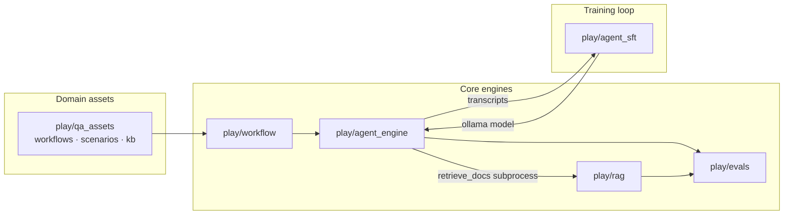

# alchemy

[](https://github.com/AndyUneducated/alchemy/actions/workflows/ci.yml)
[](https://www.python.org/downloads/)
[](LICENSE)
[](https://github.com/AndyUneducated/alchemy)

> Personal **vibe-coding sandbox** for LLM engineering — local RAG, multi-agent scenarios, declarative workflows, and an lm-evaluation-harness-style eval stack, wired into a closed-loop SFT experiment. Not a single shipped product; many small `play/` experiments with shared contracts.

## What it does

Production-minded spikes that compose into one story:

1. **Run agents** — Markdown scenarios drive multi-turn discussions with tools, memory, and artifacts ([`play/agent_engine/`](play/agent_engine/)).
2. **Retrieve locally** — Hybrid dense + BM25 + optional rerank over a self-describing on-disk VDB ([`play/rag/`](play/rag/)).
3. **Evaluate** — Task-declarative harness with `score` / `run` parity, JSONL run storage, and phased metric families ([`play/evals/`](play/evals/)).
4. **Orchestrate** — Linear YAML pipelines mixing deterministic hooks and agent stages ([`play/workflow/`](play/workflow/)).
5. **Close the loop** — Mine `require_tool` nudge traces from the engine, QLoRA-tune a 7B model, deploy via Ollama, re-measure with evals ([`play/agent_sft/`](play/agent_sft/)).

A reference vertical slice ties it together: QA test-plan generation ([`play/qa_assets/`](play/qa_assets/)) runs `qa_supervisor.yaml` through workflow → agent_engine → rag.



## Repository layout

|Path|Purpose|
|---|---|
|[`play/`](play/)|Default home for spikes, scripts, and demos (each sub-project has its own README)|
|[`grow/`](grow/)|Longer-lived mini-apps promoted from `play/`|
|[`stash/`](stash/)|Paused work-in-progress|
|[`refs/`](refs/)|Copied reference snippets — not first-class product code|
|[`_archive/`](_archive/)|Retired experiments|
|[`AGENTS.md`](AGENTS.md)|Notes for coding agents (Cursor rules, doc conventions)|

New experiments belong under `play/` unless you choose another path explicitly.

## Projects

|Directory|One-liner|Docs|
|---|---|---|
|[`play/agent_engine/`](play/agent_engine/)|Step-driven multi-agent engine (scenario = YAML frontmatter + markdown body)|[README](play/agent_engine/README.md)|
|[`play/rag/`](play/rag/)|Local-first hybrid RAG (Chroma + BM25 RRF, optional cross-encoder rerank)|[README](play/rag/README.md)|
|[`play/evals/`](play/evals/)|lm-eval-style LLM evaluation harness (tasks, adapters, JSONL runs)|[README](play/evals/README.md)|
|[`play/workflow/`](play/workflow/)|Declarative linear pipeline runner (hooks + agent stages)|[README](play/workflow/README.md)|
|[`play/agent_sft/`](play/agent_sft/)|Nudge-grounded SFT on agent trajectories (mine → QLoRA → Ollama → re-eval)|[README](play/agent_sft/README.md)|
|[`play/qa_assets/`](play/qa_assets/)|QA domain assets (workflows, scenarios, hooks, kb, example CSV/PRD)|[README](play/qa_assets/README.md)|
|[`play/sft_hello/`](play/sft_hello/)|One-shot MLX-LM hello-world fine-tune (pipeline smoke test)|[README](play/sft_hello/README.md)|

Sub-projects with non-trivial design choices also keep append-only [`DECISIONS.md`](play/evals/DECISIONS.md) (ADR-style) and [`JOURNAL.md`](play/evals/JOURNAL.md) (milestones) beside their README — see any `play/<name>/` that has them.

## Quick start

There is **no monorepo-wide `pip install`**. Each project owns a `requirements.txt` and is run from `play/` (module paths assume that cwd).

**Example — run the QA supervisor workflow** (needs Ollama for embeddings + LLM backends configured in agent_engine):

```bash
cd play/
python -m venv .venv && source .venv/bin/activate
pip install -r workflow/requirements.txt -r agent_engine/requirements.txt -r rag/requirements.txt -r qa_assets/requirements.txt

# Optional: build qa_kb VDB if scenarios use retrieve_docs
cd rag && python ingest.py --docs ../qa_assets/kb --output ../qa_assets/vdb/qa_kb && cd ..

python -m workflow run qa_assets/workflows/qa_supervisor.yaml \
  --vars csv_path=qa_assets/examples/req_tracker.csv \
  --vars output_dir=/tmp/qa_out
```

**Example — list eval tasks and score predictions**:

```bash
cd play/
pip install -r evals/requirements.txt
python -m evals list-tasks
python -m evals score --task <name> --predictions path/to/preds.jsonl
```

See each project README for full CLI surfaces, env vars, and hardware notes (Apple Silicon + MLX for SFT paths; local Ollama for RAG embeddings and inference).

### Running tests locally

Requires **Python 3.12+**, [Ollama](https://ollama.com/) with `qwen2.5:7b` (or set `EVALS_TEST_OLLAMA_MODEL`) and `qwen3-embedding:8b`, plus ingested VDBs under `play/rag/vdb/` (see [CI workflow](.github/workflows/ci.yml) ingest steps).

```bash
python -m venv .venv && source .venv/bin/activate
pip install -r requirements-ci.txt
# build VDBs once (from play/rag): test_vdb + panel — same as CI
python -m pytest -v
```

CI uses `requirements-ci.txt` (excludes `mlx-lm`, which is Apple Silicon–only; `play/agent_sft` tests do not require it).

## Principles (repo-wide)

|#|Principle|
|---|---|
|1|**Experiments over products** — optimize for learning and composability, not a unified release|
|2|**Contracts at boundaries** — e.g. RAG `--json` envelope consumed by agent_engine subprocess; evals `api.py` dataclasses across layers|
|3|**YAGNI** — repo CI runs the full `pytest` suite on push/PR; add lint/format only when a sub-project needs it|
|4|**Document decisions** — important technical choices go to per-project `DECISIONS.md`; substantive progress to `JOURNAL.md`|

Cursor authoring rules live in [`.cursor/rules/workshops.mdc`](.cursor/rules/workshops.mdc).

## What this repo is not

- Not a framework release with semver or stable public APIs
- Not a hosted service or Terraform stack
- Not guaranteed reproducible without local models (Ollama tags, HF caches) and API keys where cloud backends are used

Large generated artifacts (VDB dirs, eval `runs/`, most training checkpoints) are gitignored; see [`.gitignore`](.gitignore).

## License

[Apache License 2.0](LICENSE).
