# Journal

> Note: 2026-04-26 之前项目名为 `play/multiagent`；保留旧名是为了让 git 历史与本 journal 时间线吻合，DECISIONS §10 / 2026-04-26 的里程碑解释了改名缘起。日期以实际 commit 历史为准。

## 2026-04-14 — Multiagent PoC：能让两个 agent 围绕一个 topic 对话

这个阶段的里程碑是把“多 agent 在一个话题上你来我往”这件事在终端跑通。固定 agents、round-robin 发言、写死 topic，是一个最小但完整的闭环。最值得讲的不是 multi-agent 本身，而是 4 个 backend client（ollama / openai / anthropic / gemini）的 drop-in pattern + `config.py` 一行 `BACKEND` 切换——让“以后会接 OpenAI 还是本地 ollama”从一开始就成为可换件，而不是需要重构才能解决的耦合。

### 框架变更

|变更|目的|
|---|---|
|单文件 `run.py` + 4 个 backend client drop-in|让 LLM provider 从一开始就是一个可换件|
|`config.py` 单一 `BACKEND` 开关|切后端不改业务代码|
|共享 history `list[{role, content}]`|首版最简形态，为后面暴露问题留空间|

### 新增 scenario

|scenario|目的|演示什么|
|---|---|---|
|（硬编码）|首版没有 scenario 抽象|两个 agent 围绕硬编码 topic 轮流发言|

### 新增 / 改动工具

|工具|说明|
|---|---|
|—|本期无工具，仅 LLM 对话|

## 2026-04-14 — Phase-driven scenario：把“参与者 + 流程”抽出来做配置

这个阶段把流程从代码里抽出来：YAML frontmatter + markdown body 的单文件即一个场景。换话题不再改 `run.py`，只改 `.md`。4 个示例覆盖 (moderator / no moderator) × (open / goal-oriented) 2×2 矩阵，强调流程抽象在四种典型形态下都成立。这一里程碑是 agent_engine 真正变成“可声明的会议引擎”的起点：流程、角色、主题、提示语全部进入数据，运行时只是“按声明顺序展开”。

### 框架变更

|变更|目的|
|---|---|
|YAML frontmatter + MD body 单文件 scenario|每个会议是一份可读、可改的文档|
|`phases:` 列表声明 opening / main / closing|流程结构数据化|
|`members:` + 可选 `moderator:` 顶层块|角色显式建模|
|启动期 schema 校验 + `who` 字段对参与者名校验|错配 fail-fast，不到运行时才出错|

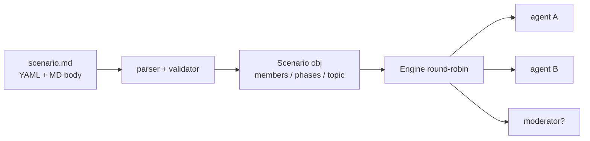

### 新增 scenario

|scenario|目的|演示什么|
|---|---|---|
|4 份示例|覆盖 (moderator / no moderator) × (open / goal-oriented) 2×2|流程抽象在四种典型形态下都跑得通|

### 新增 / 改动工具

|工具|说明|
|---|---|
|—|本期无工具|

## 2026-04-15 — Per-agent 消息投影：共享 transcript + 每 agent 视角

这个里程碑把单 history 多 agent 的根本张力一次性解决：① agent 分不清“我说的”和“别人说的”；② system prompt 优先级失真；③ Anthropic / Gemini API 不接受连续同 role 消息。范式确立——**Discussion 维护一条共享 transcript（唯一权威），每个 agent 在 `respond()` 时把它投影成自己的视角**：speaker == owner 时投成 `assistant`，他人 wrap 进 `<message from="X">...</message>` 包进 user，元数据走 `<tag>...</tag>`。这条范式是后面 memory / artifact / tracer 全部站在其上的地基。

### 框架变更

|变更|目的|
|---|---|
|Discussion 持单条共享 transcript（SoT）|消除多 agent 视角下的真相不一致|
|每 agent `respond()` 投影自身视角|解决“我说的 vs 别人说的”混淆|
|history entry 从 `role/content` 改为 `speaker/type`|把“说话人”和“消息形态”作为一等公民|
|system prompt 走 client 独立参数|不再混进 messages 与 user 内容争优先级|
|Anthropic / Gemini client 自动合并连续同 role|对齐多 provider API 兼容|

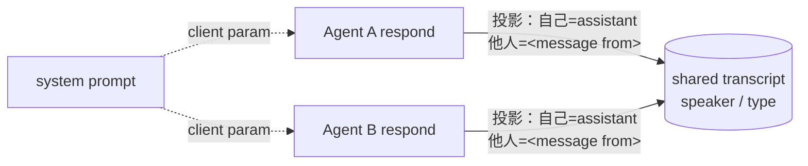

### 新增 scenario

|scenario|目的|演示什么|
|---|---|---|
|`debate.md` / `panel.md` 等 4 份|替换旧脚手架场景|新范式下的多 agent 对话形态|

### 新增 / 改动工具

|工具|说明|
|---|---|
|—|本期无工具|

## 2026-04-16 — Per-round phases + instruction-as-arg：修两个 bug 顺手解锁能力

这个里程碑是修两个 bug 顺手解锁了一种能力：① **instruction 泄露**——给 moderator 的“点名追问 X”被 members 当成自己的指令；② **轮次无差异**——`main` 阶段静态定义，每轮完全相同。修法：instruction 不进 history，作为 `Agent.respond(instruction=...)` 参数传入；`main` 每个 phase 加 `round: <int> | "default"`，引擎按当前轮次匹配 + fallback。这一刻确立了 **instruction-as-arg 这条 invariant**——history 不再承担“控制流 + 对话内容”双重职责，后来扁平 steps 重构（§9）也保留这条线。

### 框架变更

|变更|目的|
|---|---|
|`phases` 拆为 `opening / main / closing` 三段|流程语义更清晰，main 可单独按轮次扩展|
|`main.<phase>.round` 字段（int 或 `"default"`）|让“第 1 轮自由讨论 → 第 N 轮逼迫表态”可表达|
|引擎匹配顺序：`round == N` → `round == "default"` → 全员发言|稳健的回退路径|
|instruction-as-arg invariant|history 只承载对话，不再承载控制流|

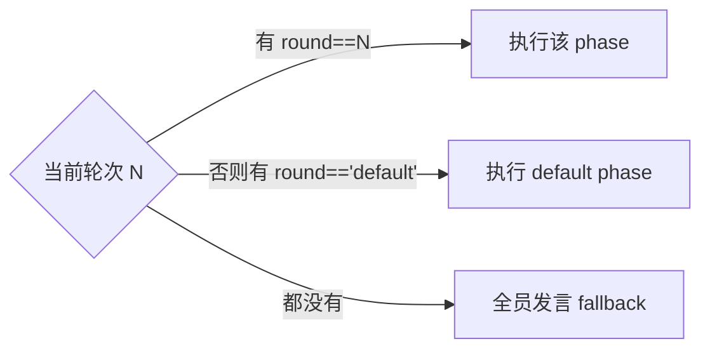

### 新增 scenario

|scenario|目的|演示什么|
|---|---|---|
|—|沿用既有 scenario|轮次差异化指令的典型用法|

### 新增 / 改动工具

|工具|说明|
|---|---|
|—|本期无工具|

## 2026-04-16 — Subprocess 隔离的 RAG 工具

这个里程碑接入第一个工具 `retrieve_docs`，但**不通过 Python import 接 `play/rag`，而是 `subprocess.run(["python", "rag/query.py", "--json", ...])`**。原因是两个子项目各有自己的 `config.py`，`sys.path.insert` 直接 import 第二个会拿到第一个的模块缓存——靠 OS 级进程边界保证隔离。这一步同时立下后续所有跨子项目对接的形态：subprocess + JSON envelope。后来 `play/evals` phase 4（rag）/ phase 5（agent_engine）原样复用。

### 框架变更

|变更|目的|
|---|---|
|工具走 subprocess + JSON envelope|跨子项目零 Python import 耦合|
|`rag/query.py` 加 `--json` 输出模式|为机器消费保留专用 channel|
|LLM tool schema 剥掉 scenario-pinned 参数（`_path_params`）|LLM 只看自己要填的字段，不被默认值干扰|
|`OLLAMA_BASE_URL` 跨 multiagent + rag 统一|多子项目共享同一本地 LLM|

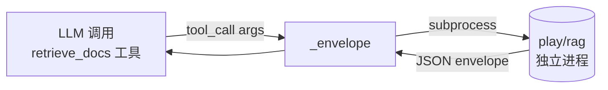

### 新增 scenario

|scenario|目的|演示什么|
|---|---|---|
|`brainstorm.md`|RAG-backed tool use 的主场|agent 在讨论中调用检索工具|
|`vdb_test.md`|最小回归 probe（~5 行 facts，秒级）|subprocess wrapper 的 smoke 验证|

### 新增 / 改动工具

|工具|说明|
|---|---|
|`retrieve_docs`|首个工具，subprocess 调 `play/rag` 检索；scenario-pinned 默认参数对 LLM 隐藏|

## 2026-04-20 — Per-agent conversation memory：full / window / summary 三策略

`panel` 实测撞性能墙：4 成员 + 1 主持 × 3 轮，末段单次发言 111s（开场 24s 的 4.5 倍），整场 1398s。根因是所有 agent 共享全量 history，每轮末尾输入 token 线性增长。这个里程碑引入 `ConversationMemory` ABC + 三实现：`FullHistory`（默认 backward compat）、`WindowMemory`（最近 N + pinned）、`SummaryMemory`（stale 折叠成 `
`）。**pinned types 永不被剪**（`topic / round / phase / artifact_event`）是会议纪要级信息，丢了对话就破。同日还把 opening / closing phase 注入 `<phase>` marker，让 agent 自感所处阶段。

### 框架变更

|变更|目的|
|---|---|
|`ConversationMemory` ABC + 3 实现|memory 策略可插拔，scenario / agent 双层覆盖|
|共享 transcript 不变，每 agent 持自己 memory 实例|延续 §3 的“共享 + 投影”地基，不破坏 SoT|
|pinned types 不可剪（`topic / round / phase / artifact_event`）|保留会议纪要级信息|
|summary 触发：stale 达阈值才折叠|未到阈值时“不动就无信息损失”|
|opening / closing phase 注入 `<phase>` marker|agent 自感阶段，不靠 prompt 工程隐式表达|

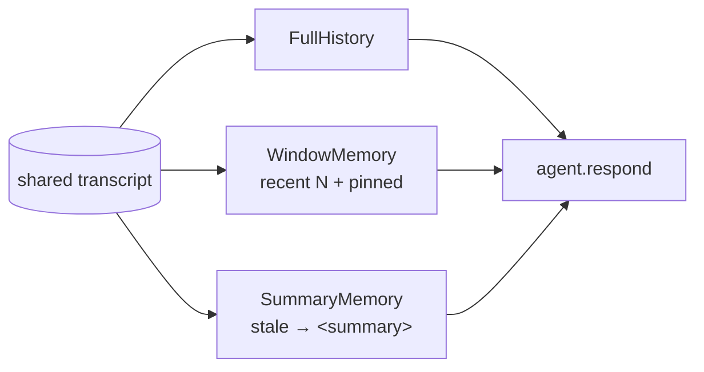

### 新增 scenario

|scenario|目的|演示什么|
|---|---|---|
|`phase_test.md`|`<phase>` marker 存在性的最小回归 probe|opening / closing 阶段被 agent 真正“看到”|

### 新增 / 改动工具

|工具|说明|
|---|---|
|—|本期无工具|

## 2026-04-21 — Shared artifact + 结构化投票：让“讨论 → 决策”可机器验证

`panel` 类场景要求“一方胜出”但只产一串发言，最终决策靠隐式推断。这个里程碑引入 `ArtifactStore` 把决策结构化：6 个工具（`read_artifact / write_section / append_section / propose_vote / cast_vote / finalize_artifact`）。section 在 scenario 的 `initial_sections` 里显式声明、每节标 `mode: replace | append`、store 强制；mode 不匹配返回 `{"error": ...}`，LLM 在同一 tool loop 内 self-correct。两个关键设计：**out-of-band artifact view**——每次 agent 发言前把 `artifact.render()` 作为 `<artifact>` user 消息**带外**注入（不进 history，memory 裁剪永远不会把它藏掉）；**artifact_event 进 history**（pinned，不被剪）——“事件可回放，状态无历史”是 event sourcing 的基本区分。`finalize_artifact` 是 sealing step，幂等返回 error 防重入。

### 框架变更

|变更|目的|
|---|---|
|`ArtifactStore` 内部状态 + 6 个 artifact tools|让决策成为可机器验证的对象|
|section.mode 强制 + error → tool loop self-correct|约束写入语义，但不让出错炸全场|
|out-of-band `<artifact>` 渲染（不进 history）|memory 裁剪不会藏掉 artifact 状态|
|artifact_event 进 history（pinned）|事件可回放，状态由 store 持有，避免双 SoT|
|`finalize_artifact` sealing 幂等|对齐 workflow terminal state 模型|
|tool handler 中 scenario 默认值覆盖 LLM 提供的参数|防止幻觉的 `vdb_dir` 偷换 scenario 解析路径|

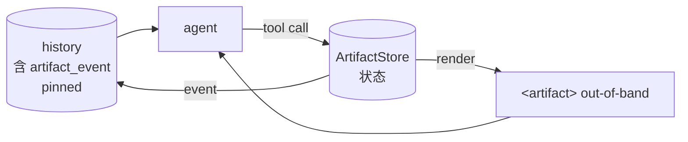

### 新增 scenario

|scenario|目的|演示什么|
|---|---|---|
|`panel.md`|端到端启用 artifact + 投票|结构化决策链路完整跑通|
|`test_artifact.md`|六工具覆盖 + mode 冲突 self-correction|工具协议在错路径上的鲁棒性|

### 新增 / 改动工具

|工具|说明|
|---|---|
|`read_artifact`|读取当前 artifact 状态|
|`write_section`|按 mode=replace 写入 section|
|`append_section`|按 mode=append 追加 section|
|`propose_vote`|提出投票 vote_id|
|`cast_vote`|对 vote_id 投票|
|`finalize_artifact`|sealing 步骤，幂等防重入|

## 2026-04-21 — Phase-assert (`require_tool`)：让“沉默违规”变可见

panel closing 实测 bug：指令要求“每人发言后调用 `cast_vote(...)`”，但两名 member 只说话没投票，引擎 fire-and-forget。这个里程碑加 `phase.require_tool: <tool_name> + max_retries: N`（默认 1）：未命中 → 追加 nudge instruction（per-call 参数，**不进 history**，其他 agent 看不见这次辅导）→ 重试用尽 → stderr `WARNING` + 终端 `🔁` emoji。**核心目标不是“强制 agent 调工具”（LLM 本质上做不到强制），而是让沉默违规变可见**——detect-and-nudge-and-audit 模式。同时把 `propose_vote` 加进 `MODERATOR_ONLY_TOOLS`，消除 member 乱 propose 把 vote_id 错位的 bug 类。

### 框架变更

|变更|目的|
|---|---|
|`phase.require_tool` + `max_retries`|对工具调用合规性做断言|
|nudge instruction 走 per-call 参数，不进 history|不污染其他 agent 视角，保留 instruction-as-arg invariant|
|失败：stderr `WARNING` + 终端 `🔁` emoji|让违规可见，方便 workshop 观众和后续 audit|
|`artifact_event` 加 `tool` / `caller` 结构化字段|程序化检查 compliance，不再解析 free-form 文本|
|`run.py` line-buffer stdout/stderr，`2>&1 \| tee` 保 chronological|日志顺序与时间线一致|

```mermaid
flowchart LR
    P[phase 结束] -->|require_tool 检测| C{命中?}
    C -- yes --> OK[continue]
    C -- no, retries left --> N[nudge instruction<br/>per-call arg]
    N --> P
    C -- retries 用尽 --> W[stderr WARNING<br/>+ &#x1F501; emoji]
```

### 新增 scenario

|scenario|目的|演示什么|
|---|---|---|
|`test_phase_assert.md`|smoke 端到端|retry + warning 路径完整跑通|

### 新增 / 改动工具

|工具|说明|
|---|---|
|`propose_vote`|加入 `MODERATOR_ONLY_TOOLS`，消除 member 乱 propose 的 bug 类|

## 2026-04-22 — Tool observability：ToolTracer 让 non-artifact 工具调用可见

可观测性盲点暴露：artifact tools 已经有完整可观测（events + 终端 emoji），但 non-artifact tools（当时只有 `retrieve_docs`）完全静默——终端看不见、transcript 回放不出来、workshop 演示时观众根本不知道 agent 到底有没有查、查了什么。这个里程碑引入 `ToolTracer`，**双 sink** 对应 OpenTelemetry 的 live exporter + batch exporter：stderr 一行 `🔧`（现场可见）+ transcript event 带 `visible=False`（不进 memory，离线可回放）。同 commit 修了 moderator-first bug：`who: all` 在某些 phase 上让主持人每轮抢先发言，改成 `who: members`。**显式不做**：让 tool_call 进 memory（成本：4 个 backend client + memory 渲染分支 + summary 策略 + 每轮额外 token），artifact 已经承载“状态性跨 agent 共享”这个最强用例。

### 框架变更

|变更|目的|
|---|---|
|`ToolTracer` 类（`drain() -> list[event]`）|集中收集 non-artifact 工具调用|
|双 sink：stderr `🔧`（live）+ transcript `visible=False`（batch）|对齐 OTel 双 exporter 语义|
|`tools.is_error` 抽公共函数|stderr tripwire 与 tracer `ok` 字段对“失败”定义一致|
|所有 entry 加 `ts`（ISO timestamp）|时序完整，回放可精确对齐|
|`--save-transcript` 落盘结构化 history|离线回放成为一等公民|

```mermaid
flowchart LR
    T[tool call] --> TT[ToolTracer]
    TT -->|live| ER[stderr<br/>&#x1F527; one-liner]
    TT -->|batch| TR[transcript event<br/>visible=False]
```

### 新增 scenario

|scenario|目的|演示什么|
|---|---|---|
|—|沿用既有 scenario|tracer 的现场可见性 / 离线回放双视角|

### 新增 / 改动工具

|工具|说明|
|---|---|
|`ToolTracer`|基础设施，不暴露给 LLM；同时为 stderr live 与 transcript batch 服务|

## 2026-04-25 — 扁平 step 列表：取代 phase × round 二维结构

这个里程碑是 schema 的一次大改写。**心智模型从“phase × round 二维”压缩到“steps 一维顺序展开成 turns”**。删了：`opening / main / closing` 三段、`rounds` / `phase.round`、顶层 `moderator:` 块、`members:` 别名、`MODERATOR_ONLY_TOOLS` 硬编码、CLI `--rounds`。新增：扁平 `steps:` 列表；`agents:` 统一列表 + 强制 `role: moderator | member`；`artifact.tool_owners` 显式 ACL；运行时 `<turn>turn X of N</turn>` pinned marker。`tool_owners` 默认全员可调（含 `finalize` / `propose_vote`）；想保留主持人专属必须**显式声明**——与“显式优于隐式”对齐。破坏性变更，所有旧 scenario 必须迁移；workshop 项目无外部消费者，可控。

### 框架变更

|变更|目的|
|---|---|
|扁平 `steps:` 列表（取代 phase × round 二维）|心智模型从“两维矩阵”压成“顺序 turn 串”|
|`agents:` 统一列表 + 强制 `role`|参与者建模一致化，删冗余顶层块|
|`artifact.tool_owners` 显式 ACL|权限数据驱动，删 `MODERATOR_ONLY_TOOLS` 硬编码|
|`<turn>turn X of N</turn>` pinned marker|agent 自感位置，但不强制行为；token 成本约 9|
|`who` 简化为 `moderator` / `member` / `all` + `[name1, name2]`|寻址形态收敛，删 `role:` 前缀和动态 `by:` stub|

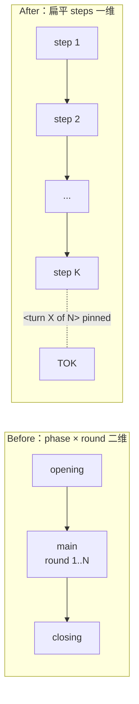

### 新增 scenario

|scenario|目的|演示什么|
|---|---|---|
|—|旧 scenario 全量迁移到新 schema|心智模型一维化在所有现有场景上都成立|

### 新增 / 改动工具

|工具|说明|
|---|---|
|—|无新工具，但 artifact 工具权限改为数据驱动 ACL|

## 2026-04-25 — Hybrid retrieval 集成到 retrieve_docs 工具

这个里程碑把 `retrieve_docs` 从“黑盒检索”升级到“LLM 可调参的检索”。通过 OpenAI tool schema 把 `mode` + `rerank` 暴露给 LLM；scenario `tools:` 默认值仍可 pin。`_retrieve_docs` 把 rag CLI envelope 解包为 slim `{data, meta:{mode, reranked, top_k}}` 给 LLM——HTTP envelope ↔ SDK 解列表的两层分工，对齐 OpenAI SDK 风格。ToolTracer preview 也升级了：从“三键 dict”改成 `[N items, mode=..., reranked]`，信息密度更高。同 commit 与 rag 侧 hybrid + reranker 落地一并合并。

### 框架变更

|变更|目的|
|---|---|
|`retrieve_docs` schema 暴露 `mode` + `rerank`|LLM 可基于 query 歧义自适应选择|
|slim envelope 解包：rag CLI envelope → `{data, meta}`|LLM 只看自己需要的形态，meta 用于观测|
|ToolTracer preview 升级为 `[N items, mode=..., reranked]`|观测可读性提升|

### 新增 scenario

|scenario|目的|演示什么|
|---|---|---|
|`test_vdb.md`|prompt nudge LLM 在歧义 query 上 `rerank=true`|工具自适应能力|

### 新增 / 改动工具

|工具|说明|
|---|---|
|`retrieve_docs`（升级）|增加 `mode` + `rerank` 参数；返回 slim envelope|

## 2026-04-26 — 改名 + tools/ 包拆分（Engine.invoke 库化前奏）

这个里程碑做的是机械改名 + 文件拆分，零行为变更，但在叙事上很关键。`play/multiagent/` → `play/agent_engine/`：项目名从“实现手段”（multi-agent）改为“能力描述”（agent engine），与未来作为可被 workflow 嵌入的库 surface 对齐。`tools.py` 单文件 → `tools/` 包：`retrieve_docs.py` + `_envelope.py` + `_subprocess.py` 三文件，公共 surface（`TOOL_DEFINITIONS / dispatch / is_error / warn_if_error`）保持不变，所有 import 一行不改。这一步是为下一个 commit 的 Engine.invoke 库化做准备——tools 在能干净 import 之前不能拆得过细。

### 框架变更

|变更|目的|
|---|---|
|`play/multiagent/` → `play/agent_engine/`|项目名贴合“能力描述”，为库化做命名先验|
|`tools.py` 单文件 → `tools/` 包（3 文件）|为 Engine.invoke 库化时干净 import 做准备|
|公共 surface 全部保持兼容|零行为变更，下游 zero migration|
|`DESIGN_DECISIONS.md` 加“historical name”|名称迁移可追溯|

### 新增 scenario

|scenario|目的|演示什么|
|---|---|---|
|—|本期为重命名 + 拆分|—|

### 新增 / 改动工具

|工具|说明|
|---|---|
|—|工具行为零变更，仅文件位置调整|

## 2026-04-26 — 库化拆分：Scenario / Engine / CLI 取代一体式 run.py

这个里程碑是把 agent_engine 从“CLI 程序”升级成“可嵌入库”。`Engine`（库 SoT） + `cli.py`（thin adapter，`python -m agent_engine`）双重 surface，共享同一装配路径。`Engine.invoke(*, initial_artifact, transcript_path, artifact_path, callbacks, print_stream) -> Result`：LangChain Runnable 风格 API；`ainvoke` / `stream` / `astream` 显式 `NotImplementedError` 留口，对“抽象引入滞后于第二个具体案例”这条原则保持纪律。`Result` dataclass 持 `artifact / transcript / success / warnings`；require_tool 用尽时除既有 stderr WARNING 外也写 `.warnings`，调用方可程序化判断。`print_stream` 默认 False（库边界）/ True（CLI 边界），让同一引擎在脚本与终端两种语境下安静度不同。同 commit 后续 `d2c4598` 还把 4 个 standalone smoke scenario（`test_artifact / test_memory / test_phase_assert / test_vdb`）合并成 `example.md` 单一 kitchen-sink；ADR 归档由 `DESIGN_DECISIONS.md` 迁到与 `play/rag` / `play/workflow` 体例对齐的项目级 `CHANGELOG.md`（后改名 `DECISIONS.md`）。

### 框架变更

|变更|目的|
|---|---|
|`scenario.Scenario.from_yaml() + assemble()`|把解析 / 校验 / 装配从 `run.py` composition root 抽出来|
|`engine.Engine.invoke()`|库 SoT，单一装配路径同时服务库与 CLI|
|`Result` frozen dataclass|`artifact / transcript / success / warnings` 是单点 SoT|
|`events.py` + `callbacks.py` 5 子类预接线|今天只 `RunFinished` 落地，其余留口|
|`tracer.ToolTracer` 单独成模块|Discussion 不再 `TYPE_CHECKING` 引用 CLI 模块|
|`print_stream` 默认 False（库）/ True（CLI）|同一引擎在脚本与终端两种语境下不同安静度|
|`ainvoke` / `stream` / `astream` `NotImplementedError`|抽象引入滞后于第二个具体案例|

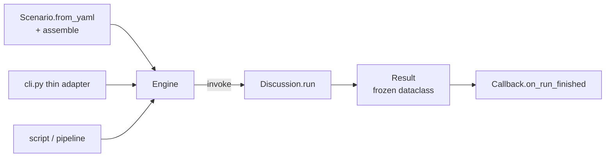

### 新增 scenario

|scenario|目的|演示什么|
|---|---|---|
|`example.md` kitchen-sink|合并 4 个 smoke scenario|memory + artifact + phase_assert + retrieve_docs 一起跑|

### 新增 / 改动工具

|工具|说明|
|---|---|
|—|工具集合不变，主要是装配路径重组|

## 2026-05-04 — Phase 5 evals 接口落地：`--save-result-json` envelope + artifact_event 加 `arguments`

这个里程碑给 `play/evals` phase 5（agent_traj task）提供机器消费接口。新增 CLI flag `--save-result-json PATH`：用 `dataclasses.asdict` 把 `Result` 序列化成 JSON envelope（`{transcript, artifact, warnings, success}`）落盘，与 `--save-transcript`（人类 JSON list）/ `--save-artifact`（人类 markdown）并列，是机器消费格式的专用 channel。**envelope 走 file 而非 stdout**：agent_engine 整段讨论会刷 stdout（streaming + 工具反馈），envelope 不能寄生 stdout——这是与 `play/rag/query.py --json`（短查询输出）形态分叉的根本原因。同时 5 个 artifact_event handler 现在保留原始 `arguments`，让 transcript 永久持有“agent 当时调了什么”的完整快照——pre-phase 5 仅留人类可读 `content` 字符串造成的信息丢失被补回。`evals` 端 `argument_correctness` metric 依赖此字段在 run 路径有真数据。

### 框架变更

|变更|目的|
|---|---|
|`--save-result-json PATH` file flag|机器消费独占 channel，不污染 stdout|
|envelope = `dataclasses.asdict(Result) → json.dump(...)`|`Result` 自身就是单点 SoT，无需再加 `to_dict()`|
|envelope 走 file 而非 stdout|agent_engine stdout 已被 streaming 占用|
|5 个 artifact_event handler 保留 `arguments`|transcript 永久持有 agent 当时调了什么的完整快照|
|envelope schema 由 `dataclasses.fields(Result)` 自描述|跨项目契约监控成本接近零|

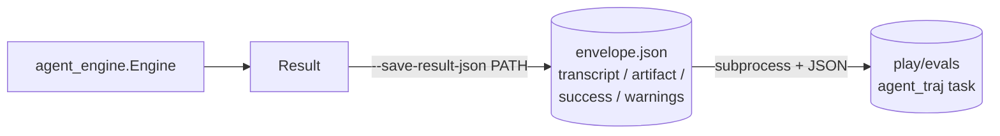

### 新增 scenario

|scenario|目的|演示什么|
|---|---|---|
|—|沿用既有 scenario|envelope 在 example/panel/brainstorm 上都能产稳定 schema|

### 新增 / 改动工具

|工具|说明|
|---|---|
|artifact_event handler（5 个）|事件 dict 增加 `arguments` 字段；老消费者忽略未知键，evals 端 `argument_correctness` 拿到真数据|
