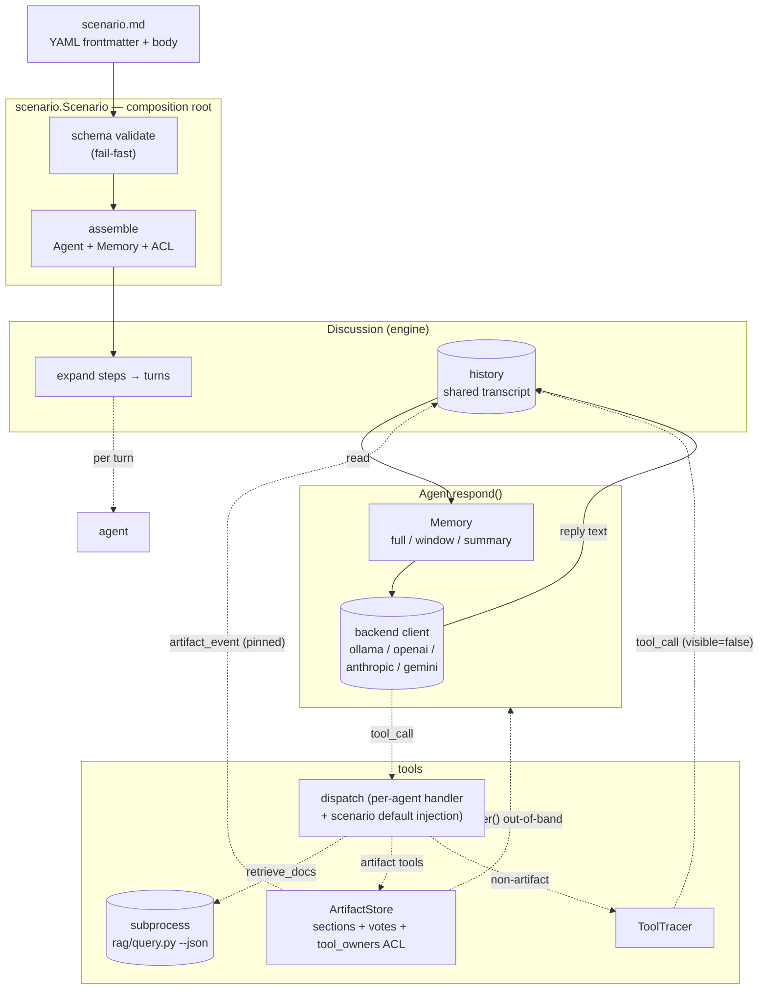
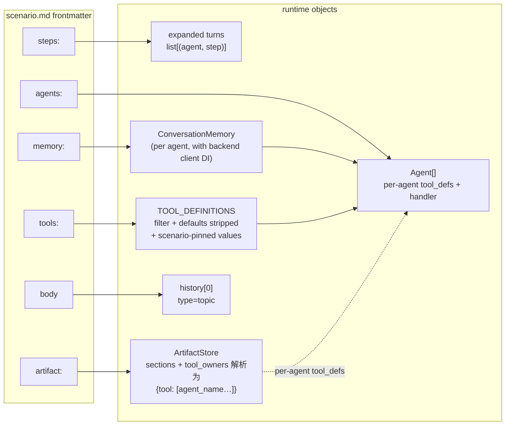

# play/agent_engine

Step-driven 多 agent 讨论引擎：scenario = 一份 markdown，YAML frontmatter 声明参与者 / 流程 / 工具 / memory / artifact，body 即话题。共享 transcript + per-agent 投影，支持 ollama / openai / anthropic / gemini 四个后端，可被 [`play/rag/`](../rag/) 通过 subprocess 喂数据。

## 特性

- **Scenario 即配置**：YAML frontmatter + markdown body，一文件一场景；启动期 schema 校验，作者改场景零代码
- **扁平 step 列表**：`steps:` 一段顺序声明所有 turn，`who` 用 role/all/name 列表灵活寻址；每 turn 注入 `<turn>turn X of N</turn>` pinned marker，让 agent 自感位置
- **Shared transcript + per-agent projection**：history 只有一份权威视图，每个 agent 在 `respond()` 时按 `speaker == owner` 投影为 `assistant`，他人投影为 `<message from="X">`，控制流（`topic / turn / artifact_event`）投影为带标签的 user 消息
- **Per-agent memory**：`full / window / summary` 三策略可换，详见 [§Memory 策略](#memory-策略)
- **Shared artifact + 结构化投票 + ACL**：sectioned markdown + `replace / append` mode + 投票 + `finalize`，view 带外注入；`tool_owners` 限制每个 artifact 工具的可调用方（取值与 `who` 完全对齐）；详见 [§Artifact 工具](#artifact-工具)
- **Step assert（require_tool）**：声明 step 必须调用某工具；缺则 nudge 重试，最终落 stderr WARNING——**让沉默违规可见**而非强制
- **Tool observability**：`ToolTracer` 双 sink——stderr 实时 🔧 emoji + transcript event（`visible=False`，离线回放可用）
- **Subprocess 隔离工具**：`retrieve_docs` 通过 `subprocess.run(python rag/query.py --json)` 调用，进程边界隔离两个子项目的 `config.py` / 依赖；透传 rag 的 hybrid（dense + BM25 RRF）检索 + 可选 cross-encoder 精排，LLM 可按需选 `mode` / `rerank`
- **多后端 pluggable**：`config.py` 改一行 `BACKEND` 切换 ollama / openai / anthropic / gemini

## 指导原则

贯穿本项目的 5 条原则：

|#|原则|说明|
|---|---|---|
|1|**Shared transcript + per-agent projection**|一份权威 history，各 agent 按自身需求投影（详见 [§History 投影规则](#history-投影规则)）|
|2|**显式优于隐式**|配置能声明的不靠代码推断；LLM 行为能结构化约束的不靠 prompt 约定|
|3|**承认 LLM 不确定性**|不把 LLM 当确定性函数，容错设计（retry / self-correct / audit）优先于强制|
|4|**装配点集中**|`Scenario.assemble()` + `Engine.invoke()` 是唯一装配 / 编排入口；`cli.py` 只做 argparse → 同一 API，讨论内核不依赖 CLI|
|5|**抽象引入滞后于第二个具体案例**|不为未来需求预留抽象，等第二个使用者出现时再抽|

## 架构

> 业界 5 层模型对应：UI = `cli.py` + scenario `.md`；Orchestration = `scenario.Scenario` / `engine.Engine` / `discussion.Discussion`；Capabilities = `agent.Agent` + `memory.*` + `tools/` + `artifact.ArtifactStore`；LLM Core = 4 个 pluggable backend client；Infrastructure = `play/rag/` subprocess + `tracer.ToolTracer` + JSON 落盘。下面四张图分别是组件视角、scenario→运行时映射、单 turn 时序、history 投影。

### 组件总览

`scenario.Scenario` 作为 composition root 把 scenario.md 装配成运行时对象图（`Assembly`），由 `engine.Engine` 串到 `Discussion`；`Discussion` 持有唯一权威 `history`，`Agent` 通过 `Memory` 投影读取它，`ArtifactStore` / `ToolTracer` 各自往 `history` 反向写事件。



### Scenario → 运行时装配

YAML 字段与 runtime 对象一一对应；`scenario.py` 是唯一知道这些映射的地方。



### 单 turn 数据流

每个 turn 内部的执行顺序——尤其是 artifact view 带外注入、tool_call 事件先于发言入 history、`require_tool` nudge 闭环——在这里一图说清。

```mermaid
sequenceDiagram
    autonumber
    participant D as Discussion
    participant H as history
    participant AG as Agent.respond
    participant M as Memory
    participant CL as backend client
    participant AS as ArtifactStore
    participant TR as ToolTracer

    D->>H: append &lt;turn X of N&gt; (pinned)
    D->>AS: render() → markdown view
    D->>AG: respond(history, instruction, artifact_view)
    AG->>M: build_messages(history, owner)
    M-->>AG: messages (per-agent projection)
    Note over AG,CL: artifact_view 作为 &lt;artifact&gt; user 消息<br/>带外注入；不进 history
    AG->>CL: chat(system, messages + view + instruction, tools)

    loop tool-use loop
        alt artifact tool
            CL->>AS: dispatch(name, args, caller)
            AS-->>CL: result (+ enqueue artifact_event)
        else non-artifact tool
            CL->>TR: dispatch via tracer
            TR-->>CL: result (+ stderr 🔧 + enqueue tool_call)
        end
    end

    CL-->>AG: final reply text
    AG-->>D: reply

    D->>TR: drain() tool_call 事件
    D->>H: append tool_call 事件 (visible=false)
    D->>H: append speaker turn
    D->>AS: drain_events() artifact 事件
    D->>H: append artifact_event (pinned)

    alt require_tool 未命中 且 attempt &lt; max_retries
        D->>D: 生成 nudge instruction，重新进入 turn
    else require_tool 命中 或 重试用尽
        D-->>D: 进入下一 turn (用尽则 stderr WARNING)
    end
```

### History 投影规则

History 只有一份；每个 agent 在 `Memory.build_messages(history, owner)` 中按下表把它折成自己的 `messages`。

|来源 entry|投影规则|
|---|---|
|`type=topic / turn / artifact_event / summary`|包成 `<tag>...</tag>` 的 user 消息|
|`speaker == owner`|`assistant` 消息|
|`speaker != owner`|包成 `<message from="X">...</message>` 的 user 消息|
|`visible=False`（`tool_call` from `ToolTracer`）|所有 agent 投影时跳过；仅 `--save-transcript` 落盘可见|

> Pinned 类型（`topic / turn / artifact_event`）永不被任何 memory 策略剪掉——会议纪要级信息丢了对话就破。`<artifact>` 视图每 turn 带外注入，不进 history，因此既"总是最新"又不占 memory 配额。

## 环境准备

- Python 3.12+
- `pip install -r requirements.txt`（`anthropic / google-genai / openai / pyyaml`）
- 选一个后端（默认 ollama）：

```bash
# 本地 ollama（默认）
ollama pull qwen2.5:32b
# 或者改 config.py 的 BACKEND，并填上对应 *_API_KEY
```

`retrieve_docs` 需要 [`play/rag/`](../rag/) 已建好 VDB。

## 快速开始

### 作为 Python 库（library, source of truth）

以下路径假定当前工作目录为 **`play/`**（`import agent_engine` 能解析到本包）。

```python
from agent_engine import Engine, Scenario

scenario = Scenario.from_yaml("agent_engine/scenarios/roundtable.md")
engine = Engine(scenario)
result = engine.invoke(
    initial_artifact={"PRD": "..."},          # 可选; 预填 artifact section
    transcript_path="/tmp/transcript.json",   # 可选; 落盘结构化 history
    artifact_path="/tmp/artifact.md",         # 可选; 落盘渲染后 markdown
    print_stream=False,                       # 库默认安静; CLI 默认 True
)
result.artifact     # dict[section_name, content]
result.transcript   # list[Entry]
result.success      # bool (True iff no warnings)
result.warnings     # require_tool 用尽等软失败
```

### 作为 CLI（thin adapter）

在 **`play/`** 目录下（`python -m agent_engine` 能解析包名；scenario 路径相对当前工作目录）：

```bash
# 1. 经典圆桌（主持人 + 2 嘉宾）
python -m agent_engine agent_engine/scenarios/roundtable.md

# 2. 决策会议（主持人 + 4 成员，11 步 26 turn，带 artifact + 投票 + finalize）
python -m agent_engine agent_engine/scenarios/panel.md --save-artifact /tmp/panel.md

# 3. 集成烟囱 + CI 单文件（who 四种形态 + artifact + retrieve_docs + memory + require_tool）
python -m agent_engine agent_engine/scenarios/example.md
```

预期输出片段：

```
============================================================
  Participants: 主持人, 嘉宾A, 嘉宾B
  Steps: 3  |  Total turns: 4
============================================================

🗣  [主持人] (step=open): 各位嘉宾好，今天我们讨论 ...
🗣  [嘉宾A] (step=discuss): 从技术原理 ...
🔧 [嘉宾A] retrieve_docs(query='AGI 路径', vdb_dir='...') → [3 items, mode=hybrid]
...
```

## CLI 速查

> 完整说明见 `python -m agent_engine --help`。

|参数|必选|默认|说明|
|---|---|---|---|
|`scenario`|是|—|scenario `.md` 文件路径|
|`--no-stream`|flag|`False`|关闭流式输出（CLI 默认开；库调用默认关）|
|`--save-artifact`|否|—|把最终 artifact markdown 落盘（仅 `artifact.enabled` 场景生效）|
|`--save-transcript`|否|—|落盘结构化 history（topic / turn / speaker / tool_call / artifact_event）JSON|
|`--save-result-json`|否|—|落盘完整 `Result` envelope（`{transcript, artifact, warnings, success}`，`dataclasses.asdict` 直出）。机器消费格式，与上两个 human format 并列；`play/evals` phase 5 trajectory eval 通过此 flag 走 subprocess + JSON envelope 接 agent_engine（详见 [`DECISIONS §11`](DECISIONS.md)）|

## Scenario schema

YAML frontmatter 字段：

|字段|类型|说明|
|---|---|---|
|`agents`|list|必填，至少 1 项；每项 `{name, role, prompt}`，可选 `model / temperature / max_tokens / memory`；`role` ∈ {moderator, member}|
|`steps`|list|必填，至少 1 项；每项 `{who, instruction, id?, require_tool?, max_retries?}`；按列表顺序展开成 turn|
|`memory`|dict|scenario 级默认 memory 配置；agent 级 `memory` 字段可覆盖|
|`tools`|list|每项 `{name: <tool>, ...defaults}`；scenario 级默认值会从 LLM schema 中隐藏并注入到 dispatch|
|`artifact`|dict|`{enabled, initial_sections?, tool_owners?}`；section 项可声明 `mode: replace\|append`；`tool_owners` 限制可调用方|

`who` 取值（共四种）：

|形态|含义|
|---|---|
|`moderator`|scalar role：所有 role=moderator 的 agent，按声明顺序|
|`member`|scalar role：所有 role=member 的 agent，按声明顺序|
|`all`|scalar 关键字：全员，按声明顺序|
|`[name1, name2]`|显式名单：按列表顺序，每个 name 必须存在；单点也写成 `[name]`|

`<artifact>` 视图在每次发言前带外注入（不进 history）。`<turn>turn X of N</turn>` 在每 turn 前 pinned 注入，让 agent 自感位置。

### Memory 策略

|`type`|必填字段|行为|
|---|---|---|
|`full`|—|默认；保留全量 history|
|`window`|`max_recent`|保留所有 pinned marker + 最近 N 条发言|
|`summary`|`max_recent` + 可选 `model / max_tokens / temperature / summarizer_prompt / summarize_instruction`|stale 发言增量折叠进 `<summary>` block；client 由 `Engine.invoke()` 装配时注入|

### Artifact 工具

|工具|默认可见性|作用|
|---|---|---|
|`read_artifact`|all（除非 tool_owners 限制）|返回当前 markdown 视图|
|`write_section`|all（受 mode 限）|覆盖式写 section；`append` 节调用返回 error|
|`append_section`|all（受 mode 限）|追加 entry；`replace` 节调用返回 error|
|`propose_vote`|all（除非 tool_owners 限制）|注册结构化投票，返回 `vote_id`|
|`cast_vote`|all（除非 tool_owners 限制）|记录一票（按 `caller` 覆盖写）|
|`finalize_artifact`|all（除非 tool_owners 限制）|封板；幂等返回 error 防重入|

`require_tool: <tool>` 在 step 结束后扫 `artifact.drain_events()` 验证调用是否发生；未命中追加 nudge instruction 重试，重试用尽 stderr WARNING。

## Scenario 库

|文件|用途|
|---|---|
|`example.md`|**集成烟囱 + CI**：artifact 六工具 + `retrieve_docs` + window/full/summary + `require_tool` nudge；`ci_who_*` 两步覆盖 `who: member` / `who: all` 标量寻址；字段说明见本 README|
|`roundtable.md`|主持人 + 2 嘉宾，最简流程烟囱（3 step）|
|`debate.md`|无主持人，2 立场对辩（2 step）|
|`brainstorm.md`|无主持人，演示 `who: [name, ...]` 显式列表寻址（2 step）|
|`panel.md`|决策会议：主持人 + 4 成员，11 step / 26 turn，artifact + 投票 + finalize（最完整）|

## 项目结构

```
play/agent_engine/
├── README.md                   # 本文件
├── DECISIONS.md                # ADR 归档（每条架构决策一个条目，含 Status / Date / 取舍）
├── JOURNAL.md                  # 每日进展（按里程碑，≤2 条/天，含功能 + 技术，必要时反链 DECISIONS §N）
├── requirements.txt            # anthropic / google-genai / openai / pyyaml
├── config.py                   # BACKEND + 各家 model/key/默认参数
├── __init__.py                 # 导出 Engine / Scenario / Result / Callback
├── __main__.py                 # python -m agent_engine 入口
├── cli.py                      # zero-logic CLI: argparse → Engine.invoke
├── engine.py                   # Engine class (invoke / ainvoke* / stream* / astream*)
├── result.py                   # Result dataclass (artifact / transcript / success / warnings)
├── events.py                   # Event base + 5 子类（流式占位，今天仅 RunFinished 触发）
├── callbacks.py                # Callback base（on_xxx 方法）
├── scenario.py                 # Scenario.from_yaml + 装配 Assembly
├── tracer.py                   # ToolTracer（非 artifact tool 调用事件 + stderr 🔧）
├── discussion.py               # Discussion 引擎：扁平 steps -> 线性 turn
├── agent.py                    # Agent.respond() + memory 投影入口
├── memory.py                   # FullHistory / WindowMemory / SummaryMemory
├── artifact.py                 # ArtifactStore + 6 工具 + 投票 + finalize
├── tools/                      # reasoning tool 包（_envelope / _subprocess / retrieve_docs / __init__）
├── anthropic_client.py         # 后端 client（含 tool_handler loop）
├── openai_client.py            #
├── gemini_client.py            #
├── ollama_client.py            #
└── scenarios/                  # 场景库（见上表）
```

架构决策见 [`DECISIONS.md`](DECISIONS.md)；每日进展（按里程碑）见 [`JOURNAL.md`](JOURNAL.md)。
