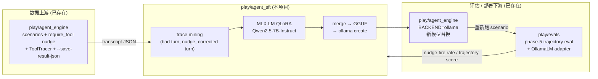

# play/agent_sft

**Nudge-grounded SFT**：把 [`play/agent_engine`](../agent_engine/) 的 `require_tool` 闭环作为监督信号，对 7B 本地模型做 LoRA 微调，让"被 nudge 才补调用"变成"自己就调对"。训练管线：mine traces → SFT on (failed turn, nudge, corrected turn) → merge LoRA → GGUF → `ollama create` → 回灌 `agent_engine`，由 [`play/evals`](../evals/) phase-5 trajectory 评估闭环效果。

## 中心问题

> 把"`agent_engine` 不得不发出 nudge"这一**自有 supervision 信号**作为微调目标，能不能让一个 7B-class 模型在自己产出的 trajectory 上，把 nudge-fire rate 显著降下来，且不在 OOD 工具调用上回归？

这不是"再做一遍 BFCL fine-tune"——那条路走过的人太多。本项目的差异化在于：**supervision 信号只能由我自己的 agent 系统产生**，复现门槛即护城河。

> **v1 工程约束**（不进入中心问题）：M4 Pro 48GB 单机 + QLoRA 4-bit on Qwen2.5-7B。v2/v3 演化时硬件约束可放宽（见下文 §"v1 / v2 / v3 演化路径"），中心问题不变——把硬件从中心问题剥离，是为了让"项目能否 scale 到更大底座 / 上云 GPU"成为可讨论的演化方向，而非要重写命题。

## 与现有 play/ 子项目的关系



垂直整合是这条故事的核心——**没有 `agent_engine` 就没有这份训练数据，没有 `evals` 就没有这套度量**。

## 七阶段路线图

|Phase|目标|关键产出|
|---|---|---|
|0 — Frame|确定中心问题、技术栈、约束、扩展性留口|本 README + [`DECISIONS §1`](DECISIONS.md) + [`§2`](DECISIONS.md)|
|1 — Baseline|定义 nudge-fire rate 度量；测 Qwen2.5-7B (off-the-shelf, Ollama) 与 **Qwen2.5-32B-Instruct (Ollama)** 在现有 scenario 上的基线|`evals` 4 task：`nudge_fire_rate` / `agent_traj` / `bfcl_slice` / `mmlu_slice`；`agent_sft/eval/` 多 seed runner + aggregator + 报告|
|2 — Data|从 `agent_engine` 跑批 + 历史 transcript 中挖掘 (bad, nudge, corrected) 三元组；公开 tool-call 数据集做 OOD 对照|≥1k 训练样本；held-out in-dist + OOD split|
|3 — Train|MLX-LM QLoRA 在 Qwen2.5-7B-Instruct 上做 SFT；小规模超参 sweep|adapter checkpoint + train/eval loss 曲线|
|4 — Deploy|merge LoRA → GGUF Q4_K_M → 自定义 Modelfile → `ollama create agent-sft-qwen`（详见 [`deploy/`](deploy/) + [`DECISIONS §6`](DECISIONS.md)）|可在 `agent_engine` 通过 `BACKEND=ollama` + `MODEL=agent-sft-qwen` 切换的本地模型 tag|
|5 — Re-measure|用 Phase 1 同套 evals 跑 base 7B / SFT 7B / **Qwen2.5-32B 原版** 三组对比；附 OOD + 通用对话回归测试|对比报表 + 回归说明（**诚实标注哪里变差**）|
|6 — Reflection|README 增补 lessons learned + 下一步（DPO / 更大底座 / on-policy distill）|README §"Lessons" + `DECISIONS` 追加结案条目|

每完成一个 phase，`JOURNAL.md` 记一条里程碑（功能 / 技术），重要决策追加进 `DECISIONS.md`。

### v1 / v2 / v3 演化路径

七阶段路线图是 **v1**——把 nudge-grounded SFT 这条主线打穿。**v2/v3 候选**在 v1 收尾后按 Phase 6 反思的数字决定是否启动；预先列出一是为说明"本项目不是一锤子"，二是给面试时的"下一步是什么"问题留干脆答案。

|版本|主题|候选增量|触发条件|
|---|---|---|---|
|**v1**|nudge-grounded SFT 主线打穿|本 README 的 7 阶段|当前进行中|
|v2-A|偏好对齐：nudge SFT + DPO|用 (failed, corrected) 当 prefer pair 做偏好学习|v1 数字稳定但 7B SFT 后仍有可见短板|
|v2-B|on-policy 迭代 SFT|v1 模型回灌跑 scenario，挖新 nudge → 再训一轮|v1 数据规模 < 1k 但效果可观察|
|v2-C|失败模式 taxonomy + 难样本挖掘|按错例分类（漏调 / 错调 / 参数错）做 hard sample mining|v1 复测时按 per-tool / per-scenario breakdown 发现明显短板|
|v3-A|14B 升级（Qwen2.5-14B QLoRA Q4 ≈ 8GB，48GB 仍可行）|换底座重训，验证方法是否 scale|v1 + v2 完成且 7B 显示饱和|
|v3-B|公开 artifact|HF Hub release adapter + Model Card + BFCL leaderboard 提交|v2 任一完成|
|v3-C|技术报告 / blog|4-6 页小论文风格 writeup|v3-B 之前|
|v3-D|多 supervision 信号 superset|`require_tool` + ACL 拒绝 + 投票失败 + finalize 反复，全打入数据池|`agent_engine` 引擎层加新失败模式后|

> **v2/v3 候选清单是路线图广告位，不是承诺**——v1 数字若不达预期，候选项可在 Phase 6 反思中"摘牌"。这种"显式留口但不预设抽象"的姿态遵循 [`workshops.mdc`](../../.cursor/rules/workshops.mdc) 的"抽象引入滞后于第二个具体案例"原则。

## 度量定义（Phase 1 锁定，先在这里占位）

|指标|定义|来源|
|---|---|---|
|**nudge-fire rate**|`require_tool` step 中触发 nudge 重试的比例|`agent_engine` transcript 里 `tool_call` 缺失 + 后续 nudge instruction 计数|
|**trajectory score**|`evals` phase-5 既有指标（multi-turn tool-use 全链路）|`evals` registry 已存在的 trajectory task|
|**BFCL slice**|公开基准 [Berkeley Function-Calling Leaderboard](https://gorilla.cs.berkeley.edu/leaderboard.html) AST/exec 子集，做 OOD 对照|公开数据，`evals` 加 task wrapper|
|**general regression**|MMLU 子集 / 通用对话保留任务一小撮，防 catastrophic forgetting|`evals` 现有 task|

度量先于训练定义。Phase 1 的产物即"这四张数字表，未训练前的版本"。

### 报告维度（Phase 1 实现 evals task wrapper 时就按此切，避免 Phase 5 才补）

每项度量除聚合数字外，必须按下表三轴 + 多 seed 做 breakdown。这层结构是 v2-C "失败模式 taxonomy + 难样本挖掘" 的输入，先于 Phase 1 落地能避免 Phase 5 复测时发现"没存细粒度数据要重跑"。

|轴|拆分|为什么|
|---|---|---|
|**per-scenario**|按 `agent_engine` scenario 文件分组|定位"哪个场景最难"——可作 hard sample mining 起点|
|**per-tool**|按 `require_tool` 名分组（`cast_vote` / `write_section` / ...）|定位"哪个工具最易漏调"——可作针对性数据增强信号|
|**per-failure-mode**|按错例类型分类：漏调 / 错调（调了别的工具）/ 参数错（调对了但 args 错）|失败模式 taxonomy 预留——v2-C 候选的输入|
|**多 seed**|每组 ≥ 3 seed，报均值 ± 标准差|LLM 输出有随机性，单次跑数字不可信，置信区间是 S 级 portfolio 的最低标准|

## 技术栈与约束

|维度|选择|为何（详见 `DECISIONS`）|
|---|---|---|
|底座模型|Qwen2.5-7B-Instruct|强 tool-call 基线 + MLX 友好 + Ollama 同 tag 现成|
|微调方式|QLoRA（4-bit base + LoRA adapters）|48GB 统一内存约束下 7B 唯一可行解|
|训练框架|[MLX-LM](https://github.com/ml-explore/mlx-lm)|Apple Silicon 原生；`mlx_lm.lora` + `mlx_lm.fuse` + `mlx_lm.convert` 一条龙（详见 [`§2`](DECISIONS.md)）|
|量化与部署|fuse → 转 GGUF → `ollama create`|与 `agent_engine` `BACKEND=ollama` 零成本对接|
|评估框架|[`play/evals`](../evals/)|自有 harness 即护城河，phase-5 已支持 trajectory|
|硬件|M4 Pro 48GB（v1 工程约束，不绑中心问题）|v1 所有结论的隐含上界；v2/v3 演化时可放宽，见上文 §"v1 / v2 / v3 演化路径"|

> **可移植性声明**：HF safetensors 是 source of truth——MLX-LM（训练）与 Ollama（部署）都是它的消费者。后续 v2 加 DPO / GRPO 切到 [TRL](https://huggingface.co/docs/trl)、或 v3 上云 GPU 跑更大底座，**checkpoint 不需要重导**，仅适配训练 / 部署侧脚本即可。

### v1 non-goals（v2/v3 候选见上节，这里只列**永久禁区**与 **v1 边界**）

|项|分类|理由|
|---|---|---|
|训练集混入公开 tool-call 数据集（xLAM / ToolACE 等）|❌ **永久禁区**|破坏 [`§1`](DECISIONS.md) 差异化承诺；公开数据集仅用于 OOD 测试|
|风格 / 角色微调|❌ **永久禁区**|饱和赛道，与本项目主题无关|
|DPO / RLHF / PPO|⏸ **v1 边界** → v2-A 候选|先把 SFT 做干净，再谈偏好学习|
|多底座对比（Llama / Mistral / 跨家族）|⏸ **v1 边界** → 可作 v3 增量|先把一条主线打穿|
|32B+ 底座 QLoRA|⏸ **v1 边界** → v3-A 候选（14B 优先）|48GB 边缘，先在 14B 验证 scaling，再决定要不要冲 32B|

## 项目结构（规划）

```
play/agent_sft/
├── README.md                # 本文件
├── DECISIONS.md             # ADR 归档（§1 中心问题 + §2 训练框架 + §3 数据流水线 + §4 SFT schema + §5 推荐 adapter + §6 Phase 4 量化锁定）
├── JOURNAL.md               # 每日里程碑（功能 + 技术，≤2/天）
├── requirements.txt         # mlx-lm[train] + huggingface-hub
├── data/                    # Phase 2 已落地：mine / extract / synthesize / split / formatter + 1k×2 数据集
├── train/                   # Phase 3 已落地：lora_config.yaml / train.py / eval_smoke.py / sweep.py
├── eval/                    # Phase 1 已落地：run_baseline.py + aggregate_seeds.py + baselines/
│                            #  task 实现归 evals/
├── deploy/                  # Phase 4 已落地：Modelfile（1:1 复刻 qwen2.5:7b template）+ build.sh / deploy.sh / smoke_test.py + README
└── tests/                   # 89 单元测试（70 数据流水线 + 17 aggregate_seeds + 32 formatter schema 升级）
```

具体文件按 phase 推进时补齐——README 不预创空文件夹。

## 面试叙事脚本（草稿，随项目推进迭代）

> "我自己写了一个 agent engine，里面有一个 `require_tool` 机制：当某一步必须调用某个工具但 LLM 漏调时，引擎会发 nudge 让它重试。这个 nudge 信号就是免费的监督——本来意味着模型该调没调。我把它当作 SFT 的 target，挖了约 N 条 (failed turn, nudge, corrected turn) 三元组，在 M4 Pro 48GB 上用 MLX-LM QLoRA 微调 Qwen2.5-7B。
>
> 怎么知道有效？我用自己写的 evals harness（lm-eval-harness 风格，有 phase-5 trajectory eval）跑了三组对比：原 Qwen 7B / 我微调后的 7B / Qwen2.5-32B 原版（同家族跨规模 ceiling reference）。在 in-dist 上 nudge-fire rate 从 X% 降到 Y%，**追到与 32B 原版同档**；BFCL 公开切片上没有显著回归。微调后的权重 fuse 成 GGUF，`ollama create` 注册成本地 tag，agent engine 改一行 BACKEND 配置就跑起来了。
>
> 这个项目最值得讲的不是数字本身，而是 supervision 信号只能由我自己的 agent stack 产生，**且整条链路全本地、零闭源依赖**——这事儿没有别的 portfolio 可以复现。"

完整三段式（项目背景 / 技术决策 / 反思）会在 Phase 6 收尾时定稿。

## 参考

- [MLX-LM LoRA 文档](https://github.com/ml-explore/mlx-lm/blob/main/mlx_lm/LORA.md)
- [BFCL leaderboard](https://gorilla.cs.berkeley.edu/leaderboard.html)
- [xLAM / ToolACE / Hammer 数据集（OOD 对照参考）](https://huggingface.co/datasets?search=tool+calling)

## 附录 1：模型调优全谱系

把所有"让一个已有模型更适合我的任务"的手段平铺到一张表，按"改不改权重 / 改多少"由轻到重排（A → H）。**SFT ⊂ fine-tune ⊂ 模型调优**——本项目落在 D 的"SFT"+ B 的"QLoRA"+ H 的"GGUF/Ollama"三栏的组合。各类可叠加（PEFT + SFT + DPO 是常见组合）。

先看每一类做什么，再下钻到具体手段：

|类|浅释|典型代表|
|---|---|---|
|A. 推理时调（inference-time / prompt-time tuning）|不动模型，只在"怎么问"上做文章——换 prompt、塞示例、外接资料 / 工具。最便宜，最先该试|Prompt engineering / RAG / Tool use|
|B. PEFT 旁路（parameter-efficient fine-tuning）|主模型冻结，只在旁边训一个极小的"插件"（adapter / 低秩矩阵 low-rank matrix / 软 prompt soft prompt）。像西装里加件可拆衬里——能换装、省显存|LoRA / QLoRA / Adapter|
|C. Partial FT（partial fine-tuning）|介于 PEFT 与 Full FT 之间——只解冻一部分层去训。今天大多被 PEFT 替代|Layer freezing / BitFit|
|D. Full FT（full fine-tuning）|把整个模型权重都更新。能力上限最高，但显存 / 数据 / 算力门槛也最高，且易灾难遗忘（catastrophic forgetting）|SFT / CPT / DAPT|
|E. 偏好对齐 / RL（preference alignment / reinforcement learning）|不给"标准答案"，只告诉模型"两个回答里哪个更好"。教礼貌、价值观、对齐人类偏好（human alignment）的主流路径|RLHF / DPO / GRPO|
|F. 自我改进（self-improvement / self-distillation）|训练数据由模型自己（或同族模型）产出——采样、筛选、自打分后回灌（bootstrap）。supervision 不靠人工|Rejection sampling / STaR / Self-Refine|
|G. 模型合并 / 编辑（model merging / editing）|不需要训练数据——直接对若干已有权重做算术（合并、加减），或外科手术（surgical edit）改一两条事实|TIES merging / Task arithmetic / ROME|
|H. 部署调优（deployment tuning / inference optimization）|目的不是让模型变聪明，而是让它变小变快能上线——量化（quantization）、剪枝（pruning）、蒸馏到小模型|GGUF / AWQ / GPTQ / pruning|

下钻到具体手段的全表 9 列依次回答：**这是什么 → 何时提出 → 改不改权重 → 需要什么数据 → 机制一句话 → 何时选 → 有什么坑 → 与本项目关系**。年份是首篇代表论文 / LLM 时代落地年，便于串领域时间线。

|类|手段|年份|改权重|数据形态|一句话|典型场景|典型坑|与本项目|
|---|---|---|---|---|---|---|---|---|
|A. 推理时调|Prompt engineering|2020+|❌|无|改 prompt 词序、结构、模板|快速原型；调风格|模型/版本一变就破|`agent_engine` scenario `prompt:` 字段|
|A. 推理时调|Few-shot / In-context learning|2020|❌|prompt 内塞示例|prompt 里塞几个示例|prompt 容量够时|占 token；example 选错反伤|—|
|A. 推理时调|RAG|2020|❌|文档库 + retriever|推理时检索外部库拼进 prompt|知识更新快；外部权威资料|检索质量决定答案|见 [`play/rag`](../rag/)|
|A. 推理时调|Tool use / function calling|2023|❌|工具 schema|让模型调外部工具补能力|缺计算/检索/代码能力|schema 设计差 → 乱传参|`agent_engine` 核心机制|
|A. 推理时调|System prompt 工程|—|❌|无|长 system prompt 注入角色/规则|固定角色/流程|长度膨胀；注意力稀释|scenario YAML `prompt:`|
|B. PEFT 旁路|LoRA|2021|加旁路 (~1%)|同主任务|每层加两个小矩阵 A·B 只训这俩|多任务可换装；省显存|rank/alpha 选错欠/过拟|Phase 3 选型基础|
|B. PEFT 旁路|**QLoRA**|2023|加旁路 + 主模型 4-bit|同主任务|LoRA + 主模型先量化省显存|消费级显存做 SFT|4-bit 量化损失；需配套部署|**Phase 3 实际方案** ([`DECISIONS §2`](DECISIONS.md))|
|B. PEFT 旁路|DoRA|2024|加旁路|同主任务|LoRA 升级版，分解方向+幅度|想比 LoRA 再压几个点|训练时间略增|—|
|B. PEFT 旁路|Adapter (Houlsby)|2019|加旁路|同主任务|每层中间插一小段 MLP|多任务隔离；PEFT 鼻祖|推理多一次 forward|—|
|B. PEFT 旁路|Prefix / P-tuning|2021|加旁路|同主任务|学一段"软 prompt"向量挂输入前|极小参数；任务化|长 prefix 占 context；不稳|—|
|B. PEFT 旁路|IA³|2022|加旁路|同主任务|学几个缩放向量乘到激活上|极致省参数|表达能力有限|—|
|C. Partial FT|Layer freezing|—|部分|同主任务|冻结底层 N 层只训顶层|快糙猛省显存|选层凭经验|—|
|C. Partial FT|BitFit|2021|部分|同主任务|只训 bias 项|科研对照；极致省参|表达能力太弱|—|
|D. Full FT|CPT / DAPT|2020|全部|无标注领域文本|拿无标注领域文本继续做 next-token|灌入新领域知识|灾难遗忘原指令能力|本项目相反路径；若缺领域知识可前置|
|D. Full FT|**SFT / Instruction Tuning**|2022|全部|`(prompt, target)` 对|用 (prompt, ideal answer) 对学怎么响应|教指令 / 工具调用 / 风格|灾难遗忘；过拟合 instruction 模板|**本项目训练目标形态**（用 LoRA 做，不做 full FT）|
|D. Full FT|Long-context FT|2023|全部|长文档 + (prompt, target)|RoPE scaling 等扩窗口|长文档 / 多轮长对话|显存爆；远端注意力质量下降|—|
|E. 偏好对齐 / RL|RLHF (PPO)|2022|全部|偏好对 → reward model|reward model + PPO 强化学习|大厂偏好对齐主流|复杂；reward hacking；mode collapse|non-goal（Phase 6 才考虑）|
|E. 偏好对齐 / RL|DPO|2023|全部|偏好对 `(chosen, rejected)`|数学等价 RLHF 但跳过 reward model|想要 RLHF 但不想跑 PPO|易过拟合到偏好分布|**non-goal — 显式排除**|
|E. 偏好对齐 / RL|KTO|2024|全部|单条 good/bad|不要成对数据，每条标 good/bad 即可|只能拿到二元判断|标注质量门槛|—|
|E. 偏好对齐 / RL|ORPO / SimPO / IPO|2023-24|全部|偏好对|DPO 家族修补（合并 SFT+DPO 等）|一阶段做完 SFT+对齐|较新；最佳实践演化中|—|
|E. 偏好对齐 / RL|RLAIF|2023|全部|AI 打分偏好对|reward 信号由更强模型打分|人工偏好成本高|AI 打分偏置累积|—|
|E. 偏好对齐 / RL|GRPO (DeepSeek)|2024|全部|prompt + 多采样 + reward|不要 critic，组内相对优势驱动|数学 / 推理任务|reward 设计敏感|—|
|E. 偏好对齐 / RL|RLVR (o1 / R1 路线)|2024|全部|prompt + 可自动验证答案|答案能被自动验证（单测 / 数学对错）做 reward|数学 / 代码 / 可 verify 任务|仅适用可验证任务|远期：`require_tool` 命中可作 verifiable reward|
|F. 自我改进|Knowledge Distillation|2015|全部 / 旁路|teacher 输出 / soft labels|小模型 mimic 大模型输出分布|大模型能力迁到小模型|上限 = teacher|—|
|F. 自我改进|Rejection Sampling FT (RFT)|2023|全部 / 旁路|prompt + N 次采样筛对的|一题采样 N 次挑对的当 SFT 数据|已有 LLM + 可验证任务|采样成本高；筛选错则越训越偏|—|
|F. 自我改进|Self-distillation|2018+|全部 / 旁路|模型自产 (prompt, target)|模型自己产数据再训自己|想自我提升|模型瓶颈无法靠自己突破|[`DECISIONS §1`](DECISIONS.md) 选项 D 即此|
|F. 自我改进|Self-Rewarding|2024|全部 / 旁路|模型自产 + 自打分|模型既当生成方又当打分方|跳出人工标注瓶颈|自打分偏置被放大|—|
|F. 自我改进|STaR / Self-Refine / Reflexion|2022-23|推理 + 训练|推理 trace + 修正版|推理时反思修正后回灌训练|推理 / 工具使用任务自我迭代|修正质量受限于基础推理|**与 nudge-grounded SFT 同族**——supervision 由系统自身产生|
|G. 模型合并 / 编辑|Model merging (TIES / DARE / SLERP)|2022-23|重组|多个微调权重，无新数据|多个微调模型权重算术平均|多个 LoRA 想合一|任务冲突 → 性能退化|远期：多 scenario 各训 LoRA 后合并|
|G. 模型合并 / 编辑|Task arithmetic|2022|重组|多个微调权重|"微调向量"可加减|任务能力组合 / 抑制|不稳；结果不可预测|—|
|G. 模型合并 / 编辑|Model editing (ROME / MEMIT)|2022|改 1-N 权重|(subject, relation, object) 三元组|外科手术改某事实，不影响其他知识|改一条事实，不重训|副作用范围难控|—|
|H. 部署调优|**PTQ (post-training quant)**|2022-23|不变|校准集（small）|训完后量化为 4-bit（**GGUF / AWQ / GPTQ**）|部署本地|4bit 以下精度大跌|**Phase 4: fuse → GGUF → `ollama create`**|
|H. 部署调优|QAT|2018|训练时|同主任务|训练时模拟量化误差，精度更稳|量化精度敏感|训练管线复杂|—|
|H. 部署调优|Pruning|2023 (LLM)|改部分权重|校准集 / 梯度数据|砍掉近 0 权重得稀疏模型|进一步压模型|稀疏推理引擎支持有限|—|
|H. 部署调优|Distill to smaller model|2015+|全部|teacher 输出（无标注 prompt）|大模型当老师训一个更小的模型|部署小模型|容量瓶颈，有些能力学不下|—|

> 应付任何 agent / LLM 调优讨论的"最小 5 词"：**SFT、LoRA / QLoRA、DPO、RAG、GGUF / PTQ**——其余条目都是这五个的变体或叠加。
