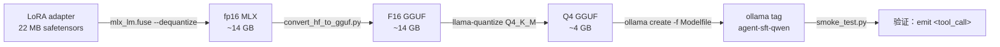

# `agent_sft/deploy/` — Phase 4 部署

把 Phase 3 训出来的 LoRA adapter（[`runs/sweeps/iters/200/`](../train/runs/sweeps/iters/200/)，[`DECISIONS §5`](../DECISIONS.md)）合体进 Qwen2.5-7B 主模型，压成 Q4_K_M GGUF，注册成 Ollama `agent-sft-qwen` tag——Phase 5 复测的入口。

## 三步流程



## 文件清单

|文件|职责|
|---|---|
|`Modelfile`|Ollama 配方；与 `ollama show --modelfile qwen2.5:7b` 1:1 复刻 TEMPLATE，仅改 `FROM` 指本地 q4 gguf|
|`build.sh`|step 1-3 串起来：`mlx_lm.fuse` → `convert_hf_to_gguf.py` → `llama-quantize`；幂等（已存在跳过，`--force` 覆盖）|
|`deploy.sh`|step 4：`ollama create agent-sft-qwen -f Modelfile`；幂等（已存在 tag 先 `rm`）|
|`smoke_test.py`|step 5：直接调 Ollama HTTP API `/api/chat`，断言输出含 `<tool_call>` 块|
|`build/`|gitignored；中间产物 + 最终 GGUF（~18 GB 总）|

## 起步命令

```bash
# 一次性：装 llama.cpp（含 build/bin/llama-quantize + convert_hf_to_gguf.py 用 venv）
mkdir -p ~/Tools && cd ~/Tools
git clone --depth 1 https://github.com/ggerganov/llama.cpp.git && cd llama.cpp
cmake -B build -DGGML_METAL=ON -DLLAMA_CURL=OFF \
      -DLLAMA_BUILD_TESTS=OFF -DLLAMA_BUILD_EXAMPLES=OFF -DLLAMA_BUILD_SERVER=OFF
cmake --build build --config Release --target llama-quantize -j 8
python3 -m venv .venv && .venv/bin/pip install -r requirements/requirements-convert_hf_to_gguf.txt

# 装训练侧依赖（含 mlx_lm.fuse）
cd /Users/anning/Documents/ai_workshops
pip install -r play/agent_sft/requirements.txt

# 三步部署
cd play/agent_sft/deploy
bash build.sh        # ~6-10 min，产 build/agent-sft-qwen-q4.gguf
bash deploy.sh       # ~30 s，注册 ollama tag
python smoke_test.py # ~10 s，验证 emit <tool_call>
```

## 行业对位

|维度|本目录|对位|
|---|---|---|
|fuse 路径|`mlx_lm.fuse --dequantize` 先回 HF 安全张量|MLX-LM 官方推荐的"跨工具链"出口（`--export-gguf` 直出 GGUF 是次新功能，对 tokenizer 元数据兼容性不及 llama.cpp 路径）|
|GGUF 转换|`convert_hf_to_gguf.py`（llama.cpp 仓库自带）|llama.cpp / ollama / lm-studio / koboldcpp 全生态事实标准|
|量化等级 Q4_K_M|与 Ollama 内置 `qwen2.5:7b` 完全一致|社区主流（4 GB 文件大小 + perplexity 损失 < 1%，参数说明见 [GGUF/GGML quantization formats](https://github.com/ggerganov/llama.cpp/discussions/2094)）|
|Modelfile|1:1 复刻 qwen2.5:7b TEMPLATE|Ollama 函数调用解析对 `<tool_call>` 块的识别依赖 TEMPLATE；自写 template 一字之差 → tool_call event 不触发|

## 常见问题

|症状|可能原因|对策|
|---|---|---|
|`build.sh` step 1 报 "model not found"|`mlx_lm.fuse` 找不到 4-bit 底座，触发 HF 下载|首次跑会自动下；如果网络受限，先 `huggingface-cli download mlx-community/Qwen2.5-7B-Instruct-4bit`|
|`build.sh` step 2 `gguf` 模块缺失|系统 Python 与 llama.cpp `.venv` 不一致|确认 `$LLAMA_CPP_DIR/.venv/bin/python` 存在 + 装过 `requirements-convert_hf_to_gguf.txt`|
|`build.sh` step 3 `llama-quantize: command not found`|`llama-quantize` 二进制路径环变未指向 llama.cpp build|默认 `$HOME/Tools/llama.cpp/build/bin/llama-quantize`；可 `LLAMA_CPP_DIR=... bash build.sh` 覆盖|
|`smoke_test.py` 不返回 `<tool_call>` 块|Modelfile TEMPLATE 偏离 qwen2.5:7b|`diff <(ollama show --modelfile qwen2.5:7b) <(ollama show --modelfile agent-sft-qwen)`，必须 TEMPLATE 块逐字相同|
|`smoke_test.py` 报 "cannot reach ollama"|Ollama 进程没起|`ollama serve` 起后端；或检查 `OLLAMA_HOST` 环变|

## 不在 Phase 4 范围

|项|去向|
|---|---|
|`evals` 端到端 `nudge_fire_rate` 三组对比 (base / SFT / 32B)|**Phase 5** 主线 — 本目录仅交付"能跑"，不交付"跑得好"|
|`layers` / `rank` sweep 补做|Phase 3.5 候选（[`DECISIONS §5`](../DECISIONS.md) 触发条件）|
|多量化等级对比 (Q5_K_M / Q8_0)|YAGNI——Q4_K_M 与 baseline 对齐已是 Phase 5 公平对比的最小集|
|HF Hub 公开发布|v3-B 候选（[`README.md`](../README.md) §v1/v2/v3）|
