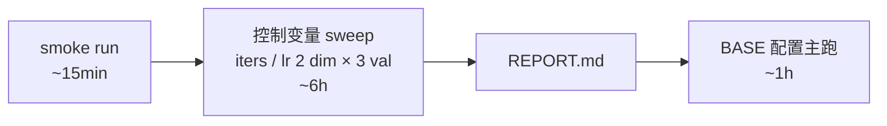

# `agent_sft/train/` — Phase 3 LoRA 训练

QLoRA 微调 Qwen2.5-7B-Instruct 4-bit，用 [`data/triples/train_*_1k.jsonl`](../data/triples/) 的 OpenAI `tools` 格式数据（[`DECISIONS §4`](../DECISIONS.md)），目标降 nudge-fire rate.

## 一行流程



> 计划过 4 dim（iters / lr / **layers / rank**），实际只跑了前 2 dim：fast proxy 4 项指标在 baseline 配置上即 100%（[`runs/sweeps/REPORT.md`](runs/sweeps/REPORT.md)），任务过简单，layers/rank sweep 推迟到"Phase 5 真测 gap 关闭率 < 50%"触发——见 [`DECISIONS §5`](../DECISIONS.md)。Phase 5 实测 gap 关闭 57.3% 未触发，sweep 不再扩（[`DECISIONS §9`](../DECISIONS.md)）。

## 文件清单

|文件|职责|
|---|---|
|`lora_config.yaml`|LoRA 结构定义（rank / scale / dropout / target keys）；CLI flag 不能传的字段|
|`train.py`|单次训练 thin wrapper：`mlx_lm.lora --train --mask-prompt ...` + log 解析 + `train_metrics.json`|
|`eval_smoke.py`|训完轻量验证：val set 生成 → 解析 `<tool_call>` 块 → 4 项指标 → `eval_smoke.json`|
|`sweep.py`|控制变量法 sweep：克隆 [`play/sft_hello/sweep.py`](../../sft_hello/sweep.py) 骨架，最多 4 dim × 3-4 值（v1 仅跑 iters / lr），产 `runs/sweeps/REPORT.md`|
|`runs/sweeps/`|v1 sweep 实验证据（tracked，~150 KB metadata + `iters/200/adapters.safetensors` 22 MB 即 v1 上线 adapter 本体，[`deploy/build.sh`](../deploy/build.sh) 引用）|
|`runs/<其他>`|一次性 / smoke / overnight 主跑产物（gitignored，未来 v2 用）|

## 行业对位

|维度|本目录配置|对位|
|---|---|---|
|数据 schema|OpenAI `tool_calls` JSON-string + 顶层 `tools`|xLAM / ToolACE / Hermes-Function-Calling / [MLX-LM `tools` format](https://github.com/ml-explore/mlx-lm/blob/main/mlx_lm/LORA.md)|
|loss masking|`--mask-prompt`（assistant-only loss）|[TRL PR #5522](https://github.com/huggingface/trl/pull/5522) Qwen2.5 训练 template 同思想|
|LoRA target keys|q/k/v/o 全 attention proj|Hermes-Function-Calling V3 / Watt-Tool 实战配置|
|底座|`mlx-community/Qwen2.5-7B-Instruct-4bit`|HF 社区主流（QLoRA Q4 ≈ 4GB，48GB 余量充足）|
|adapter 产物|HF safetensors|MLX-LM 默认；TRL / Unsloth 全兼容（[`DECISIONS §2`](../DECISIONS.md) 可移植性声明）|

## 起步命令

```bash
# 装训练侧依赖
pip install -r ../requirements.txt

# 1. smoke：~15 min 打通管线，验 loss 下降 + tool_call_emit_rate 不离谱
python train.py \
  --data ../data/triples/  --train-file train_7b_1k.jsonl --valid-file val_7b_1k.jsonl \
  --iters 100 --batch-size 4 --learning-rate 1e-4 --num-layers 16 \
  --adapter-path runs/smoke

python eval_smoke.py --adapter-path runs/smoke --valid-file ../data/triples/val_7b_1k.jsonl

# 2. sweep：v1 实际只跑 iters / lr（layers / rank 推迟，触发条件见 DECISIONS §5 / §9）
python sweep.py iters lr

# 3. 看报告
$EDITOR runs/sweeps/REPORT.md
```

## 不在 Phase 3 范围

|项|去向|
|---|---|
|`mlx_lm.fuse` / GGUF 转换 / `ollama create`|Phase 4（[`README.md` §七阶段](../README.md)）|
|端到端 nudge-fire-rate eval（agent_engine 多轮）|Phase 5 复测；`eval_smoke.py` 是它的 fast proxy|
|14B 升级 / DPO / on-policy distill|v2/v3 候选，触发条件见 [`README.md`](../README.md) §v1/v2/v3|
