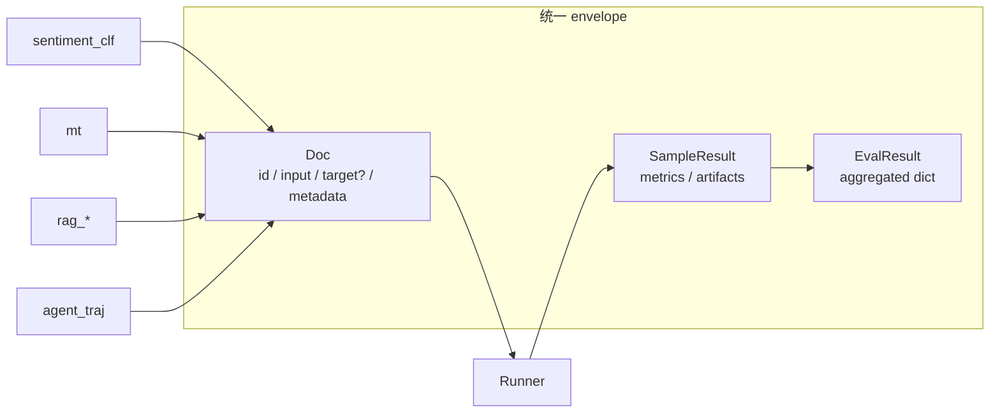
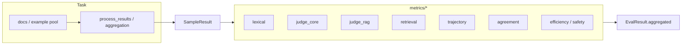
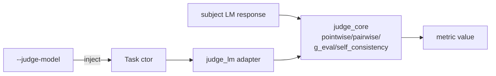
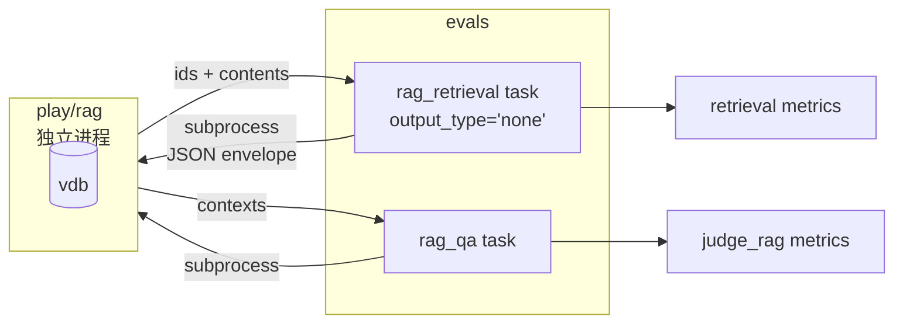
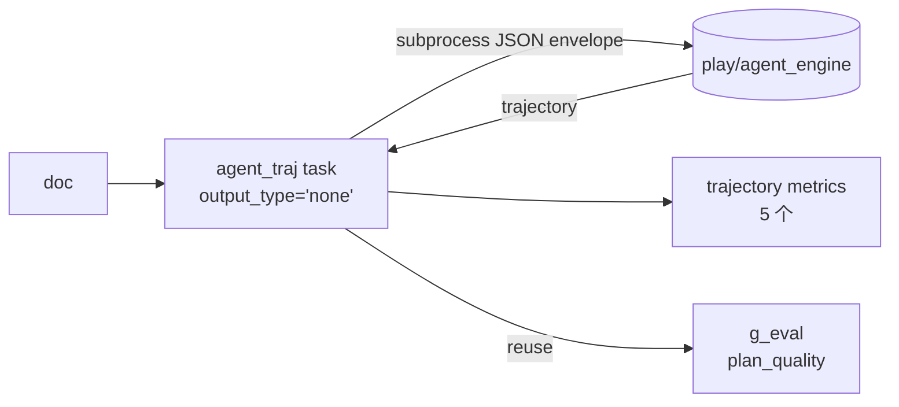
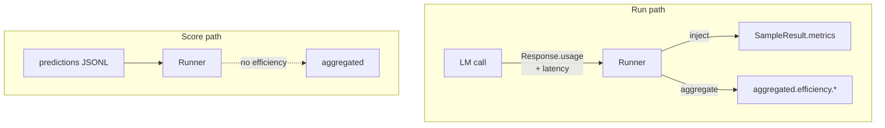
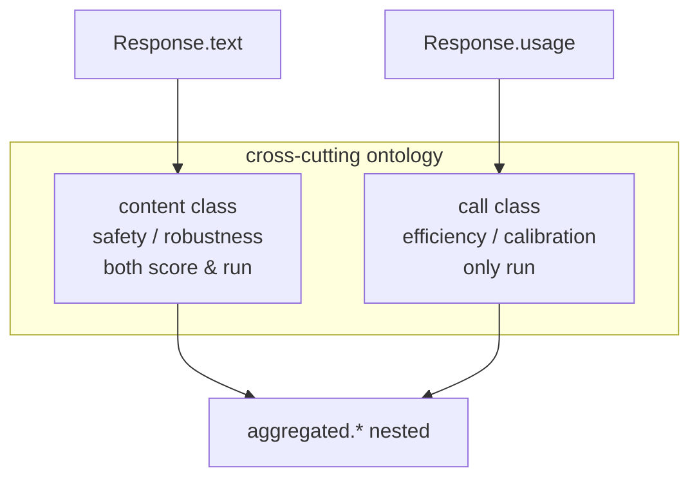
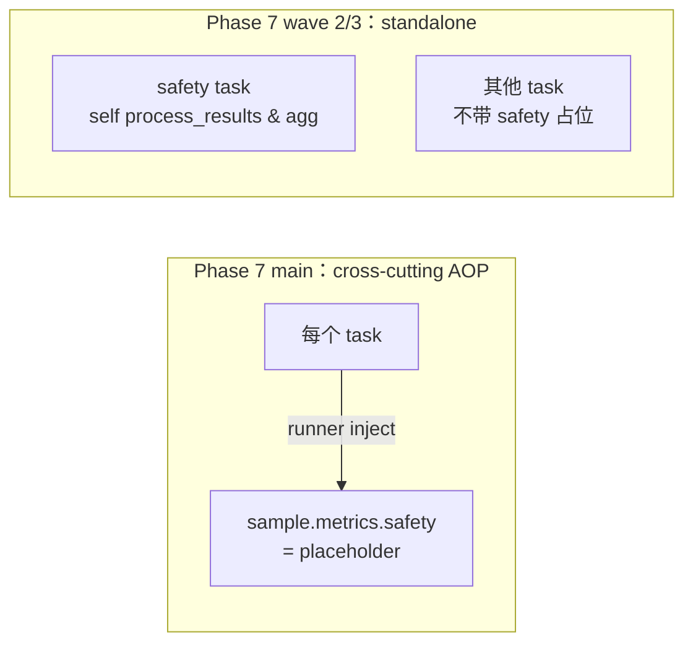
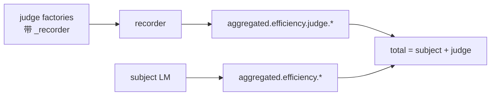
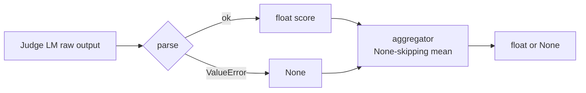

# Decisions

> 记录标准：只保留对后续架构演进、评测可靠性、成本治理、面试问答有持续价值的决策。  
> 删除标准：一次性排障过程、可从代码/commit 直接还原的实现流水、重复 supersession 细节。  
> 日期以 git commit 历史为准。

## 1. Phase 1：评测对象采用统一 envelope 合约（Doc / SampleResult / EvalResult）

- **Date**: 2026-05-02

### Context

`evals` 同时覆盖分类、生成、RAG、Agent trajectory。若每类任务各自定义输入输出，runner / metrics / 存储就会沿着任务数线性分叉，几个 phase 之后维护代价会不可控。

### Options considered

|Option|说明|优点|风险/成本|
|---|---|---|---|
|A. 每任务自定义结构|任务内部完全自治|上手快|跨任务复用差，回归难|
|B. 统一 envelope + 任务层解释|底层字段稳定，任务做语义映射|可复用、可审计|前期抽象成本更高|

### Decision

采用 **B**：`Doc` / `SampleResult` / `EvalResult` 是唯一运行时契约，任务只做映射与校验；后续 phase 的扩展全部走“向上加字段、向下不破坏旧解析”的方式（如 phase 4 把 `Doc.target` 放宽为 `str | None`、加 `SampleResult.artifacts`；phase 6 把 `aggregated` 放宽为 `dict[str, Any]`）。

### Consequences

|影响|结果|
|---|---|
|扩展性|新增任务主要改 task/metric，runner 基本不动|
|一致性|跨任务指标与日志字段可横向对比|
|迁移成本|后续跨项目（如 `agent_engine`）对接更稳定|

### 示例

|场景|在该决策下如何处理|
|---|---|
|新增 `rag_retrieval` 任务|`Doc.target=None`，结果挂在 `SampleResult.artifacts`，runner 不改|
|接入 `agent_engine` 轨迹数据|envelope 字段映射后直接复用现有评测流水线|

### 面试官可能问

|问题|回答要点|
|---|---|
|为什么不直接每个任务一套？|短期快，长期会形成 N 套执行框架；统一契约让扩展成本可控|
|统一会不会牺牲灵活性？|灵活性放到任务解释层（`load_prediction` / `process_docs`），不放到执行层|

## 2. Phase 2：评测架构采用“task producer + metric consumer”

- **Date**: 2026-05-02

### Context

早期实现把“任务逻辑 + 指标计算”混在一起，做同任务多指标或同指标跨任务都很别扭。few-shot 的引入也需要任务暴露 example pool 给 runner，再次确认必须把“任务”和“指标”的职责分开。

### Options considered

|Option|说明|优点|风险/成本|
|---|---|---|---|
|A. 任务内直接算指标|代码集中|开发快|指标耦合任务，不可组合|
|B. 任务产中间结果，指标独立消费|显式中间层|高复用、易测试|需要稳定中间契约|

### Decision

采用 **B**：任务只产 `SampleResult`（含 `metrics` 与 `artifacts`），指标作为独立函数 / 模块消费；few-shot 装配交给 runner 而不是任务自己实现。

### Consequences

|影响|结果|
|---|---|
|演进效率|新增指标无需改任务主流程|
|质量保障|指标可以独立单测和回归|
|可观测性|任务输出与指标输出可分别排障|

### 示例

|场景|在该决策下如何处理|
|---|---|
|给 mt task 新增 `bleu`|只实现 metric 并注册，不改 mt task 生成逻辑|
|同一指标复用到 rag task|复用 metric consumer，只做任务输出字段对齐|

### 面试官可能问

|问题|回答要点|
|---|---|
|为什么强调中间层？|它是复用与测试的边界，避免“每次加指标都改任务”|
|会不会过度设计？|多任务评测平台场景下，这个抽象是必要复杂度，不是奢侈品|

## 3. Phase 3：LLM-as-judge 统一到 adapter，judge_lm 通过 ctor 注入

- **Date**: 2026-05-03

### Context

Judge 类指标依赖多后端模型，输出不稳定（缺字段、错格式、空 token）。如果每个 judge 直接调模型，重试、解析、成本统计会沿不同代码路径长出多个版本。

### Options considered

|Option|说明|优点|风险/成本|
|---|---|---|---|
|A. 各指标自由调模型|实现直接|灵活|重复逻辑多，失败行为不可控|
|B. judge adapter 统一封装|调用、重试、解析集中治理|一致性高，易替换|增加一层抽象|

### Decision

采用 **B**：`metrics/judge_core.py` 集中 4 种 judge 范式（pointwise / pairwise+swap / g_eval / self_consistency）；judge_lm 通过任务 ctor 注入，score / run 自动复用同一判官；不引新 ABC、不破坏 Task 签名。

### Consequences

|影响|结果|
|---|---|
|一致性|不同 judge 指标共享同一失败策略和统计口径|
|可替换性|模型后端切换改动面小（phase 8 wave 4 已用上）|
|可运营性|token / cost / latency 采集更标准（phase 6 / 7 wave 3 直接接续）|

### 示例

|场景|在该决策下如何处理|
|---|---|
|从 `ollama` 切到云端 API|主要改 judge adapter，不动指标业务逻辑|
|新增重试策略|在 adapter 统一实现，所有 judge 指标自动继承|

### 面试官可能问

|问题|回答要点|
|---|---|
|为什么不每个指标自由调？|自由调用会导致同类问题在多处重复修|
|adapter 的核心价值？|把 LLM 不确定性约束在边界层，业务层保持确定性|

## 4. Phase 4：RAG 拆成 retrieval + grounding 双 task；envelope 顺势扩 artifacts / 钩子

- **Date**: 2026-05-03

### Context

RAG 失效有两层根因：召回不到、生成不对齐。只给一个总分既无法定位瓶颈，也会让“检索改善”和“生成改善”互相遮蔽。同期还要解决：检索任务没有 string gold（强塞空串污染语义）、检索结果是 list（不能塞进 scalar metrics）、纯检索任务不该走 LM 生成。

### Options considered

|Option|说明|优点|风险/成本|
|---|---|---|---|
|A. 单一 RAG 总分|展示简单|对外直观|诊断能力差|
|B. retrieval / grounding 分层|根因分离|可诊断、可优化|指标解释更复杂|

### Decision

采用 **B**：分层评测 + envelope 扩展三件套：`Doc.target: str | None`、`SampleResult.artifacts: dict`、`output_type='none'` + `load_prediction` / `process_docs` 钩子；同步立下 monorepo 解耦原则——evals 不直接 import `play/rag`，通过 subprocess + JSON envelope 对接。

### Consequences

|影响|结果|
|---|---|
|定位速度|可快速判断“召回问题”还是“对齐问题”|
|优化效率|检索和生成可独立迭代|
|架构副产品|envelope 三件套被 phase 5 直接复用，零再设计|

### 示例

|场景|在该决策下如何处理|
|---|---|
|`retrieval_recall` 下降、`grounding` 稳定|优先排查向量索引和召回参数|
|`retrieval` 稳定、`grounding` 下降|优先排查生成 prompt 或答案约束策略|

### 面试官可能问

|问题|回答要点|
|---|---|
|为什么不只看最终正确率？|最终正确率无法指导具体改哪一层|
|为什么 evals 不直接 import rag？|跨子项目要解耦：保持 import 边界，跨进程用 envelope|

## 5. Phase 5：Agent 评测“轨迹优先，结果补充”，零 ABC 改动

- **Date**: 2026-05-04

### Context

Agent 场景里“答案对”不等于“行为可上线”。更进一步，phase 4 已经给出 `output_type='none'` + `process_docs` + envelope 三件套，agent 评测如果再扩 ABC 就是过度抽象。

### Options considered

|Option|说明|优点|风险/成本|
|---|---|---|---|
|A. 只评 final answer|实现简单|展示直观|忽略行为风险|
|B. trajectory + final，复用 phase 4 三件套|无新 ABC，零 runner 改动|与 phase 4 形态一致|教学叙事更复杂|
|C. trajectory + final，引入新 ABC（如 `process_trajectory`）|结构更显式|过度抽象|长期维护成本高|

### Decision

采用 **B**：通过 subprocess 启动 `play/agent_engine`，envelope 写回 `Doc.metadata.trajectory`；指标侧用闭包工厂；`plan_quality` 直接复用 `g_eval`，不重复实现 LLM 评估范式。

### Consequences

|影响|结果|
|---|---|
|风险识别|可发现“结果正确但过程危险”样本|
|架构稳定|没有为 agent 单独引入 ABC，phase 4 形态复用一遍|
|跨项目协作|与 `agent_engine` 的对接形态可被未来其他子项目继续复用|

### 示例

|场景|在该决策下如何处理|
|---|---|
|最终答案正确但调用了危险工具|final 指标通过，trajectory 风险指标触发告警|
|答案错误但轨迹接近正确|保留过程评分，用于策略微调而非全盘推翻|

### 面试官可能问

|问题|回答要点|
|---|---|
|为什么要评过程？|Agent 的核心价值和风险都在过程，不只在终局文本|
|为什么不为 agent 引新 ABC？|phase 4 已给出通用形态，复用比重新抽象更可靠|

## 6. Phase 6：Efficiency 作为 cross-cutting，runner 自动注入；run 路径独占

- **Date**: 2026-05-04

### Context

成本与时延是评测落地约束。如果让每个任务自己采集，会出现 N 套口径；如果在 score 路径也写效率，分数就成了“没有 LM 调用也能伪造”的伪指标。

### Options considered

|Option|说明|优点|风险/成本|
|---|---|---|---|
|A. 任务自己采集|结构简单|实现自由|口径不一致，账单不可信|
|B. runner 全程注入，含 score 路径|看板统一|实现轻|score 路径无 LM 调用却也带效率值，语义错|
|C. runner 注入 + run 路径独占 + 三层组织|信息完整、口径一致|实现复杂度中等|需要明确 sample / run / metric 三层关系|

### Decision

采用 **C**：runner 自动注入 per-sample latency / usage；`aggregated["efficiency"]` 子组只在 run 模式挂出；价格表 + 成本计算集中在 `metrics/efficiency.py`；CLI 走 dot-path 渲染。

### Consequences

|影响|结果|
|---|---|
|预算治理|可从全局到单样本逐级定位|
|语义诚实|score 路径不写 efficiency，避免“没调用也有时延”的伪数据|
|后续扩展|phase 7 的 ontology 二分直接以此为先验|

### 示例

|场景|在该决策下如何处理|
|---|---|
|run 成本上涨但平均 sample 稳定|定位到少量 metric 级调用暴涨，而非整体退化|
|p95 时延恶化|先查 sample 长尾，再下钻到具体 metric 调用链|

### 面试官可能问

|问题|回答要点|
|---|---|
|为什么不让任务自己采？|任务自采会导致 N 套口径，账单不可比|
|score 路径为什么不写效率？|没有 LM 调用就没有真实的成本，写出来就是假数据|

## 7. Phase 7：cross-cutting ontology 采用 content vs call 二分

- **Date**: 2026-05-05

### Context

phase 6 上线 efficiency 后，phase 7 又要上 safety。两个都是“跨任务”，但性质不同：efficiency 来自 LM 调用副产物，safety 来自 `Response.text` 的内容评估。如果不在 ontology 上分清楚，会出现“safety 强行注入到所有任务” / “efficiency 注入到 score 路径”这类语义错配。

### Options considered

|Option|说明|优点|风险/成本|
|---|---|---|---|
|A. 全部当 cross-cutting，统一 AOP|形式统一|易做看板|语义失真，phase 7 wave 2 实测被推翻|
|B. content class vs call class 二分|按来源分类|可解释、可治理|需要持续维护命名规范|

### Decision

采用 **B**：

|class|出处|何时采集|代表指标|
|---|---|---|---|
|content|`Response.text` 衍生|score 与 run 都可|safety / robustness|
|call|LM 调用副产物|仅 run|efficiency / calibration|

`SampleResult.metrics` 同步统一为 nested 形态：`dict[str, float \| dict[str, float]]`。

### Consequences

|影响|结果|
|---|---|
|语义清晰|score 路径不写 efficiency 不再是“事后让步”而是“显式原则”|
|演进性|后续要加 robustness / calibration 时归位明确|
|看板设计|nested 形态给 CLI / 报表提供稳定 schema|

### 示例

|场景|在该决策下如何处理|
|---|---|
|新增 robustness 指标|挂到 content class，score 路径也能算|
|想给 score 路径加 cost|直接被 ontology 拒绝，避免假数据|

### 面试官可能问

|问题|回答要点|
|---|---|
|为什么要做 ontology？|指标数量上涨后必须有归位规则，否则命名失控|
|二分够用吗？|当前够用，必要时可在 quality 下扩子层级|

## 8. Phase 7 wave 2/3：Safety 从 cross-cutting AOP 回归 standalone task

- **Date**: 2026-05-05（supersedes phase 7 §7.A “content class cross-cutting” 主原则的注入部分；仍保留 ontology 二分）

### Context

phase 7 主 commit 把 safety 当 content class cross-cutting AOP 注入到所有任务。7 阶段真实 ollama live audit 暴露两个问题：非 safety 任务被迫携带 `metrics["safety"]={0,0}` 占位，对 sample 输出污染；safety 语义在不同任务下含义不同，跨任务统一打分语义失真。

### Options considered

|Option|说明|优点|风险/成本|
|---|---|---|---|
|A. 全局 cross-cutting AOP（旧）|展示统一|形式整齐|语义失真、占位污染|
|B. 给 AOP 加“是否启用”闸门|保留统一架构|可控|架构未变，问题只是延后|
|C. 完全撤回 AOP，safety 回归 standalone task|与 lm-eval / HELM / inspect_ai 主流一致|可解释、零占位|需要重写 safety 任务侧 process_results / aggregation|

### Decision

采用 **C**：删除 `inject_per_sample_safety` / `safety_aggregated` / FOLD trait；safety 任务自管 `process_results` + `aggregation`；非 safety 任务彻底不再背 `metrics["safety"]` 占位。ontology 二分仍然保留，作为新原则的命名先验。

### Consequences

|影响|结果|
|---|---|
|数据质量|sample.metrics 不再背异类占位|
|治理成本|safety 语义按场景独立迭代|
|外部可比性|与 lm-eval / HELM / inspect_ai 的主流体例对齐|

### 示例

|场景|在该决策下如何处理|
|---|---|
|摘要任务出现“低安全分”争议|改用该任务专属 safety 规则，避免沿用通用规则误判|
|客服任务需要新增敏感词策略|只更新 safety task 配置，不影响其他任务主指标|

### 面试官可能问

|问题|回答要点|
|---|---|
|为什么放弃统一横切？|统一是手段，不是目标；语义正确优先|
|为什么不加闸门保留 AOP？|那只是把问题延后，架构上仍是错的|

## 9. Phase 7 wave 3：保留 `efficiency.judge.*` 子组，分离判官开销

- **Date**: 2026-05-05

### Context

判官 LM 调用是 evaluation-tool call，与被评模型（subject LM）的业务调用语义不同。phase 6 把它们混在 `efficiency.*` 一起统计，导致优化时常被误导（“总成本上涨”实为判官变贵）。

### Options considered

|Option|说明|优点|风险/成本|
|---|---|---|---|
|A. 合并到统一 efficiency|结构简单|易读|无法区分成本来源|
|B. 单独 `efficiency.judge.*` 子组|显式区分判官开销|治理更精确|指标树更深|

### Decision

采用 **B**：通过 `closure recorder` 协议（judge factory 暴露 `_recorder`，self_consistency 透传），让所有 judge 工厂共享同一记录器；runner 在 score 与 run 两条路径都挂出 `aggregated["efficiency"]["judge"]`；CLI fold 协议下沉到 nested 层。

### Consequences

|影响|结果|
|---|---|
|账单可分|`total = efficiency.cost_usd + efficiency.judge.cost_usd`|
|优化正确性|避免把判官成本当业务成本优化|
|实验设计|可单独做“是否启用 judge”的 ROI 评估|

### 示例

|场景|在该决策下如何处理|
|---|---|
|总成本上升 20%|先看 `efficiency.judge.cost_usd` 是否主导增长|
|要压预算但保留主指标|先下调 judge 调用频率，不立即削减业务评测样本|

### 面试官可能问

|问题|回答要点|
|---|---|
|为什么单独拆 judge 成本？|否则优化会指向错误层，ROI 判断失真|
|这属性能优化还是产品决策？|两者都有：先做技术分层，再支持产品权衡|

## 10. Phase 8：IAA 双 task（nominal + ordinal），零 ABC 改动复用 phase 4 形态

- **Date**: 2026-05-05

### Context

只看 nominal kappa 在偏斜分布下会失真（kappa paradox），单一指标无法解释模型/标注质量真实情况。但同时，IAA 任务也是“是否要再扩 ABC”的诱惑点（多 rater 看起来像新数据形态）。

### Options considered

|Option|说明|优点|风险/成本|
|---|---|---|---|
|A. 仅 nominal|实现简单|沟通成本低|偏斜分布下不稳健|
|B. nominal + ordinal 双路径，并扩 ABC 支持多 rater|结构最清晰|过度抽象|多一层 ABC 维护成本|
|C. nominal + ordinal 双路径，复用 phase 4 现有 schema|双视角 + 零 ABC 改动|实现紧凑|教学叙事需要明确读数规则|

### Decision

采用 **C**：predictions JSONL 多一列 `raters: list`，复用 `load_prediction` 钩子；指标手算控制在 4 个公式（`scott_pi` / `gwet_ac1` / `lins_ccc` / `icc_1_1`），其余库直调放进 task aggregation；不引 irrCAC / pingouin 等依赖膨胀。

### Consequences

|影响|结果|
|---|---|
|统计稳健性|可在偏斜数据上互相校验，避免单指标误读|
|架构稳定|API / Task ABC / runner / CLI 一行不改|
|教学价值|kappa paradox + ordinal 救场可作为对外讲解锚点|

### 示例

|场景|在该决策下如何处理|
|---|---|
|`constant_majority` 在 90/10 数据上 acc=0.9|同步看 cohens_kappa=0、gwet_ac1≈0.89，避免误判模型“不错”|
|`off_by_one` 预测|nominal kappa 失真，看 quadratic kappa / pearson / ccc 兜住|

### 面试官可能问

|问题|回答要点|
|---|---|
|为什么不坚持一个统一指标？|单指标在复杂分布下会误导决策|
|为什么不扩 ABC 支持多 rater？|phase 4 schema 已经够，扩 ABC 只是为整齐而整齐|

## 11. Phase 8 hardening：storage 全量 `allow_nan=False`，task 三件套兜底

- **Date**: 2026-05-05

### Context

NaN/Inf 会让 `json.dumps` 默认输出 `NaN` 字面量，jq / 浏览器 / DB / 仪表盘消费都会坏掉，且会污染 `runs/index.jsonl` 这类 cross-run 索引。同时 sklearn / scipy / krippendorff 在退化输入（pos_label 缺席、unique<2、N<2）下会 raise 或返回 NaN。

### Options considered

|Option|说明|优点|风险/成本|
|---|---|---|---|
|A. 让 NaN 自然写盘|实现简单|不报错|结果文件非合法 JSON，下游消费随机失败|
|B. fail-loud：storage 拒 NaN/Inf 写盘 + task 内退化路径短路|出问题就地暴露|可靠|task 侧需补 helper|

### Decision

采用 **B**：`storage.py` 三处 `json.dumps` 全部 `allow_nan=False`；task 内补 `_pos_label_present` / `_nan_to_zero` / unique<2 短路 / N<2 短路；`--limit 0/1/2` 退化路径锁回归。

### Consequences

|影响|结果|
|---|---|
|结果可靠性|`runs/<id>/*.json` 与 `index.jsonl` 永远是合法 JSON|
|失败可定位|有 NaN 不再静默扩散，立即就地报错|
|跨环境稳定|小 limit / 边界数据不再让整轮 evaluate 崩|

### 示例

|场景|在该决策下如何处理|
|---|---|
|未来新 task 漏算 NaN|`storage.save()` 立刻 ValueError，而非污染索引|
|jq 读 result.json|严格合法 JSON，工具链不破|

### 面试官可能问

|问题|回答要点|
|---|---|
|为什么不让 NaN 默认通过？|JSON 标准不允许 NaN 字面量，下游消费会随机坏|
|这是过度防御吗？|这是契约边界检查，比事后排障便宜得多|

## 12. Phase 8 wave 3：OOV / invalid prediction 进入显式数据契约

- **Date**: 2026-05-05

### Context

sklearn `cohen_kappa_score(..., labels=[1..5])` 会静默丢掉 OOV 预测，导致 mixed-invalid run 出现假 `cohens_kappa=1.0`。如果不显式表达异常预测，评测结果就处于“看起来稳但实际是被吞掉”的危险状态。

### Options considered

|Option|说明|优点|风险/成本|
|---|---|---|---|
|A. 隐式忽略|实现简单|报表干净|可审计性差、结果失真|
|B. 显式 `_pred_invalid: bool` artifact + valid subset filter|契约清晰|可追溯、可解释|看板需要并读两个数|

### Decision

采用 **B**：在 `SampleResult.artifacts` 写入 `_pred_invalid: bool`，对 OOV 敏感的指标只看 valid 子集；accuracy / confusion_matrix / 多 rater 仍按全量统计，N 稳定保留教学叙事；CLI 同时呈现主分数与 invalid 占比。

### Consequences

|影响|结果|
|---|---|
|可信度|评测分数和异常样本比例可同时解释|
|治理能力|可针对异常分布制定专项修复|
|审计性|边界样本处理过程可追溯|

### 示例

|场景|在该决策下如何处理|
|---|---|
|新模型上线后 OOV 暴涨|优先排查标签映射和输出规范，而非只看主分数|
|主分数持平但 invalid 上升|判定为质量风险，阻止直接上线|

### 面试官可能问

|问题|回答要点|
|---|---|
|为什么不把异常值过滤掉？|过滤会美化结果但损失真实性|
|如何避免异常样本主导结论？|分层展示：主分数 + 异常占比并读|

## 13. Phase 8 wave 4 E1：Judge closure 解析失败 → `None` propagation

- **Date**: 2026-05-05

### Context

phase 1-8 全量真实 LM 测试在 `agent_traj` score+judge garbage.jsonl 路径触发 `ValueError`：`parse_pointwise_score` 在 LM 输出无 int 时 raise，judge_pointwise / g_eval 两个 closure 没捕获，~140s 工作量丢失。这种行为与 phase 7 wave 2 已经立的 “None vs 0 语义分离”原则冲突。

### Options considered

|Option|说明|优点|风险/成本|
|---|---|---|---|
|A. fail-fast 抛异常|错误暴露快|排障直观|整轮评测可用性差|
|B. 失败传播为 `None` + warning|主流程持续可运行|鲁棒性高|`SampleResult.metrics` 类型需放宽到 `float \| None`|

### Decision

采用 **B**：判官 closure 层 `try/except ValueError → None`；aggregator 自然过滤 None，全空时返回 None；与 phase 7 wave 2 P2 同形扩展（从“切片为空”扩到“解析失败”）。

### Consequences

|影响|结果|
|---|---|
|可用性|单点解析失败不再中断整轮 run|
|可解释性|warning + None 仍可定位失败原因|
|数据契约|下游统计必须显式处理缺失值|

### 示例

|场景|在该决策下如何处理|
|---|---|
|判官输出缺少预期 JSON 字段|该样本指标 = `None`，run 继续，warning 记录|
|批量评测中 5% 样本解析失败|aggregator 返回有效均值并独立暴露 `null_rate`|

### 面试官可能问

|问题|回答要点|
|---|---|
|为何不 fail-fast？|评测平台优先保证整轮信号完整，再对局部失败做可审计降级|
|会不会隐藏问题？|不会，warning 和 None 都被显式记录|

## 14. Phase 8 wave 4 E2：依赖边界显式声明（evals/requirements.txt 覆盖 rag subprocess deps）

- **Date**: 2026-05-05

### Context

phase 4 立的 monorepo 解耦原则是“Python import 边界”：evals 不 `from rag import ...`。但 evals 通过 subprocess 调 `play/rag/query.py` 时，子进程仍然需要 chromadb / rank-bm25 / tokenizers / sentence-transformers。这是 “pip install 边界”，与 “import 边界” 正交，不应被混为一谈。

### Options considered

|Option|说明|优点|风险/成本|
|---|---|---|---|
|A. 让 rag 子进程惰性 import|看起来减依赖|不解决问题（1.2GB cross-encoder 是 `_model()` 首次调用时 load，与 import 时机正交）|两条 onboarding 命令|
|B. evals/requirements.txt 显式覆盖 subprocess deps|0 行代码改动|onboarding 一条 pip install|两个 requirements 短期冗余|

### Decision

采用 **B**：在 `evals/requirements.txt` 末尾追加 4 行；`rag/requirements.txt` 仍是 rag 独立用法的真值源；触发条件（第三个子项目复用）满足时再抽 `requirements/common.txt`。

### Consequences

|影响|结果|
|---|---|
|可复现性|fresh checkout 一次安装可跑|
|架构契约|Python import 边界保持，pip install 边界单独治理|
|演进路径|短期接受冗余，长期有明确抽公共项的触发条件|

### 示例

|场景|在该决策下如何处理|
|---|---|
|开发机可跑、CI 失败|先核对 `evals/requirements.txt` 是否覆盖子进程依赖|
|新增第三个子项目复用 rag|抽 `requirements/common.txt`，触发条件已显式登记|

### 面试官可能问

|问题|回答要点|
|---|---|
|这算不算“文档性工作”？|它是可复现性的基础工程，不是纯文档|
|为什么放进 ADR？|依赖边界是长期工程决策，不是临时修补|

## 非目标（持续有效）

|项|说明|
|---|---|
|追求一次性完美评测体系|优先可扩展、可诊断、可运营|
|在 ADR 记录实现流水|ADR 只保留高杠杆决策与后果|
|为了统一牺牲语义准确性|统一是手段，语义正确是底线|
|让单一分数承载全部真相|保留分层与异常信号，避免过度压缩信息|
