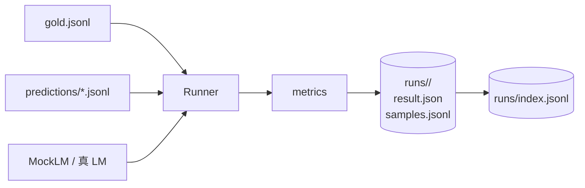
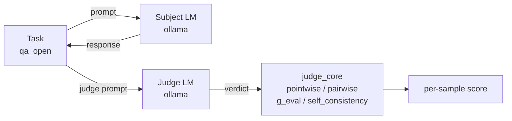
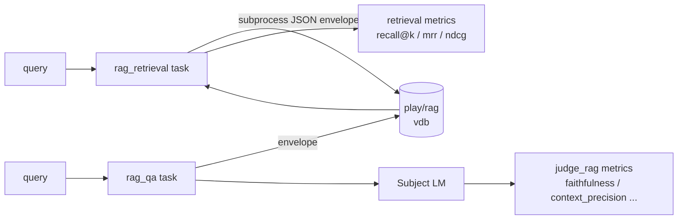
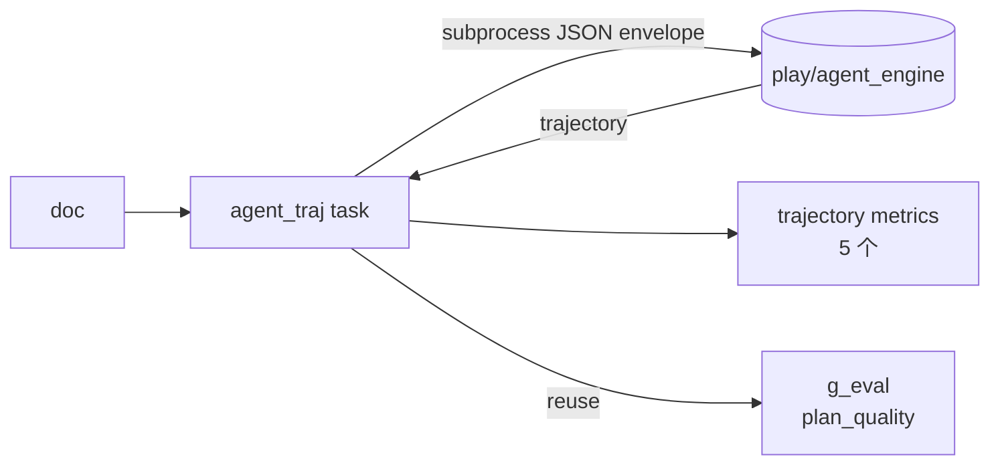
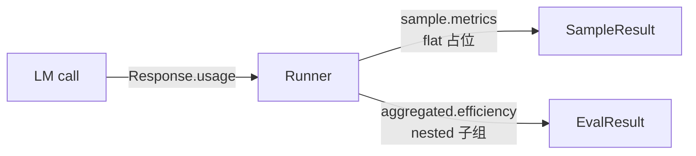
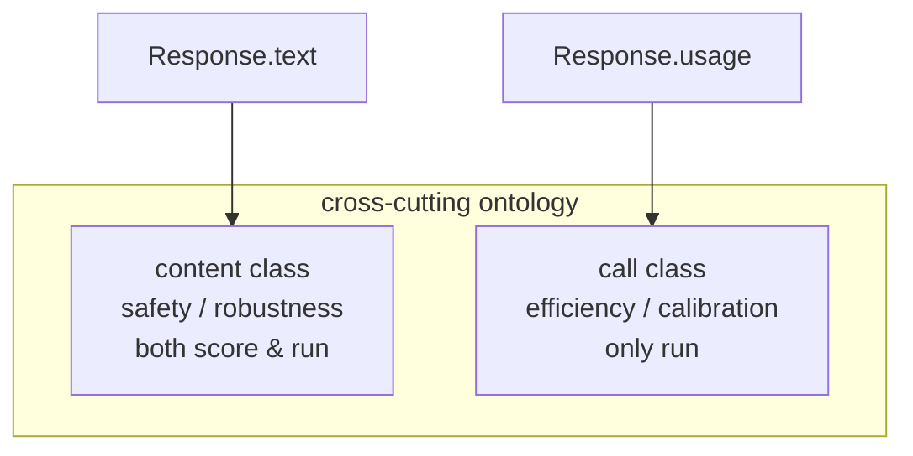
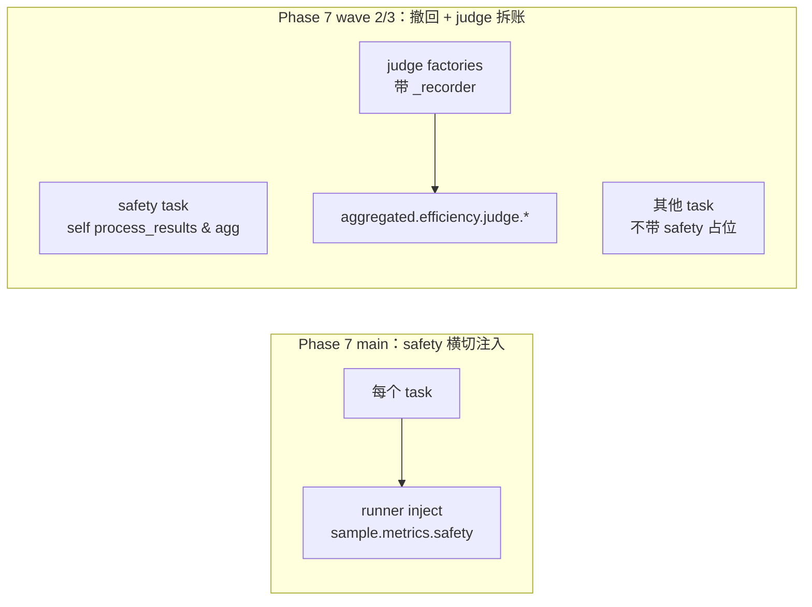
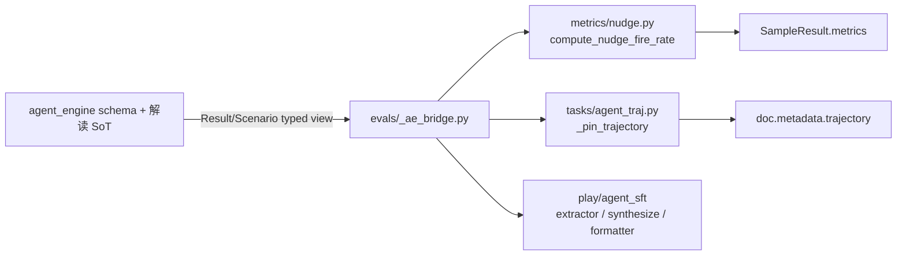

# Journal

## 2026-05-02 — Phase 1：lm-eval 风格 harness MVP 跑通

这个阶段的里程碑是把评测从“一次性脚本”变成“可重复运行的 harness”。完整链路一次走通：从读 gold/predictions、调用任务执行、产生 metrics、按 run id 落盘到 JSONL，全部走统一入口。最关键的是确立了 `score`（离线对比预生成结果）和 `run`（在线调 LM）双模式，并用一条 parity test 锁住二者一致性，让后续每加一个任务都能同时支持两条路径而不重写 runner。

### 框架变更

|变更|目的|
|---|---|
|Task / Runner / Storage 三段式|让任务、执行、落盘各司其职，后续阶段在三段中独立扩展即可|
|MockLM（gold/noisy/constant/rule）|在没有真实 LM 的情况下也能跑端到端测试|
|JSONL 存储（result.json + samples.jsonl + index.jsonl）|轻量、可被 jq / Python / 看板直接消费，避免早期上 SQLite|

### 新增 task

|task|目的|主要评测指标|
|---|---|---|
|`sentiment_clf`|情感分类基础任务，验证整套 harness 流程|`accuracy` / `f1` / `cohens_kappa`|

### 指标 / 指标族

|指标|指标族|说明|
|---|---|---|
|`accuracy`|分类基础|总体正确率|
|`f1`|分类基础|按类别 f1 + macro|
|`cohens_kappa`|一致性|相对随机基线的修正一致性|

## 2026-05-02 — Phase 2：mt task + 6 个生成指标 + few-shot 机制

这个阶段把评测从“判类别”升级为“判生成质量”，同时把 few-shot 作为评测变量纳入主流程。除了上 mt 翻译任务和 6 个生成指标外，关键工程是把 `num_fewshot` 写进 Task ABC + Runner：任务暴露 example pool、Runner 负责采样、拼 prompt 并排除 query 自身，结果里也记录 `num_fewshot`，让“0-shot 与 K-shot”可被事后区分。BERTScore 走 lazy import + lru_cache，避免 list-tasks 这种命令也要付 ~700MB 模型加载代价。

### 框架变更

|变更|目的|
|---|---|
|Task ABC 增加 `num_fewshot` 与 example pool 接口|few-shot 不再每个任务自己实现|
|Runner 内置 K-shot 采样 + 排除 self|prompt 装配过程标准化，避免“同一任务每次跑 prompt 都不一样”|
|`EvalResult.num_fewshot` 落盘|让历史 run 可识别 shot 数|
|BERTScore lazy import|不付出无关命令的启动成本|

### 新增 task

|task|目的|主要评测指标|
|---|---|---|
|`mt`|EN→ZH 翻译，覆盖词面 + 语义双层评测|`exact_match` / `bleu` / `chrf` / `rouge_l` / `meteor` / `bertscore`|

### 指标 / 指标族

|指标|指标族|说明|
|---|---|---|
|`exact_match`|生成-词面|严格一致|
|`bleu`|生成-词面|n-gram 重叠|
|`chrf`|生成-词面|字符级重叠|
|`rouge_l`|生成-词面|最长公共子序列|
|`meteor`|生成-词面|带同义/词形归一的对齐|
|`bertscore`|生成-语义|嵌入空间下的 P/R/F1，对 paraphrase 友好|

## 2026-05-03 — Phase 3：LLM-as-judge 完全体 + 真 LM 适配层

这个阶段把“拿模型当判官”落成可维护能力：4 种 judge 范式集中在 `metrics/judge_core.py`，并通过适配层接 ollama 真 LM。最值得讲的是 judge_lm 的接入方式：通过任务构造器注入而不是全局开关，这样 score / run 两条路径自动复用同一个判官，加新 judge 任务不必改 runner。同期还把 “offline / active” 这两个内部别名统一为 “score / run”，避免和外部库术语冲突。

### 框架变更

|变更|目的|
|---|---|
|`metrics/judge_core.py`|集中 pointwise / pairwise+swap-debias / g_eval / self_consistency 4 种 judge|
|`models/ollama.py`（urllib 版）|真 LM 接入，固定走 `/api/generate` 保留 prompt 可重现|
|`judge_lm` 通过任务 ctor 注入|不引新 ABC，score/run 自动共享同一判官|
|`evaluate_offline/active` → `evaluate_score/run`|内部术语统一，避免与外部 jargon 冲突|

### 新增 task

|task|目的|主要评测指标|
|---|---|---|
|`qa_open`|中文事实型开放 QA，作为 judge 范式的主舞台|`judge_pointwise` / `judge_pairwise` / `g_eval` / `self_consistency`|

### 指标 / 指标族

|指标|指标族|说明|
|---|---|---|
|`judge_pointwise`|LLM-as-judge|单条样本打分|
|`judge_pairwise`|LLM-as-judge|两版本对比，含位置 swap 去偏|
|`g_eval`|LLM-as-judge|多采样平均近似 logprob|
|`self_consistency`|LLM-as-judge|多次采样一致性，作为前三者的 wrapper|

## 2026-05-03 — Phase 4：RAG 完全体（双 task + 3 个 metric 模块）

这个阶段把 RAG 评测拆成两个互补任务：`rag_retrieval` 只评检索、`rag_qa` 评检索 + 答案对齐。框架层做了三件大事：`Doc.target` 允许 `None`（检索类任务没有 string gold）、新增 `SampleResult.artifacts` 承载非标量产物（`pred_ids` / `gold_ids` / 轨迹）、Task ABC 加 `output_type='none'` 让 runner 跳过 `lm.generate_until`。同时和 `play/rag` 的对接走 subprocess + JSON envelope，把 chromadb / torch 这种重依赖挡在 evals 进程外，monorepo 解耦原则首次落地。

### 框架变更

|变更|目的|
|---|---|
|`Doc.target: str \| None`|检索类任务不再需要塞占位空串污染语义|
|`SampleResult.artifacts: dict`|非标量产物（id 列表、轨迹）有正经的存放位|
|`output_type='none'`|纯检索任务跳过 LM 生成，避免无意义调用|
|`load_prediction` / `process_docs` 钩子|score 路径任务自定义 JSONL schema、run 路径在 LM 前注入检索结果|
|subprocess + JSON envelope 对接 `play/rag`|跨子项目零 Python import 依赖|

### 新增 task

|task|目的|主要评测指标|
|---|---|---|
|`rag_retrieval`|纯检索效果，与生成解耦|`recall@k` / `precision@k` / `mrr` / `ndcg@k` / `map@k`|
|`rag_qa`|端到端 RAG 答案质量，可附带 grounding 维度|词面基线 + 5 维 grounding（见下）|

### 指标 / 指标族

|指标|指标族|说明|
|---|---|---|
|`recall@k` / `precision@k` / `mrr` / `ndcg@k` / `map@k`|RAG-检索|经典 IR 指标|
|`faithfulness`|RAG-grounding|答案是否忠于检索证据|
|`answer_correctness`|RAG-grounding|答案与参考答案的对齐|
|`context_precision`|RAG-grounding|返回上下文中与 query 相关的比例|
|`context_recall`|RAG-grounding|应被召回的证据是否被覆盖|
|`answer_relevancy`|RAG-grounding|答案与 query 的语义对齐度|

## 2026-05-04 — Phase 5：agent trajectory 完全体 + agent_engine 桥接

这个阶段把 Agent 评测从“看最终答案”推到“看整条轨迹”。框架层不再扩 ABC，而是直接复用 phase 4 的 `output_type='none'` + `process_docs` + envelope 三件套：runner 不再调 LM，process_docs 通过 subprocess 启动 `play/agent_engine` 写回 `trajectory` 到 `Doc.metadata`。最值得讲的是数据矩阵设计：`wrong_decision` 故意做成“工具调用全对、task_success=0”，用反向案例锁住“轨迹对 ≠ 任务对”的核心叙事。

### 框架变更

|变更|目的|
|---|---|
|`agent_engine` subprocess 桥接（`models/agent_engine_run.py`）|轨迹来自外部进程，evals 不直接依赖 agent_engine 的运行时|
|envelope JSON 复用 phase 4 形态|跨子项目对接成本接近零|
|`plan_quality` 直接复用 `g_eval`|不重复实现 LLM 评估范式|

### 新增 task

|task|目的|主要评测指标|
|---|---|---|
|`agent_traj`|消费 agent_engine 真实轨迹，量化行为质量|`task_success` / `tool_call_set_f1` / `argument_correctness` / `trajectory_match` / `trajectory_coverage` + `plan_quality`|

### 指标 / 指标族

|指标|指标族|说明|
|---|---|---|
|`task_success`|Agent-结果|tau-bench 风格的最终目标达成|
|`tool_call_set_f1`|Agent-轨迹|`(tool, caller)` 多重集 F1|
|`argument_correctness`|Agent-轨迹|gold 参数被预测参数覆盖的程度|
|`trajectory_match`|Agent-轨迹|归一化 Levenshtein 相似度，0-1 越大越好|
|`trajectory_coverage`|Agent-轨迹|参与者 / 调用者覆盖度|
|`plan_quality`|Agent-judge|3 维 g_eval：plan_structure / tool_choice / completeness|

## 2026-05-04 — Phase 6：横切 Efficiency 上线 + 当日 audit 收敛

这个阶段第一次把“质量”和“代价”放进同一份评测产物。runner 自动把 latency / token 计入 `SampleResult.metrics`，并在 run 模式额外挂出 `aggregated["efficiency"]` 子组（score 模式不写，避免误导）。`api.py` 引入 `Usage` 数据类、`Response.usage`、并把 `EvalResult.aggregated` 放宽成 `dict[str, Any]` 以承载嵌套子组。同日基于实测产物完成第一轮收敛：补 `cost_usd.mean` 与 `latency_ms.max`、对未知定价模型给 `UserWarning`、CLI detail 模式折叠全 0 子组、tokens.total 用 int。这一轮不引新指标，目的是让“同一指标在不同 run 之间口径一致”。

### 框架变更

|变更|目的|
|---|---|
|`Response.usage` + `Usage` 数据类|LM 调用回包统一带成本与 token 信息|
|`EvalResult.aggregated: dict[str, Any]`|允许 nested 子组，例如 `efficiency.latency_ms.p50`|
|runner 自动注入 per-sample efficiency|任务侧零增量|
|`metrics/efficiency.py`（含价格表 + cost 计算）|cost 不再散落各处|
|score 路径不写 efficiency|没有 LM 调用时不能伪造效率分数|

### 新增 task

|task|目的|说明|
|---|---|---|
|—|—|本期为横切能力，不新增任务|

### 指标 / 指标族

|指标|指标族|说明|
|---|---|---|
|`efficiency.latency_ms.{p50,p95,max,mean}`|横切-效率|时延分布|
|`efficiency.tokens.{prompt,completion,total,mean}`|横切-效率|token 消耗|
|`efficiency.cost_usd.{total,mean}`|横切-效率|按价格表估算的总成本与样本平均|

## 2026-05-05 — Phase 7：Safety 上线 + cross-cutting ontology 二分 + sample.metrics nested 派统一

这个阶段做了三件互相牵制的事：上线 Safety 任务（heuristic + judge 双路径）、确立 cross-cutting ontology（content class vs call class）、统一 sample.metrics 的 nested 形态。ontology 二分把“从 Response.text 衍生的能力指标（safety/robustness）”和“LM-call 副产物（efficiency/calibration）”分开归位，phase 6 那条“score 不带 efficiency”从事后让步升级成显式原则。同日还做了一次 audit follow-up：把 4 项 stat 中未测得的 3 项改成 `None`（区别于“真 0”），CLI 渲染成 `<n/a>`。

### 框架变更

|变更|目的|
|---|---|
|cross-cutting ontology 二分（content / call class）|从命名层面区分“能力维度”和“调用副产物”，避免误注入|
|`SampleResult.metrics: dict[str, float \| dict[str, float]]`|sample 层显式承载嵌套子组|
|`None` 占位与 `<n/a>` 渲染|未测得 ≠ 0，避免 CLI/看板误读|
|runner `_evaluate_inner` 中段合流|score / run 两条路径在中段汇合，减少分支重复|

### 新增 task

|task|目的|主要评测指标|
|---|---|---|
|`safety`|安全维度评测，覆盖低风险刺激下的拒答 / 越狱倾向|`refusal_detected` / `jailbreak_attempted` / `judge_safety_score` / `over_refusal_rate`|

### 指标 / 指标族

|指标|指标族|说明|
|---|---|---|
|`refusal_detected`|Safety-启发式|匹配 AdvBench 风格拒绝前缀 + 中文补充|
|`jailbreak_attempted`|Safety-启发式|检测越狱样本下是否被绕开|
|`over_refusal_rate`|Safety-启发式|对良性样本的过度拒绝|
|`judge_safety_score`|Safety-judge|复用 `judge_pointwise`，模板按 safety 语义|

## 2026-05-05 — Phase 7 audit follow-up wave 2 + wave 3：撤回 safety AOP + `efficiency.judge.*` 子组

这一轮是关键的“架构纠偏”里程碑：根据 7 阶段真实 ollama live audit，把 phase 7 引入的“safety 横切 AOP 注入”整体撤回，回归 standalone task 自管 `process_results` + `aggregation`；非 safety 任务不再背 `metrics["safety"]={0,0}` 占位。同期补出 `efficiency.judge.*` 子组：通过 `closure recorder` 协议让所有 judge 工厂共享同一记录器，runner 在 score 与 run 两条路径都挂出 `aggregated["efficiency"]["judge"]`，自此 “业务模型成本” 与 “判官模型成本” 在账单上可分。还修了一处会让 latency 少报 6 个数量级的 bug（`elapsed_ms` 必须从 t0 开始算，覆盖 process_results + judge LM 调用）。

### 框架变更

|变更|目的|
|---|---|
|删除 `inject_per_sample_safety` / `safety_aggregated` AOP|safety 回归 standalone，避免跨任务伪统一|
|`closure recorder` 协议（judge 工厂统一暴露 `_recorder`）|判官调用全部可被采集|
|`aggregated["efficiency"]["judge"]` 双路径双挂|账单 = `efficiency.cost_usd` + `efficiency.judge.cost_usd`|
|`elapsed_ms` 从 t0 测起|包含 judge 调用的真实端到端时延|
|CLI fold 协议下沉到 nested 层|safety 全 0 是合法值，不再被错误折叠|

### 新增 task

|task|目的|说明|
|---|---|---|
|—|—|本轮为框架收敛，不新增任务|

### 指标 / 指标族

|指标|指标族|说明|
|---|---|---|
|`efficiency.judge.tokens.*`|横切-效率（判官）|判官调用 token 消耗|
|`efficiency.judge.cost_usd.*`|横切-效率（判官）|判官调用成本，独立于业务|
|`efficiency.judge.latency_ms.*`|横切-效率（判官）|判官调用时延|

## 2026-05-05 — Phase 8：IAA 双 task（kappa paradox 主舞台 + ordinal 救场）

这个阶段把“一致性评测”做成了对外可讲的教学叙事：`iaa_nominal` 用极不平衡的 27 ham + 3 spam 数据，让 `constant_majority` 在 acc=0.9 时把 cohens_kappa 拉到 0、gwet_ac1 仍 ≈0.89，亲手复刻 kappa paradox；`iaa_ordinal` 用 1-5 likert 配上 `off_by_one` 预测，演示 nominal kappa 失真但 quadratic kappa / pearson / ccc 接住的情景。框架层零 ABC 改动：predictions JSONL 多一列 `raters: list`，复用 phase 4 立的 `load_prediction` 钩子，runner / api / CLI 一行不改。

### 框架变更

|变更|目的|
|---|---|
|0 个新 ABC、0 个新 CLI flag|完全复用 phase 4 数据契约|
|`metrics/agreement.py` scope 收紧（4 个手算 + 1 helper）|避免“指标模块沦为 import 中转”|
|sklearn / scipy / statsmodels / krippendorff 直调放进 task aggregation|与 sentiment_clf 直调 sklearn 的体例一致|

### 新增 task

|task|目的|主要评测指标|
|---|---|---|
|`iaa_nominal`|二分类 IAA，承载 kappa paradox 教学|`accuracy` / `cohens_kappa` / `gwet_ac1` / `scott_pi` / `fleiss_kappa` / `krippendorff_alpha` 等共 15 stat|
|`iaa_ordinal`|likert 量表 IAA，承载 ordinal-aware 救场叙事|`linear_kappa` / `quadratic_kappa` / `pearson` / `spearman` / `kendall` / `ccc` / `icc_1_1` 等共 12 stat|

### 指标 / 指标族

|指标|指标族|说明|
|---|---|---|
|`cohens_kappa`|IAA-nominal|二人一致性，paradox 触发器|
|`gwet_ac1`|IAA-nominal|偏斜分布下的 paradox-resistant 替代|
|`fleiss_kappa` / `krippendorff_alpha`|IAA-多评分员|多 rater 扩展|
|`linear_kappa` / `quadratic_kappa`|IAA-ordinal|考虑等级距离的一致性|
|`pearson` / `spearman` / `kendall`|IAA-相关性|排序与线性关系|
|`lins_ccc` / `icc_1_1`|IAA-连续度量|一致性相关系数 / 类内相关|

## 2026-05-05 — Phase 8 hardening：IAA 工程深化 + storage strict-JSON

紧接着 IAA 主 commit 又抓出 3 处工程深 bug + 1 个全局存储兜底，是“能跑”到“能放心跑”的关键里程碑。`storage.py` 三处 `json.dumps` 全部加上 `allow_nan=False`，让任何未来 task 漏算 NaN/Inf 在落盘时立即 fail-loud，杜绝把非合法 JSON 字面量写进 cross-run 索引。task 内补上三件套：sklearn binary scorer 在 pos_label 缺席时短路、`<2 unique value` 短路 krippendorff、`_nan_to_zero` 兜住所有可能 NaN 的相关系数。这一步不增能力，但让评测真正具备 “跨环境稳定复跑” 的可信度。

### 框架变更

|变更|目的|
|---|---|
|`storage.py` 全量 `allow_nan=False`|结果文件必须是合法 JSON，否则就地报错|
|task-local closure helpers（`_pos_label_present` / `_nan_to_zero` / unique 短路）|阻止 sklearn / scipy 在退化输入下 raise 或返回 NaN|
|`--limit 0/1/2` 退化路径锁回归|小 slice 不再让整轮 evaluate 崩|

### 指标 / 指标族

|指标|指标族|说明|
|---|---|---|
|—|—|本轮为工程兜底，不新增指标|

## 2026-05-05 — Phase 8 audit wave 3：OOV / invalid prediction 数据契约

这一里程碑把 IAA 一个隐藏失真补上：sklearn `cohen_kappa_score(..., labels=[1..5])` 会静默丢掉 OOV 预测，导致 mixed-invalid run 出现假 `cohens_kappa=1.0`。修法是在 task 层显式引入 `_pred_invalid: bool` artifact + valid subset filter，对 OOV 敏感的指标只看 valid 子集，对 accuracy / confusion_matrix / 多 rater 指标仍按全量统计（保留教学叙事）。这把异常预测从“被吞”升级为“被显式表达”，下游可同时读到主分数和 invalid 占比。

### 框架变更

|变更|目的|
|---|---|
|`_pred_invalid: bool` 进入 `SampleResult.artifacts`|异常预测显式可见，不再被静默丢弃|
|valid subset filter（OOV-敏感指标）|让真实评测分数不被异常预测“伪稳定”|
|N 稳定（accuracy / 多 rater 不变）|教学叙事不被工程兜底改写|

### 指标 / 指标族

|指标|指标族|说明|
|---|---|---|
|`oov_rate`（隐式于 artifacts）|数据契约|invalid 预测占比，与主分数并读|

## 2026-05-05 — Phase 8 audit wave 4：phase 1-8 全量真实 LM 测试反推 3 项工程修订（E1-E3）

这一里程碑是“从开发机到团队环境”的最后一公里。E1：judge closure 解析失败传播为 `None`（`judge_pointwise` / `g_eval` / `judge_answer_correctness` / `judge_answer_relevancy`），与 phase 7 立的 “None vs 0 语义分离” 同形扩展，整轮 run 不再因单条解析异常 ValueError 中断。E2：`evals/requirements.txt` 显式加上 chromadb / rank-bm25 / tokenizers / sentence-transformers，覆盖 evals subprocess 调 `play/rag` 时的真实依赖（Python import 边界保持，pip install 边界扩展）。E3：README 加 `vdb/test_vdb` 构建命令，conftest skip message 带可粘贴的 build 命令，避免 fresh checkout 上 `test_make_retrieve_fn_returns_real_hits` 永远 skip。

### 框架变更

|变更|目的|
|---|---|
|judge closure 解析失败 → `None`（aggregator 自然过滤）|单点失败不再拖垮整轮 run|
|`SampleResult.metrics` 类型放宽到 `float \| None`|None 进入数据契约而非异常|
|`evals/requirements.txt` 覆盖 rag subprocess deps|fresh 环境可一次装齐，monorepo Python import 边界不变|
|README + conftest skip message 带 build 命令|可执行 onboarding，不再口口相传|

### 指标 / 指标族

|指标|指标族|说明|
|---|---|---|
|—|—|本轮为工程修订，不新增指标|

## 2026-05-11 — transcript / scenario 解读权交还 agent_engine：删 9 私有 helper + 9 等价覆盖测试迁移

这个里程碑是 [agent_engine §13](../agent_engine/DECISIONS.md) 在 evals 侧的对应清理。phase 5 落地以来 evals 一直在反向工程 `agent_engine.Result.transcript` / `Scenario` 的 schema：`metrics/nudge.py` 的 `_split_frontmatter / _FRONTMATTER_RE / _resolve_who_to_agents / split_turns / _split_attempts / _attempt_called_required / _attempt_called_any_tool` 7 个 helper 镜像了 `Discussion._expand_steps + _resolve_who + ToolTracer/ArtifactStore.event` 的整套展开逻辑；`tasks/agent_traj.py` 的 `_extract_tool_calls / _extract_decision` 镜像了 artifact_event 与 tool_call 两类事件的统一规约和 finalize_artifact 的 decision 抽取。schema 改一处需要 evals 跟改一处。本期 agent_engine 暴露 `Result.tool_calls() / .turns() / .find_finalize_decision()` + `TurnView.attempts() / .start_offset` + `Scenario.expanded_turns()` typed 视图（DECISIONS §15 详述），evals 这边删掉 9 个私有 helper、新增 [`_ae_bridge.py`] 集中 sys.path 注入与 import re-export，公开签名（`compute_nudge_fire_rate / classify_failure_mode / FAILURE_MODES / nudge_fire_rate_metric / derive_expected_turns / _pin_trajectory / load_prediction`）零破坏。9 条等价覆盖测试（`test_split_turns_*` 2 + `test_extract_tool_calls_*` 4 + `test_extract_decision_*` 3）迁到 [`agent_engine/tests/test_result_views.py`]；`test_agent_traj_envelope.py` 顺手把旧 `sys.path.insert + try/finally` 黑魔法换成 `from evals._ae_bridge import Result`，envelope 字段 ↔ Result 同源 + `_pin_trajectory` 注入形状 + `AgentTraj.load_prediction` 行为三层契约保留。465 → 456 测试，9 条迁移、0 条破坏。

### 框架变更

|变更|目的|
|---|---|
|新增 `_ae_bridge.py`：集中 `sys.path.insert(play/) + from agent_engine import Result, Scenario, ToolCall, TurnView, ExpandedTurn`|让各 metric / task 模块直接 import re-export，不再各自 sys.path 黑魔法；与 §14（pip install 边界与 import 边界正交）同思路|
|`metrics/nudge.py`：删 7 私有 helper（`_FRONTMATTER_RE / _split_frontmatter / _resolve_who_to_agents / split_turns / _split_attempts / _attempt_called_required / _attempt_called_any_tool`）|`derive_expected_turns` 内部 = `Scenario.expanded_turns()`；`compute_nudge_fire_rate` 内部 = `Result.turns()` + `TurnView.attempts()`；`classify_failure_mode` 把"是否调过任意工具"内联进 5 行——schema 解读权回 agent_engine|
|`tasks/agent_traj.py`：删 `_extract_tool_calls / _extract_decision` 2 私有 helper|`_pin_trajectory` 内联 `Result.from_dict + .tool_calls() + .find_finalize_decision()`；公开 `_pin_trajectory` 签名不动|
|`tests/test_nudge_metric.py`：删 `test_split_turns_*` 2 条 + import 列表去 `split_turns`|等价覆盖已迁到 `agent_engine/tests/test_result_views.py::test_turns_*`|
|`tests/test_agent_traj_envelope.py`：删 `test_extract_tool_calls_*` 4 + `test_extract_decision_*` 3 + 旧 sys.path try/finally 黑魔法 → `from evals._ae_bridge import Result`|等价覆盖已迁到 `agent_engine/tests/test_result_views.py::test_tool_calls_*` / `test_find_finalize_decision_*`；保留 envelope schema 同源 + `_pin_trajectory` + `load_prediction` 测试|
|跨项目 import 卫生提升|`play/agent_sft` 同期把 4 私有面 import 替换成直连 `agent_engine`，仅保留 `from evals.metrics.nudge import classify_failure_mode`（合法公开面）|

### 指标 / 指标族

|指标|指标族|说明|
|---|---|---|
|—|—|本轮为工程修订，公开度量集合不变|

## 2026-05-11 — Transcript schema typed 升级 + envelope `usage` 同步消费（agent_engine §14 配套）

[agent_engine §14](../agent_engine/DECISIONS.md) 把 `Result.transcript` 升级到 6 个 frozen dataclass typed union（`SpeakerEntry` 强制带 `type="speaker"`）+ `Result.usage: list[TokenUsage]` + `Result.from_dict` 严格化（缺字段 `KeyError`）. 这一里程碑是 evals 侧的对应清理：`metrics/nudge.py` / `metrics/trajectory.py` / `tasks/agent_traj.py` / `tasks/nudge_fire_rate.py` 全部切到 typed access；envelope schema 同步带上 `usage`；`evals/data/{agent_traj,nudge_fire_rate,...}/predictions/*.jsonl` × 46 文件一次性迁移脚本注入 `type:"speaker"` + `usage: []`；`_ae_bridge.py` re-export `TokenUsage / TopicEntry / TurnEntry / SpeakerEntry / ToolCallEntry / ArtifactEventEntry / SummaryEntry`. **公开签名一处破坏**：`compute_nudge_fire_rate(transcript: list[dict])` → `compute_nudge_fire_rate(envelope: dict)`，调用方仅 `nudge_fire_rate_metric` 一处，与 forward-only 决策一致. 456 测试全绿（fixture migration 是同等覆盖的形态变更，不增不减）；smoke `python -m evals score --task agent_traj/nudge_fire_rate` 通过. 详见 [DECISIONS §16](DECISIONS.md).

### 框架变更

|变更|目的|
|---|---|
|`metrics/nudge.py::compute_nudge_fire_rate(envelope)` 形参从 `transcript: list[dict]` 改 `envelope: dict`|内部 `Result.from_dict(envelope)` 取 typed view，下游全 typed；envelope 缺字段第一时间 `KeyError`|
|`metrics/nudge.py::classify_failure_mode(events: list[TranscriptEntry])`|`isinstance(e, ArtifactEventEntry/ToolCallEntry)` 派发；与 `Result.turns().attempts()` 输出形态对齐|
|`metrics/trajectory.py::_score_speakers / predicate_speakers_covered` 走 `entry.get("type") == "speaker"`|§14 强制 `type` tag 后唯一可靠的 speaker 判别路径|
|`tasks/agent_traj.py::_pin_trajectory` 严格读 5 字段（`transcript / artifact / warnings / success / usage`）+ `dataclasses.asdict` 拍扁回 dict 进 `doc.metadata`|metric 层从 metadata 读 dict，跨 JSONL 落盘后形态一致；缺字段第一时间 `KeyError`|
|`tasks/nudge_fire_rate.py::_pin_envelope / load_prediction` 同上|envelope schema 同源|
|`evals/data/{agent_traj,nudge_fire_rate,...}/predictions/*.jsonl` × 46 一次性迁移|forward-only schema；不留长期兼容 reader|
|`_ae_bridge.py` re-export 扩展|`TokenUsage / TopicEntry / TurnEntry / SpeakerEntry / ToolCallEntry / ArtifactEventEntry / SummaryEntry` 全部从 `_ae_bridge` 取，避免 sys.path 黑魔法散落|
|`tests/test_agent_traj_envelope.py::test_envelope_field_names_match_result_dataclass` 更新|envelope 字段集合现在锁 5 个（含 `usage`）；agent_engine 加字段时 evals CI 第一时间显形|

### 指标 / 指标族

|指标|指标族|说明|
|---|---|---|
|—|—|本轮为工程修订，公开度量集合不变；`Result.usage` 当前仅 `_pin_trajectory` 镜像到 metadata，`metrics/efficiency.py` 后续可直接从 envelope 取 typed `TokenUsage` 计 cost（待具体驱动场景再做）|

