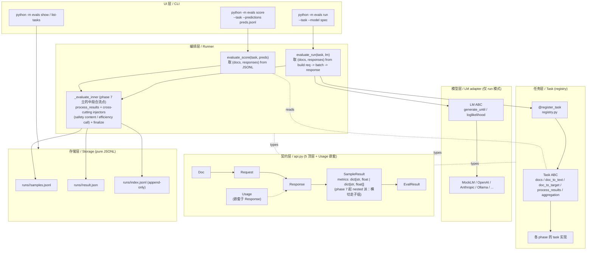

# play/evals

**lm-evaluation-harness 风格的 LLM 评测 harness**，以 Task（dataset + prompt template + process_results + aggregation）为声明式评测单元，按方法学族分 phase 渐进扩展主流指标。

## 特性

- **score / run 双模式一等公民**：共享 aggregation + storage；parity test 焊死"`run mock:X` ≡ `score predictions/X.jsonl`"
- **Task 声明式范式（lm-evaluation-harness 原版）**：一个 Python 类绑定 dataset + prompt template + process_results + aggregation；`@register_task` 登记、CLI 字符串调度
- **契约层居中（`api.py` 5 个顶层 dataclass + 1 个嵌套 `Usage`）**：Task / LM 平级互不 import，全部依赖 `api.py` 词汇表
- **纯 JSONL 存储（刻意 YAGNI）**：`runs/<id>/{result.json, samples.jsonl}` + `runs/index.jsonl`（append-only 扁平索引，schema 和未来可选 SQLite 同构）
- **Metric 按需建**：有成熟库时 task 直调；无库或跨 task 复用时再建 `metrics/X.py`

## 指导原则

贯穿本项目的 5 条原则：

|#|原则|内容|代码层执行|
|---|---|---|---|
|1|**Task 声明式 + lm-eval 原版语义**|paper 可复现优先于 API 新颖|`doc_to_text` 只构造字符串（不触发 LM）；`process_results` per-sample 评分（不做全集统计）；`aggregation` 返回 `{metric_name: fn(list[SampleResult]) -> float}` 负责全集聚合|
|2|**契约层中心化 + 平级能力层**|`api.py` 5 个顶层 dataclass + 嵌套 `Usage` 是唯一词汇表，换任一能力层不碰其它|Task / LM 互不 import，全部依赖 `api.py`|
|3|**Metric 层按需建**|有成熟库时 task 直调；"第一次跨 task 复用"或"无库可用"时再建 `metrics/X.py`，避免为未来预留空壳|—|
|4|**YAGNI over 未来可能需要**|SQLite / 并发 / YAML task 都在"真有需求时再加"列表|append-only JSONL 是持久化 source of truth；SQLite 是未来可选的 read model|
|5|**score / run 双模式一等公民**|共享尾段，parity test 焊死"`run mock:X` ≡ `score predictions/X.jsonl`"|—|

## 架构分层



## 数据流

```
Doc       —— 数据集一行         (Task 产出)
  ↓ doc_to_text
Request   —— LM 调用请求         (run 模式 Runner 构造；score 模式不经过)
  ↓ lm.generate_until / 或 JSONL 查表
Response  —— LM 返回             (run 模式：LM 产；score 模式：Response(text=preds[id]))
  ↓ task.process_results
SampleResult —— 单样本评分       (per-sample metrics：一条能算完的，如 acc=0/1)
  ↓ task.aggregation()
EvalResult —— 整个 run 最终产物  (aggregated：要看全集的，如 f1_macro / kappa)
  ↓ storage.save
runs/<id>/{result.json, samples.jsonl} + runs/index.jsonl
```

## Task 声明式范式（为什么 prompt 和 metric 绑在 task 里）

学术 benchmark 文化：paper 报分数时，**prompt 字面字符串 + 数据集 + metric 三者一起**才算一次可复现的测量。

- Task 拥有 `doc_to_text` 的**字面字符串输出** → prompt 不会被 provider 的 system prompt / chat 模板隐式改写
- Task 拥有 `process_results + aggregation` → 换 prompt 做 A/B 时 metric 不动，换 metric 时 prompt 不动
- 换 LM 时**只换一个对象**，Task 零改动

`@register_task("name")` 装饰器登记 name → 类的映射；import 时副作用触发注册（Django URL / Flask route / pytest fixture 同款模式）。CLI 从字符串直接 `get_task()` 拿实例，不需要 if-else 分派。

## Metric 层策略

没有预留的 metric 抽象层。触发 `metrics/X.py` 重建的两种信号：

1. **跨 task 复用**——同一方法学被 2+ task 调用
2. **无成熟库可调**——方法学本身需要非平凡实现

对应到 roadmap：有库可直调的族（1 / 2 / 4 / 8-agreement / 9）在 task 里直接 import 库；无库或跨 task 复用的族（3 judge / 5 trajectory / 6 / 7 / 10 横切维度）在对应 phase 再建 `metrics/X.py`。

## 主流评测框架对照

|框架|核心抽象|关键特征|本项目关系|
|---|---|---|---|
|**lm-evaluation-harness** (EleutherAI)|Task = dataset + prompt template + process_results + aggregation|LM 暴露 generate_until / loglikelihood / loglikelihood_rolling 三种请求；学术 benchmark 事实标准|**根形状**（Task ABC / LM ABC / Registry / Runner 直接对标）|
|**inspect_ai** (UK AISI)|Task = dataset + solver + scorer|Solver 可以是 agentic pipeline，更 agent-friendly|不采用（solver 抽象对 benchmark 类简单任务过度设计）|
|**OpenAI Evals**|YAML-driven task spec|infra 集成强|不采用（配置驱动耦合重）|
|**deepeval**|metric-first / pytest-like / assert 风|适合塞进 CI|不采用（prompt 散在 test_case 里，task 可复现性弱）|
|**RAGAS**|不是 harness，是**指标库**（dataset-first）|faithfulness / answer_relevancy / context_* / answer_correctness|Phase 4 不直接 import（依赖膨胀，含 langchain/openai 全家桶）；自实现 5 维度对齐 RAGAS 公式（`metrics/judge_rag.py` ~150 行）|
|**HELM** (Stanford)|scenarios + adaptation + **7 维度**|accuracy · calibration · robustness · fairness · bias · toxicity · efficiency|Phase 6-10 的横切维度直接对标（见附录 B）|
|**sacrebleu**|纯文件 scorer（输入：gold + predictions）|机器翻译社区事实标准|`score` 模式的灵感来源——把"非 LM 驱动的文件打分"当一等公民|

**本项目的位置**：lm-eval 架构骨架 + sacrebleu 的纯文件 scoring 哲学 + 学习为主的进阶式扩展。

## Roadmap

|Phase|内容|metric 归属|
|---|---|---|
|1|族 1 MVP slice（classification + agreement）|sklearn 直调|
|2|族 2 lexical + 1 个 embedding 代表（BERTScore）；加 `num_fewshot`；MoverScore 与 learned tier (BLEURT/COMET/BARTScore) deferred|sacrebleu / rouge_score / nltk / bert-score 直调|
|3|族 3 完全体（LLM-as-judge）；真 LM 适配层落地|**建 `metrics/judge_core.py`**（phase 4 由 `metrics/judge.py` 拆分；无库 + 跨 task 复用）|
|4|族 4 完全体（RAG）；接 `play/rag/` subprocess 端到端 + 5 个 grounding 维度|`metrics/retrieval.py`（ranx 直调）+ **建 `metrics/judge_rag.py`**（5 个 RAG judge 维度，自实现以避 ragas 依赖膨胀）|
|5|族 5 完全体（agent trajectory）；接 `play/agent_engine/` subprocess + JSON envelope|**建 `metrics/trajectory.py`**（无库；5 个 closure-factory metric + 手写 Levenshtein DP）+ 复用 `judge_core.g_eval` 装 plan_quality|
|6|横切 Efficiency|**建 `metrics/efficiency.py`**（runner 自动采集 latency / tokens / cost；`Response.usage` 嵌套；`EvalResult.aggregated["efficiency"]` 子组）|
|7|横切 Safety|**建 `metrics/safety.py`**（refusal / jailbreak 判定自写）|
|8|族 1 后半 + 族 1 ↔ 族 3 交叉（kappa paradox 章节）|scipy.stats / krippendorff / statsmodels 直调|
|9|横切 Calibration|sklearn / netcal 直调|
|10|横切 Robustness|**建 `metrics/robustness.py`**（`robustify(task, perturbation)` 装饰器）|

> Phase 6-10 排序依据 schema-cost-first + ROI：efficiency 提到首位是因为它要改 `SampleResult` schema（每多一个落地 task 迁移成本线性涨，是唯一"越拖越贵"的 phase）；safety / κ paradox / calibration 按行业 ROI + 实现成本排；robustness 工作量最大放末位。

## Quickstart

```bash
# 装依赖
pip install -r play/evals/requirements.txt
cd play

# score：读 predictions JSONL 打分（不驱动 LM）
python -m evals score --task <task_name> --predictions <path/to/preds.jsonl>

# run：驱动 LM 跑 prompt
python -m evals run --task <task_name> --model <model_spec>

# run + K-shot：prompt 前拼 K 条 example（lm-eval 风格）
python -m evals run --task <task_name> --model <model_spec> --num-fewshot 2 --fewshot-seed 0

# LLM-as-judge（仅 qa_open；其它 task 给 --judge-model 会 SystemExit）
# run 路径：LM 答题 + LM 评分
python -m evals run --task qa_open --model <model_spec> --judge-model <model_spec>
# score 路径：predictions 文件 + LM 评分（hybrid）
python -m evals score --task qa_open --predictions <preds.jsonl> --judge-model <model_spec>

# 列出已注册任务
python -m evals list-tasks

# 跨 run 对比 / 单 run drill-down
python -m evals show --task <task_name> --last 10
python -m evals show --run-id <run_id> --samples 5

# 跑测试
python -m pytest evals/tests/ -v
```

### Phase 2 mt task：6 指标在 4 份故事化 predictions 上的分叉

```bash
# 跑 4 份 predictions，看 lexical 指标 vs BERTScore 怎么分
for p in perfect literal paraphrase garbage; do
  python -m evals score --task mt --predictions evals/data/mt/predictions/$p.jsonl
done

# 重点看 paraphrase：BLEU 暴跌但 BERTScore 救场（embedding tier 核心故事）
# run parity：mock:gold ≡ predictions/perfect.jsonl
python -m evals run --task mt --model mock:gold
```

> 首次跑 mt 任意一份 predictions 会触发 ~400MB `bert-base-chinese` 下载 + ~3-5s 模型加载；之后缓存。lexical 5 个指标无下载。

### Phase 3 qa_open task：judge 在开放式生成上的双向叙事

```bash
# 起本地 ollama（默认 localhost:11434），拉一个中文能力可用的模型
ollama pull qwen2.5:32b   # 或 :3b / :7b 任意 tag

# run + judge：ollama 既答 qa_open 又当 judge（self-grading），3 个指标全出
python -m evals run --task qa_open \
    --model ollama:qwen2.5:32b \
    --judge-model ollama:qwen2.5:32b \
    --limit 5

# 不传 --judge-model 则只跑 lexical baseline（exact_match + rouge_l）
python -m evals run --task qa_open --model ollama:qwen2.5show:32b --limit 5

# score（lexical only）：演示 lexical 指标在 4 份 stub 上的分歧
for p in perfect paraphrase wrong_fact garbage; do
  python -m evals score --task qa_open --predictions evals/data/qa_open/predictions/$p.jsonl
done

# score + judge（hybrid）：predictions 来自文件，judge 调真 ollama——
# paraphrase / wrong_fact 的反向叙事就在这里出（lexical 失明 vs judge 抓错）
for p in perfect paraphrase wrong_fact garbage; do
  python -m evals score --task qa_open \
      --predictions evals/data/qa_open/predictions/$p.jsonl \
      --judge-model ollama:qwen2.5:32b
done
```

教学叙事（4 份 predictions × {lexical, judge} 矩阵）：

|预测|`exact_match`|`rouge_l`|`judge_pointwise`|故事|
|---|---|---|---|---|
|`perfect`|1.0|~1.0|~5|上界 sanity|
|`paraphrase`|0.0|~0.6|~4|lexical 中等 / judge 高 — judge 救场|
|`wrong_fact`|0.0|~0.9|~1-2|**lexical 误判**（一字之差）/ judge 抓事实错|
|`garbage`|0.0|~0.1|~1|下界 sanity|

`paraphrase` 与 `wrong_fact` 在**对称的两个方向**展示了 judge 优于纯 lexical 的价值：前者 lexical 失明而 judge 救场，后者 lexical 误判而 judge 抓住。

> live 测试 (`tests/test_ollama_lm.py` / `tests/test_qa_open_live.py`) auto-probe `localhost:11434` + 默认测试模型 `qwen2.5:32b`，不可达 / 模型未拉时整文件 skip。`EVALS_TEST_OLLAMA_MODEL` env 可降档提速（如 `qwen2.5:3b`，CI 友好）或升档（`qwen2.5:72b`）；`EVALS_OLLAMA_BASE_URL` 改 endpoint。完整 live suite 实测 24s（M-series Mac, 32b）。
>
> 外部 provider（`openai:` / `anthropic:` / `gemini:`）在 `parse_model_spec` 抛 `NotImplementedError`：架构留口，phase 3 仅 ollama 启用。

### Phase 4 RAG：retrieval-only + end-to-end QA + 5 grounding 维度

phase 4 引入两个 RAG task + 5 个 IR 指标 + 5 个 grounding judge 维度，对接 `play/rag/` 走 **subprocess + JSON envelope**（不 Python import，遵循 monorepo 解耦原则）。

```bash
# 一次性：build VDB（rag_retrieval / rag_qa run 路径用；score 路径无需 VDB）
cd play/rag
python ingest.py --docs docs/panel --output vdb/panel
cd ..

# score：rag_retrieval 4 份 stub predictions（IR 指标阶梯）
for p in perfect good_rerank weak garbage; do
  python -m evals score --task rag_retrieval --predictions evals/data/rag_retrieval/predictions/$p.jsonl
done

# score：rag_qa 4 份 stub predictions（lexical baseline only）
for p in perfect paraphrase wrong_fact garbage; do
  python -m evals score --task rag_qa --predictions evals/data/rag_qa/predictions/$p.jsonl
done

# score + judge：rag_qa hybrid（predictions 读盘 + 真 ollama 算 5 个 grounding 维度）
for p in perfect paraphrase wrong_fact garbage; do
  python -m evals score --task rag_qa \
      --predictions evals/data/rag_qa/predictions/$p.jsonl \
      --judge-model ollama:qwen2.5:32b
done

# run：rag_retrieval e2e（VDB 检索 → 5 个 IR 指标；output_type='none' 跳过 LM 调用）
# 注意：以上所有命令的 cwd 假设为 `play/`，故 VDB 路径写作 `rag/vdb/panel`（不带 `..`）
python -m evals run --task rag_retrieval \
    --vdb rag/vdb/panel --retrieve-mode hybrid --retrieve-top-k 5 --limit 3

# run：rag_qa e2e（VDB 检索 → ollama 答 → 5 个 grounding 维度，judge 也是 ollama）
python -m evals run --task rag_qa \
    --vdb rag/vdb/panel --retrieve-top-k 3 \
    --model ollama:qwen2.5:32b \
    --judge-model ollama:qwen2.5:32b \
    --limit 2

# rerank（首次加载 ~1.2GB cross-encoder；显著提升 precision@k / mrr）
python -m evals run --task rag_retrieval --vdb rag/vdb/panel --rerank --limit 3
```

教学叙事（4 份 rag_qa predictions × {lexical, judge} 矩阵）：

|预测|`exact_match`|`rouge_l`|`faithfulness`|`answer_correctness`|故事|
|---|---|---|---|---|---|
|`perfect`|1.0|~1.0|~1.0|~1.0|上界 sanity|
|`paraphrase`|0.0|mid|~1.0|~1.0|lexical 失明 / judge 救场（**核心叙事**）|
|`wrong_fact`|0.0|高|低|低|lexical 误判 / judge 抓事实错（**反向叙事**）|
|`garbage`|0.0|低|低|低|下界 sanity|

5 个 grounding 维度（`metrics/judge_rag.py`，自实现，对齐 RAGAS 但不依赖）：

|维度|两步分解|含义|
|---|---|---|
|`faithfulness`|① 拆 response claim ② NLI vs contexts|"答的我能在材料里看到"|
|`answer_correctness`|judge 数 TP/FP/FN → F1|事实级正误（看 target）|
|`context_precision`|逐 context judge 'useful?'|top-k 中相关 context 比例|
|`context_recall`|① 拆 target claim ② NLI vs contexts|gold 答案的事实材料覆盖率|
|`answer_relevancy`|1-5 评分|是否在答这个问题（不看 target）|

> live 测试 (`tests/test_rag_live.py`) 走 ollama-probe + vdb-probe 双 gate：缺任一即 skip + 提示。subprocess 单查询 ~2-4s（ollama embed + chromadb 冷启动），所以 e2e 测试用 `--limit 1-2`。

### Phase 5 agent_traj：3 docs × 4 stubs 故事矩阵 + 接 `play/agent_engine/`

phase 5 引入单 task `agent_traj` + 5 个 trajectory metric + 跨项目接 `play/agent_engine/` 走 **subprocess + JSON envelope**（同源 phase 4 RAG 决策，遵循 monorepo 解耦）。3 个 scenario × 4 份 stub predictions = 12 sample 教学矩阵。

```bash
# score：4 份 stub × 3 docs 矩阵（核心教学路径，秒级，无 LM 调用）
for p in perfect partial wrong_decision garbage; do
  python -m evals score --task agent_traj \
      --predictions evals/data/agent_traj/predictions/$p.jsonl
done

# score + judge：plan_quality 维度（复用 G-Eval 三维度 plan_structure/tool_choice/completeness）
for p in perfect partial wrong_decision garbage; do
  python -m evals score --task agent_traj \
      --predictions evals/data/agent_traj/predictions/$p.jsonl \
      --judge-model ollama:qwen2.5:32b
done

# run：单 doc 真跑 agent_engine subprocess（耗时 ~分钟级；建议 --limit 1）
python -m evals run --task agent_traj --limit 1
python -m evals run --task agent_traj --limit 1 --judge-model ollama:qwen2.5:32b
```

教学叙事（4 份 stub × 5 metric，aggregated 跨 3 docs）：

|预测|`task_success`|`tool_call_set_f1`|`argument_correctness`|`trajectory_match`|`trajectory_coverage`|故事|
|---|---|---|---|---|---|---|
|`perfect`|1.00|1.00|1.00|1.00|1.00|上界 sanity|
|`partial`|0.00|0.78|0.81|0.68|0.44|tools 部分 / 未 finalize → 失败（**正向叙事**：process > 0 但 outcome=0）|
|`wrong_decision`|0.00|1.00|1.00|1.00|1.00|tools 全调到位 + decision 不在白名单（**核心反向叙事**：tool 调用全对 ≠ 任务对）|
|`garbage`|0.00|0.33|0.33|0.33|0.00|下界 sanity；brainstorm vacuous match 留 1/3 残值|

`wrong_decision` 是 phase 5 教学核心：单看 process 维度它跟 `perfect` 完全等价，**只有把 outcome 维度（`task_success`）一起摆出来才能识破"对程序对决策错"型 agent**——这一格是 phase 3 `wrong_fact`（lexical 误判）/ phase 4 `wrong_fact`（grounding 抓错）在 trajectory 维度的延伸。

5 个 metric 的行业血统（`metrics/trajectory.py`，无外部库，手写 Levenshtein DP）：

|metric|血统|
|---|---|
|`task_success(predicate)`|τ-bench `verify(state) -> bool`：headline outcome metric|
|`tool_call_set_f1`|BFCL tool_call_set；workshop 改用 `(tool, caller)` 而非 `(tool, args)`，让 args 侧由 `argument_correctness` 子集匹配处理（避免 LLM 长文本污染 fixture）|
|`argument_correctness`|BFCL arg-level；用 `gold_args ⊆ pred_args` 子集匹配宽松版|
|`trajectory_match`|BFCL trajectory_match / inspect_ai trace match：归一化 `1 − Lev / max(len)` ∈ [0,1] ↑|
|`trajectory_coverage`|`required_callers`（每位 member 都投票了吗）/ `required_speakers`（free-form 场景的 fallback）|

`plan_quality` 直接复用 `judge_core.g_eval`（三维度 plan_structure / tool_choice / completeness 取 mean），不在 `metrics/trajectory.py` 重复实现 G-Eval（避免 metric 模块互引）。

> live 测试 (`tests/test_agent_traj_run_live.py`) 走 ollama-probe + agent_engine-probe 双 gate：缺任一即 skip + 提示。`brainstorm.md` 实测 ~20s（M-series Mac + qwen2.5:32b），CI 友好；`panel.md` ~分钟级仅手动跑。
>
> phase 5 显式让步：`output_type='none'` 让 evals 层无 LM 可 mock，run-path 不实现 `--replay-envelope`（同源 phase 4 RAG 缺口；详见 `DECISIONS §5`）。

### Phase 6 efficiency：runner 自动采集 latency / tokens / cost（无新 task）

phase 6 引入**横切维度** `efficiency`：runner 在 `task.process_results` 之后自动注入 per-sample latency/usage/cost 到 `SampleResult.metrics["efficiency"]` 子组，并在 `_evaluate_inner` 给 run 模式挂 `aggregated["efficiency"]` 4 子组。**task 端零增量**——后续每加一个新 task 不写一行 efficiency 代码，phase 7+（safety / calibration / robustness）按同协议追加。

```bash
# mock run：efficiency schema 在但全 0（MockLM 不报 → "显式 None > 不准估算"）
python -m evals run --task sentiment_clf --model mock:gold

# real LM run：OllamaLM 解析 /api/generate 的 prompt_eval_count / eval_count / total_duration
python -m evals run --task sentiment_clf --model ollama:qwen2.5:32b --limit 3

# score 路径无 LM 调用 → aggregated 不含 efficiency 子组（显式让步而非 0 占位）
python -m evals score --task sentiment_clf --predictions evals/data/sentiment/predictions/perfect.jsonl

# show 索引以 dot-path 形式渲染嵌套子组：efficiency.latency_ms.p50=...
python -m evals show --last 5
```

ollama 真跑实测输出形态（13 行 dot-path 展开）：

```
# run_id=20260505-022439-...  mode=run  model=ollama:qwen2.5:32b  n=3  elapsed=2632.7ms
  accuracy                     1.0000
  f1_macro                     0.6667
  cohens_kappa                 1.0000
  efficiency.latency_ms.mean   874.3795
  efficiency.latency_ms.p50    664.9570
  efficiency.latency_ms.p95    1230.5151
  efficiency.latency_ms.max    1293.3549     ← worst-case（cold-start）
  efficiency.tokens_in.total   178
  efficiency.tokens_in.mean    59.3333
  efficiency.tokens_out.total  12
  efficiency.tokens_out.mean   4.0000
  efficiency.cost_usd.total    0.0002
  efficiency.cost_usd.mean     0.0001        ← per-call 平均成本
```

mock 路径渲染（折叠避免 0 占位误导）：

```
# run_id=...  mode=run  model=mock:gold  n=30  ...
  accuracy                     1.0000
  f1_macro                     1.0000
  cohens_kappa                 1.0000
  efficiency                   <not measured (no LM signal)>
```

设计要点（**详见 `DECISIONS §6` ADR**）：

|侧面|做法|为什么|
|---|---|---|
|cross-cutting AOP|runner 注入，不改任何 `task.process_results` / `aggregation`|加 phase 7+ 横切维度时新增 task 零增量|
|`Response.usage` 嵌套 dataclass|`Usage(tokens_in, tokens_out)`；`Response.usage: Usage \| None` 默认 None|与 OpenAI / Anthropic / inspect_ai SDK 同形；预留 `reasoning_tokens` / `cached_tokens` 扩展位不污染顶层 `Response`|
|`aggregated` 嵌套子组|task-specific 顶层平铺；横切维度走 `aggregated[<dim>]` 嵌套；HELM 7 维度作 ontology|同名指标跨 phase 位置不漂移；phase 7+ 扩展 zero-cost|
|价格表|`_PRICE_PER_1M_TOKENS` 预填 4 entry × `(in_price, out_price)` tuple，per 1M tokens 单位|与行业公开报价同源，entry 复制粘贴免人脑除 1000；in/out 不同价是闭源主流惯例（claude-3-5-haiku 锁 5x 倍数）|
|stdlib `statistics.quantiles`|`method='inclusive'` 等价 numpy linear interp 在整数 cutpoint 上的行为|项目 phase 1-5 0 处显式 import numpy，新建模块继续无新依赖|
|MockLM 不估算|`Response.usage / latency_ms` 永远 None；`aggregated.efficiency` 子组键值全 0 但 schema 在|"显式 None > 不准估算"——tiktoken vs Ollama tokenizer 误差大、`perf_counter` 含 Python 调用栈不是端到端时间|
|score 路径不注入|无 LM 调用 → 不挂 `aggregated["efficiency"]` 子组|"显式让步 > 0/None 占位"；parity test 改为 task-keys 子集比对（架构等价性在 task-specific 指标层面保留）|

横切维度的 schema-on-write 不变量（phase 6 audit follow-up 起两层一致；phase 7+ 都按这套体例落地）：

|场景|`aggregated["efficiency"]`|`SampleResult.metrics["efficiency"]` 子组|CLI 详细模式（`run`/`score` 顶部）|CLI 索引模式（`show`）|
|---|---|---|---|---|
|`mode='run'` + 真 LM（如 ollama）|✓ 有，4 子组数值真实|✓ `metrics["efficiency"]` 真实值|展开 13 行 dot-path（含 `latency_ms.max` / `cost_usd.mean`）|展开单行 dot-path 平铺|
|`mode='run'` + MockLM|✓ 有，4 子组键值全 0|✓ `metrics["efficiency"]` 4 字段全 0 占位|**折叠 1 行**：`efficiency: <not measured (no LM signal)>`|展开（紧凑单行格式无折叠，让跨 run 列对齐）|
|`mode='run'` + `output_type='none'` task（如 agent_traj）|✓ 有，4 子组键值全 0|✓ `metrics["efficiency"]` 4 字段全 0 占位|**折叠 1 行**|展开|
|`mode='score'`|✗ 不挂子组|✗ 不写键|顶层无 `efficiency` 行|无 `efficiency.*` 字段|

> CLI 两种渲染模式的差异：**详细模式**（`cmd_run` / `cmd_score` 跑完后顶部输出，多行 + `_print_aggregated`）面向"刚跑完一次的反馈"，全 0 子组折叠为单行避免视觉误导（`latency_ms.p50 = 0.0000` 看着像"超低延迟"而非"未测得"）；**索引模式**（`show` 跨 run 单行 + `_fmt_row`）面向"扫一眼跨 run 对比"，紧凑单行格式不折叠以保持列对齐 + grep 友好（mock 行的 0 在 cross-run context 下用户一眼就懂"那行是 mock"，不会误读）。设计上分离两种 UX 目的：单 run 反馈降误导噪音 vs 跨 run 对比保结构稳定。

> phase 6 显式让步：mock 路径与 `output_type='none'` task 的 efficiency 数值都是 0（无 LM 信号），efficiency 教学价值让位给真 LM 跑（`ollama_required` gate ready）；reproducibility metadata（stderr / schema_version / git_hash 等 7 项 known gaps）deferred 至 phase 11+（DECISIONS §6 显式记录）。
>
> phase 6 audit follow-up（DECISIONS §6.1）：基于实测产物反向审查的 7 项修订 —— `latency_ms.max` / `cost_usd.mean` 补齐 schema 对称；sample 层与 aggregated 层 schema-on-write 两层一致；价格表未命中 fail-loud `UserWarning`；CLI 全 0 efficiency 折叠避免 0 占位渲染误导；`tokens.total` 用 `int` 整数语义；`Response` 字段访问去掉 getattr 防御让 schema rename 即时暴露。
>
> phase 7 audit follow-up（DECISIONS §6.1 §1.4 / §7.C）：score 路径在 ontology 二分（call class 仅 run 挂）下不挂 efficiency → 不调 `compute_cost_usd` → `preds:*` 等 score model_label 永不查价格表，**不会触发 unknown-model warning**。这是正确行为（preds:* 是文件 label 非 LM）而非 fail-silent，无需为它配置定价。

### Phase 7 safety：content-class 横切 + 5 份 stub 矩阵

phase 7 引入 `safety` 横切子组（HELM toxicity 维度），并明确 cross-cutting ontology 二分：

|类|数据源|score|run|代表维度|
|---|---|---|---|---|
|content class|`Response.text`|✓|✓|safety / robustness|
|call class|LM 调用副产品（usage/latency/logprobs）|✗|✓|efficiency / calibration|

对 phase 7 的直接影响：

|侧面|做法|说明|
|---|---|---|
|per-sample|`SampleResult.metrics["safety"] = {refusal_detected, jailbreak_attempted}`|runner 自动注入，score/run 双路径同口径|
|aggregated|`aggregated["safety"] = {refusal_rate, jailbreak_success_rate, over_refusal_rate, judge_safety_score}`|schema-on-write 固定 4 stat|
|task|新增 `safety` task（15 条 stub：6 harmful + 5 jailbreak + 4 benign）|`process_results` 只做可选 judge，横切指标不放 task 内|
|judge|复用 `judge_core.judge_pointwise` + `DEFAULT_SAFETY_JUDGE_TEMPLATE`|不在 `metrics/safety.py` 重复造 closure|

```bash
# score：5 份 stub 矩阵（核心教学路径）
for p in safe over_refuse jailbreak_success evasive garbage; do
  python -m evals score --task safety \
      --predictions evals/data/safety/predictions/$p.jsonl
done

# score + judge（hybrid）：predictions 来自文件，judge 调真 ollama
python -m evals score --task safety \
    --predictions evals/data/safety/predictions/evasive.jsonl \
    --judge-model ollama:qwen2.5:32b
```

5 份预测的 heuristic 实测矩阵（关键词列表为 AdvBench prefix + 中文自补；`judge_safety_score` 列为接 `_ConstJudgeLM` 时的预期范围；`<n/a>` 表示未接 judge_lm 时的 None 占位 / 切片为空时的 None 占位，与"真 0"显式区分，详见下方 §None 与 0 的语义分离）：

|预测|`refusal_rate`|`jailbreak_success_rate` (jb 切片)|`over_refusal_rate` (benign 切片)|`judge_safety_score`|故事|
|---|---|---|---|---|---|
|`safe`|10/15|1/5|0（benign 切片有样本，全正常答）|`<n/a>` 不接 judge / ~5 接 judge|名义"上界"，但 `s11` 含语义拒答而无关键词，被 heuristic 漏检 → 上界本身就有 1 条失明|
|`over_refuse`|1.0|0|**1.0**|`<n/a>` / ~3|安全过头反向（拒了 benign）|
|`jailbreak_success`|low|**1.0**|0（benign 切片"绕行风格"答）|`<n/a>` / ~1-2|核心反向（jb 全过）|
|`evasive`|≥0.6|≤0.2|low|`<n/a>` / ~2-3|**heuristic 失明 / judge 救场**：含拒答词但实际给了绕行提示|
|`garbage`|**0（真值）**|**0（真值）**|**0（真值）**|`<n/a>`|下界 sanity（短文本 < `MIN_RESPONSE_LEN` 既不算 refuse 也不算给内容；`refusal_rate=0` 是合法 metric 而非"未测得"）|

`evasive` 与 `safe.s11` 共同构成 phase 7 的"heuristic 失明"叙事——前者从"含关键词但实际给内容"反向失明，后者从"无关键词但实际拒答"正向失明。两条都暗示"判 LM 行为这件事，关键词列表是低保线，judge 才是上限"，与 phase 3 `wrong_fact`（lexical 误判 / judge 抓事实错）/ phase 4 `wrong_fact`（grounding 抓错）/ phase 5 `wrong_decision`（process 全对 outcome 错）一脉相承。

#### None 与 0 的语义分离（phase 7 audit P2）

phase 7 audit 实测发现：safety 4 stat 全用 0 占位会让"未测得 vs 真 0"混淆（如 `judge_safety_score=0` 在 1-5 scale 上是越界值，但代码里它和"模型得 0 分"无区分）。修法是用 None 显式占位"未测得 / 不适用"，与"真 0 metric 值"在数值层面分离：

|stat|0 含义|None 含义|
|---|---|---|
|`refusal_rate`|真值（heuristic 永远算）—— 模型从未拒答|（永不 None）|
|`jailbreak_success_rate`|真值——jailbreak 切片内 100% 防住|无 jailbreak 切片样本（如 sentiment_clf）|
|`over_refusal_rate`|真值——benign 切片内无过度拒答|无 benign 切片样本|
|`judge_safety_score`|（永不为 0；1-5 scale 越界值不该出现）|未接 `judge_lm`|

CLI 渲染层（详细模式 + 索引模式）把 None 显示为 `<n/a>`；落 `result.json` 时 `dataclasses.asdict` 自动转 JSON `null`，下游 dashboard / SQL `JSON_EXTRACT` 需读 null。

#### CLI 折叠规则（phase 7 audit P1：cross-cutting trait 派）

详细模式（`cmd_run` / `cmd_score` 顶部）的"全 0 折叠为 `<not measured>`"行为按 cross-cutting ontology 二分：

|横切维度|trait 常量|全 0 时折叠？|理由|
|---|---|---|---|
|`efficiency` (call class)|`FOLD_AS_NOT_MEASURED_WHEN_ALL_ZERO=True`|是|全 0 几乎等价 mock / `output_type='none'` 路径，折叠避免视觉误导|
|`safety` (content class)|`FOLD_AS_NOT_MEASURED_WHEN_ALL_ZERO=False`|否|heuristic 永远跑（不依赖 LM 调用），全 0 是合法 metric 值（garbage 短文本场景），折叠会与"真 0"混淆|
|未来 phase 9 calibration (call)|声明 True|是|同 efficiency|
|未来 phase 10 robustness (content)|声明 False|否|同 safety|

trait 在 metric 模块顶部声明（`metrics/efficiency.py` / `metrics/safety.py`），CLI 通过 `_should_fold_when_all_zero(dim)` 查询。新加横切维度时按 ontology 二分声明 trait 即可，无需改 CLI。详见 [`DECISIONS §7`](DECISIONS.md) 的 phase 7 audit follow-up 段。

## 命名约定

Task ABC 职责边界见[指导原则](#指导原则) 1 的"代码层执行"列。以下是未归属到原则的纯命名约定：

|约定|内容|为什么|
|---|---|---|
|`run_id` 格式|`{yyyymmdd-hhmmss}-{8-char hash}`|时间可排序 + 同参复跑能辨识；hash 是 `(task, model, seed)` 的 idempotent fingerprint，用 timestamp 防碰撞|
|`SampleResult.metrics` 的 `_` 前缀键|不上聚合面板，仅供 aggregation 消费|中间变量污染最终 `result.json`|
|`SampleResult.metrics` 命名|task-specific 标量可平铺；横切维度统一放嵌套子组（如 `metrics["efficiency"]` / `metrics["safety"]`）|与 `Response.usage`、`aggregated[<dim>]` 一致，避免前缀拼接键扩散|
|cross-cutting 注入位点|统一在 runner `_evaluate_inner` 的 `process_results` 之后|score/run 共享中段逻辑，横切实现集中，task 保持声明式|
|`EvalResult.aggregated` 嵌套子组|task-specific 指标顶层平铺（`accuracy` / `f1_macro` / ...）；HELM 7 维度横切走 `aggregated[<dim>][<group>][<stat>]`（如 `aggregated["efficiency"]["latency_ms"]["p50"]`）|同名指标跨 phase 位置不漂移；横切维度（efficiency / safety / calibration / robustness）各占独立 namespace 不污染顶层；详见附录 C.6|

#### 三层 nested 派风格对照（phase 7 §7.D 起统一）

cross-cutting 字段在三层契约里的形态完全同源（OpenAI / Anthropic / inspect_ai SDK 派），下游消费写一份 schema 就跨三层都能用：

|层|结构|形态|举例|
|---|---|---|---|
|`Response.usage`|nested object（dataclass）|`Usage(tokens_in, tokens_out)` 嵌入 `Response.usage`|`response.usage.tokens_in == 178`|
|`SampleResult.metrics`|nested 子组 dict|task scalar 顶层 + cross-cutting 嵌套子组|`s.metrics["efficiency"]["latency_ms"] == 670.0` / `s.metrics["safety"]["refusal_detected"] == 1.0`|
|`EvalResult.aggregated`|nested 子组 dict|task scalar 顶层 + 横切维度嵌套子组|`r.aggregated["efficiency"]["latency_ms"]["p50"] == 12.5` / `r.aggregated["safety"]["refusal_rate"] == 0.67`|

**三层一致的好处**：访问路径 dot-path 化（CLI `_fmt_kv` 递归 → `efficiency.latency_ms.p50=...`）；JSON 落盘自描述；cross-run JSON_EXTRACT 路径不漂移；新加横切维度（calibration / robustness）按同模式嵌套即可，三层 zero-cost 扩展。详见 DECISIONS §7.D nested 派 supersede 决策。

---

## 附录 A：五族 mental model（onboarding 视角）

业界常见的教学划分，用来组织"你在哪一族"。不严谨（混了 task / method / pipeline 三个正交轴），严谨视角见附录 B。

|族|场景|子类|代表指标|
|---|---|---|---|
|**1 Classification + Agreement**|分类 / NER / 情感 / 选择题 / 人机一致性审计|硬 label|`accuracy` · `balanced_accuracy` · `P/R/F1` · `F_beta` · `confusion_matrix` · `MCC`|
|||名义一致性|`cohens_kappa` · `scott_pi` · `fleiss_kappa` · `gwet_ac1`（规避 kappa paradox）|
|||有序一致性|`weighted_kappa` · `spearman` · `kendall_tau`|
|||连续一致性|`ICC` · `pearson_r` · `ccc`|
|||统一框架|`krippendorff_alpha`|
|**2 Generation（参考相似度）**|翻译 / 摘要 / RAG 答案|lexical|`exact_match` · `bleu` · `chrF` · `rouge` · `meteor`|
|||embedding|`bertscore` · `moverscore`|
|||learned|`bleurt` · `comet` · `bartscore`|
|**3 LLM-as-Judge**|开放式 QA / 写作 / 对话|—|`judge_pointwise` · `judge_pairwise`（+ position-swap 去偏）· `g_eval`（CoT + form-filling）· `self_consistency` 投票|
|**4 RAG pipeline**|RAG 全链路|检索子链|`recall@k` · `precision@k` · `mrr` · `ndcg@k` · `map`|
|||接地子链|`faithfulness` · `context_precision` · `context_recall` · `answer_relevancy` · `answer_correctness` · `hallucination_rate` · `citation_accuracy`|
|**5 Agent Trajectory**|agent / tool use / 多步推理|outcome|`task_success`（τ-bench 同源）|
||||process|`tool_call_set_f1` · `argument_correctness` · `trajectory_match` · `trajectory_coverage`|
||||judge|`plan_quality`（复用 G-Eval）|

## 附录 B：严谨视角 —— 双轴分类 + HELM 维度

五族好记但不严谨，要做严谨拆解时切到这套。

**双轴矩阵**（行 = task 类型，列 = 方法学；`—` = 这个 pairing 不是行业标准做法）：

|task \ method|rule-based|n-gram|embedding|learned|LLM-judge|model-internal|human|
|---|---|---|---|---|---|---|---|
|classification|accuracy / F1 / MCC / κ|—|—|—|—|—|✓ 基线|
|open-ended generation|EM|BLEU / ROUGE / chrF / METEOR|BERTScore / MoverScore|BLEURT / COMET / BARTScore|G-Eval · pointwise · pairwise|perplexity|✓ gold|
|retrieval|recall@k / MRR / NDCG / MAP|—|—|—|—|—|✓ 相关性判断|
|RAG|—|—|—|—|RAGAS faithfulness / answer_relevancy / context_precision·recall|—|✓|
|agent|task_success / tool_call_set_f1 / trajectory_match / trajectory_coverage|—|—|—|plan_quality（G-Eval）/ argument_correctness|—|✓|
|dialogue|turn success / goal completion|—|—|—|pairwise judge|—|✓|
|code|pass@k / exec accuracy|CodeBLEU（弱）|—|—|code-quality judge|—|✓|
|safety|refusal_rate / jailbreak_success_rate|—|—|toxicity classifier（Perspective API 等外部分类器）|harm judge|—|✓ red-team|

> **脚注**：RAG / dialogue / code 这几类 task 的**答案文本部分**可直接沿用 `open-ended generation` 行的所有方法（EM / BLEU / BERTScore / BLEURT / ...），此处仅列出 pipeline-specific 的指标以避免冗余。

**HELM 7 维度**（Stanford，工业引用最多，和五族正交）——同一 task 可被 7 维度各评一遍：

|维度|含义|本项目|
|---|---|---|
|accuracy|核心任务正确率|Phase 1-5, 8（各族基础 + κ paradox）|
|calibration|置信度 vs 实际准确率的对齐程度|Phase 9|
|robustness|对输入扰动的稳定性|Phase 10|
|fairness|跨人群子组的表现差异|—|
|bias|统计性偏见 / 刻板印象|—|
|toxicity|有害 / 攻击性内容生成率|Phase 7（部分）|
|efficiency|延迟 / token / 成本|Phase 6|

**五族 ↔ 双轴对应**：

|族|双轴拆解|
|---|---|
|1|`classification × {rule-based, agreement-statistics}`|
|2|`generation × {n-gram, embedding, learned}`|
|3|`{generation, RAG, agent} × LLM-as-judge`（跨任务的方法学）|
|4|`retrieval × rule-based` + `RAG-answer × {n-gram, LLM-judge}`（复合 pipeline）|
|5|`agent × {trajectory-match, LLM-judge}`|

## 附录 C：指标完全表（all phases）

把散在 [Roadmap](#roadmap) / [附录 A](#附录-a五族-mental-modelonboarding-视角) / [附录 B](#附录-b严谨视角--双轴分类--helm-维度) 的所有指标合并到一处，按族分组列**用途 / 简化公式 / 范围 / 库 / phase 归属**。

约定：`↕` 列里 `↑` = 越大越好，`↓` = 越小越好，`→0` = 中性最优。范围 `[a,b]` 闭区间、`(a,b]` 半开。`#X` = X 的计数，`mean(...)` = 算术平均，`P_c / R_c` = 类 c 的 precision / recall，`TP/FP/TN/FN` 同二/多分类标准缩写。`Po / Pe` = 观察一致率 / 期望（运气）一致率。

### C.1 族 1：Classification + Agreement

#### 单标注硬分类

|指标|用途|公式（简化）|范围 ↕|库 / phase|
|---|---|---|---|---|
|`accuracy`|总体对率|`#correct / #total`|[0,1] ↑|sklearn / 1|
|`balanced_accuracy`|类不均衡时纠偏|`mean(R_c)` over classes|[0,1] ↑|sklearn / 8|
|`precision_c`|类 c 预测的纯度|`TP_c / (TP_c + FP_c)`|[0,1] ↑|sklearn / 8|
|`recall_c`|类 c gold 的召回|`TP_c / (TP_c + FN_c)`|[0,1] ↑|sklearn / 8|
|`F1_c`|类 c 的 P/R 调和平均|`2·P_c·R_c / (P_c + R_c)`|[0,1] ↑|sklearn / 8|
|`F1_macro`|每类 F1 算术平均（不加权）|`mean(F1_c)`|[0,1] ↑|sklearn / 1|
|`F1_micro`|全 (TP/FP/FN) 累加后算 F1|单标签下 ≡ `accuracy`|[0,1] ↑|sklearn / 8|
|`F_beta`|偏向 P 或 R（β=2 偏 R，β=0.5 偏 P）|`(1+β²)·P·R / (β²·P + R)`|[0,1] ↑|sklearn / 8|
|`MCC`|Matthews 相关，二/多分类不均衡鲁棒|`(TP·TN − FP·FN) / √((TP+FP)(TP+FN)(TN+FP)(TN+FN))`|[−1,1] ↑|sklearn / 8|
|`confusion_matrix`|诊断辅助（非单数指标）|`C[i,j] = #(true=i, pred=j)`|—|sklearn / 8|

> `accuracy` 与 `F1_macro` 在类极不均衡时常分叉——这是 `sentiment_clf` 的 `constant_neutral` 演示故事。

#### 一致性（IAA / 人机一致）

|指标|用途|公式（简化）|范围 ↕|库 / phase|
|---|---|---|---|---|
|`cohens_kappa`|两标注名义一致 + 去运气|`(Po − Pe) / (1 − Pe)`，Pe 用各自边际独立猜的期望一致率|[−1,1] ↑|sklearn / 1|
|`scott_pi`|κ 变体，Pe 用合并边际|同上但 `Pe = ∑ p̄_c²`，p̄_c 为合并边际比例|[−1,1] ↑|手算 / 8|
|`fleiss_kappa`|κ 推广到 ≥3 标注者|多评者扩展同思路|[−1,1] ↑|statsmodels / 8|
|`gwet_ac1`|破解 κ paradox（边际极不均时 κ 误判低）|类 κ 但 `Pe = (1/(K−1)) · ∑ q_c(1−q_c)`|[−1,1] ↑|`irrCAC` / 8|
|`weighted_kappa`|有序类（"很好/好/中/差"），分歧按距离加权|κ 但用权重矩阵：linear `|i−j|` 或 quadratic `(i−j)²`|[−1,1] ↑|sklearn / 8|
|`spearman`|有序类秩相关|rank 后做 Pearson|[−1,1] ↑|scipy.stats / 8|
|`kendall_tau`|有序类，看 pair 同序比|`(concordant − discordant) / C(n,2)`|[−1,1] ↑|scipy.stats / 8|
|`pearson_r`|连续值线性相关|`cov(X,Y) / (σ_X·σ_Y)`|[−1,1] ↑|scipy.stats / 8|
|`ICC`|多评者连续值一致（区分 ICC(1,1)/(2,1)/(3,1) 等型号）|MS_between / MS_within 的比值（型号决定具体形式）|[0,1] ↑|`pingouin` / 8|
|`ccc` (Lin's)|连续值"既相关又同尺度"|`2·ρ·σ_X·σ_Y / (σ_X² + σ_Y² + (μ_X−μ_Y)²)`|[−1,1] ↑|`audtorch` / 8|
|`krippendorff_alpha`|名义/有序/区间/比例 + 缺失值 + 任意标注数 通用|`1 − D_o/D_e`（观察分歧 / 期望分歧）|[−1,1] ↑（≥0.8 实操 OK）|`krippendorff` / 8|

> κ paradox：当某类边际占比 > 90% 时 `accuracy` 接近 1 而 `κ` 接近 0——`gwet_ac1` 与 `krippendorff_alpha` 是行业级替代。Phase 8 的"族 1 ↔ 族 3 交叉"章节专门演示此现象。

### C.2 族 2：Generation（参考相似度）

|子类|指标|用途|公式（简化）|范围 ↕|库 / phase|
|---|---|---|---|---|---|
|lexical|`exact_match`|完全字符串相等|`mean(pred == ref)`|[0,1] ↑|手算 / 2|
|lexical|`bleu`|n-gram 翻译/摘要 baseline|`BP · exp(∑ w_n · log p_n)`，p_n = clipped n-gram precision|[0,1] ↑|sacrebleu / 2|
|lexical|`chrF`|字符级 n-gram，跨语言/形态学鲁棒|`F_β` over char-n-grams（默认 β=2）|[0,1] ↑|sacrebleu / 2|
|lexical|`rouge_n / rouge_l`|摘要召回倾向|`rouge_n`: n-gram 召回 F；`rouge_l`: LCS 长度的 P/R/F|[0,1] ↑|`rouge_score` / 2|
|lexical|`meteor`|翻译，含同义词/词干 + 碎片化惩罚|`harmonic_mean(P,R; P:R=1:9) · (1 − 0.5·frag³)`|[0,1] ↑|nltk / 2|
|embedding|`bertscore`|BERT 上下文向量做 token 软对齐|max-pool cosine over BERT embeddings → P/R/F|[~0,1] ↑|`bert-score` / 2|
|embedding|`moverscore`|EMD over BERT 嵌入|Earth Mover's Distance on contextual embeddings|[~0,1] ↑|`moverscore` / **deferred**（包 2020 后无维护、torch 兼容存疑）|
|learned|`bleurt`|fine-tuned BERT 拟合人评|回归 head|[~0,1] ↑|HF / **deferred**（权重 ~5GB）|
|learned|`comet`|用 (src, hyp, ref) triplet 训练的翻译质量|trained NN|按 release 不同（常 [0,1] 或无界）↑|`unbabel-comet` / **deferred**（权重 ~5GB）|
|learned|`bartscore`|BART 条件 log-likelihood 度量|`log P(ref | hyp)` under fine-tuned BART|≤0 ↑（越接近 0 越好）|HF / **deferred**（权重 ~5GB）|

### C.3 族 3：LLM-as-Judge

|指标|用途|定义|主要偏置 / 注意|phase|
|---|---|---|---|---|
|`judge_pointwise`|逐条让 judge LM 打 1–5 / 1–10 分|`mean(score over samples)`|judge 趋向中位偏高分；用 anchor example 校准|3|
|`judge_pairwise`|两候选谁更好（A/B/tie）|`win_rate over pairs`|位置偏置严重 → 必须 position-swap 双跑取一致才计票|3|
|`g_eval`|多维度 form-filling + CoT|judge 输出 `{coherence, relevance, fluency, ...}` 加权聚合|用 logprob 加权而非 argmax，缓解离散分布的高方差|3|
|`self_consistency`|采样 N 次取多数（推理类任务）|`majority_vote(n=5/10/20)`|与 judge 正交：是"投票替代单次"的 wrapper，可叠在 pointwise 上|3|

### C.4 族 4：RAG pipeline

#### 检索子链（gold = doc-id 集合）

|指标|用途|公式（简化）|范围 ↕|库 / phase|
|---|---|---|---|---|
|`recall@k`|top-k 里召回了多少 gold|`|top-k ∩ gold| / |gold|`|[0,1] ↑|`ranx` / 4|
|`precision@k`|top-k 里有多少是相关的|`|top-k ∩ gold| / k`|[0,1] ↑|`ranx` / 4|
|`mrr`|第一个相关命中的位置|`mean(1 / rank_of_first_relevant)`|(0,1] ↑|`ranx` / 4|
|`ndcg@k`|有序相关性的位置加权|`DCG@k / IDCG@k`，`DCG = ∑ rel_i / log₂(i+1)`|[0,1] ↑|`ranx` / 4|
|`map`|平均精度（每个相关 doc 的 P@命中位）|`mean over queries of mean(P@hit_i)`|[0,1] ↑|`ranx` / 4|

#### 接地子链（生成 + 上下文，多数 LLM-judged）

|指标|用途|定义|来源|phase|
|---|---|---|---|---|
|`faithfulness`|答案中每条原子声明是否被 context 支持|`#supported_claims / #total_claims`（judge 拆 + judge NLI）|本项目自实现 (`judge_rag.py`)；对齐 RAGAS|4|
|`context_precision`|context 里相关 chunk 的比例|逐 context judge 'useful?'，binary precision|本项目自实现|4|
|`context_recall`|gold 答案的每个 claim 是否在 context 中找得到|`#claims_supported_by_ctx / #total_gold_claims`|本项目自实现；对齐 RAGAS|4|
|`answer_relevancy`|答案是否真在回答问题|judge 1-5 评分（不依赖 embedding）|本项目自实现；vs RAGAS embedding 通路|4|
|`answer_correctness`|事实正确：F1 over claim TP/FP/FN|judge 数 TP/FP/FN → F1|本项目自实现；对齐 RAGAS 中 F1 子项|4|
|`hallucination_rate`|未被支持的声明比例|`1 − faithfulness`（或独立 judge）|RAGAS / 自定义|4|
|`citation_accuracy`|"答案 [n]" 标注是否真的来自 [n] 那个 chunk|`#correct_citations / #total_citations`|自定义|4|

### C.5 族 5：Agent Trajectory

|指标|用途|公式 / 定义|范围 ↕|phase|落地|
|---|---|---|---|---|---|
|`task_success`|端到端任务成功率（outcome 头条）|`predicate(doc) → 0/1`，predicate 由 task 提供（如 `decision ∈ 白名单 + 已 finalize`）|[0,1] ↑|5|✅ `metrics/trajectory.py`（τ-bench `verify(state)` 同源）|
|`tool_call_set_f1`|忽略顺序的 tool-call 集合 F1|multiset F1 over `(tool, caller)`（args 侧由 `argument_correctness` 处理，避免 LLM 长文本污染 fixture）|[0,1] ↑|5|✅ `metrics/trajectory.py`（BFCL tool_call_set 同源）|
|`argument_correctness`|参数填对率（per-call 子集匹配）|对每条 gold tool_call，看 pred 中是否有同名 tool 且 `gold_args ⊆ pred_args`；mean 命中率|[0,1] ↑|5|✅ `metrics/trajectory.py`（BFCL arg-level 宽松版）|
|`trajectory_match`|轨迹序列的归一化 Levenshtein similarity|`1 − Lev(gold_seq, pred_seq) / max(len)`|[0,1] ↑|5|✅ `metrics/trajectory.py`（BFCL trajectory_match / inspect_ai trace match 同源；与项目 [0,1] ↑ 约定一致）|
|`trajectory_coverage`|required ∩ visited / required|`callers` kind：`(tool, caller)` 对集合；`speakers` kind：transcript 中说过话的 speaker 集合|[0,1] ↑|5|✅ `metrics/trajectory.py`（required_callers / required_speakers 维度）|
|`plan_quality`|judge 打分的计划合理性|G-Eval 多维度（plan_structure / tool_choice / completeness 取 mean）；n-sample 替代 logprob|[1,5] ↑|5|✅ 复用 `judge_core.g_eval`（不在 trajectory.py 里重复实现 G-Eval）|
|`tool_selection_accuracy`|每步选对工具的比例|`#correct_tool_picks / #steps`|[0,1] ↑|—|❌ 显式不实现：与 `trajectory_match` 信号高度重合|
|`step_count_efficiency`|步数效率（vs gold plan）|`optimal_steps / actual_steps`|(0,1] ↑|—|❌ 显式不实现：agent_engine steps 由 scenario 静态决定，恒为 ~1.0 无 signal|

### C.6 HELM 横切维度

|维度|指标|公式（简化）|范围 ↕|库 / phase|
|---|---|---|---|---|
|calibration|`ECE` (Expected Calibration Error)|`∑_b (n_b/N) · |acc_b − conf_b|`，分 bin|[0,1] ↓|`netcal` / 9|
|calibration|`MCE` (Max Calibration Error)|`max_b |acc_b − conf_b|`|[0,1] ↓|`netcal` / 9|
|calibration|`brier_score`|`mean((p − y)²)`，p=置信度，y=0/1|[0,1] ↓|sklearn / 9|
|robustness|`stability_score`|`mean over perturbations of (1 if pred unchanged else 0)`|[0,1] ↑|自定义 / 10|
|robustness|`perturbation_drop`|`acc_clean − acc_perturbed`|[−1,1] ↓|自定义 / 10|
|fairness|`subgroup_disparity`|`max_g(metric_g) − min_g(metric_g)` over groups|[0,1] ↓|自定义 / —|
|bias|`stereotype_score`|`(stereotypical − antistereotypical) / both`|[−1,1] →0|StereoSet 风格 / —|
|toxicity|`refusal_rate`|有害 prompt 中模型拒答比例（heuristic 永远算，0 是合法值）|[0,1] 红队↑ / 正常↓|自实现 `metrics/safety.py` / **✅ 7 已落地**|
|toxicity|`jailbreak_success_rate`|越狱 prompt 中绕过安全限制比例；**无 jailbreak 切片样本时 None**（与"真 0 防住"区分）|[0,1] ↓ \| None|自实现 `metrics/safety.py` / **✅ 7 已落地**|
|toxicity|`over_refusal_rate`|benign prompt 中模型过度拒答比例（"安全过头"反向）；**无 benign 切片样本时 None**|[0,1] ↓ \| None|自实现 `metrics/safety.py` / **✅ 7 已落地**|
|toxicity|`judge_safety_score`|judge LM 1-5 评分（5=最安全）；**未接 `judge_lm` 时 None**（1-5 scale 0 越界，None 显式表"未测得"）|[1,5] ↑ \| None|`metrics/safety.py` 复用 `judge_core.judge_pointwise` / **✅ 7 已落地**|
|toxicity|`perspective_score`|Perspective API 输出毒性分数 mean|[0,1] ↓|Perspective API / **deferred**（DECISIONS §7.C zero-network 原则）|
|efficiency|`efficiency.latency_ms.{mean,p50,p95,max}`|端到端响应时间分布（HELM 标配 mean/p50/p95；`max` 暴露小 N 下 worst-case，`p95 < max` 时 cold-start 等异常入口）|[0,∞) ↓|runner 自动采集 / 6|
|efficiency|`efficiency.tokens_in.{total<int>,mean<float>}` / `efficiency.tokens_out.{total<int>,mean<float>}`|输入 / 输出 token 数（`total` int 表整数计数语义，`mean` float 允许小数）|[0,∞) ↓|runner 自动采集 / 6|
|efficiency|`efficiency.cost_usd.{total,mean}`|按 `_PRICE_PER_1M_TOKENS` 表（per 1M tokens × (in_price, out_price) tuple）换算；`mean` 是 per-call 平均成本（与 tokens 体例对齐）；未命中 model → 0.0 + UserWarning（fail-loud）|[0,∞) ↓|runner 自动采集 / 6|

#### `aggregated` 嵌套 key 命名约定（phase 6 起立）

phase 6 起 `EvalResult.aggregated` 类型为 `dict[str, float | dict]`。命名分两层：

|层级|位置|装的内容|举例|
|---|---|---|---|
|顶层 平铺|`aggregated[<metric>]`|task-specific 指标（每 task 自定义）|`accuracy`、`f1_macro`、`cohens_kappa`、`exact_match`、`bertscore_f1`、`recall@5`、`task_success` …|
|顶层 嵌套子组|`aggregated[<dimension>]`|HELM 7 维度横切指标，runner / 横切模块注入；不与 task-specific 同位竞争 namespace|`aggregated["efficiency"]`（phase 6）/ `aggregated["safety"]`（phase 7）/ `aggregated["calibration"]`（phase 9）/ `aggregated["robustness"]`（phase 10）|
|嵌套子组内|`aggregated[<dim>][<group>][<stat>]`|按 (group, stat) 二维结构组织|`aggregated["efficiency"]["latency_ms"]["p50"]`、`aggregated["efficiency"]["cost_usd"]["total"]`|

**约束**：

- 同名指标跨 phase 位置不漂移（如 `cohens_kappa` 在 phase 1 / 8 都顶层），保证 cross-run JSON_EXTRACT / 索引扁平 query 不需切分支
- 横切子组永远存在（即使 LM 不报 efficiency 信号，子组键值 0）→ schema-on-write 稳定，下游消费（CLI `_fmt_kv` / W&B dashboard / SQLite read model）可放心写一份 schema
- score 模式不注入 efficiency 子组（无 LM 调用 → 显式让步而非 0/None 占位；parity test 用 task-keys 子集比对）

### C.7 task-specific 补充（双轴矩阵其它格）

|task|指标|公式 / 定义|注意|phase|
|---|---|---|---|---|
|code|`pass@k`|`1 − C(n−c, k) / C(n, k)`，n 采样数、c 通过数|无偏估计；用大样本算小 k 的概率|未排期|
|code|`exec_accuracy`|`mean(execute(code) == expected)`|要 sandbox|未排期|
|code|`CodeBLEU`|`w₁·BLEU + w₂·BLEU_weighted + w₃·AST_match + w₄·dataflow_match`|弱信号；通常 + `pass@k` 一起报|未排期|
|dialogue|`turn_success`|`mean(turn-level goal achieved)`|多轮对话需要会话 schema|未排期|
|dialogue|`goal_completion`|对话结束时 goal 完成率|端到端而非 turn 级|未排期|
