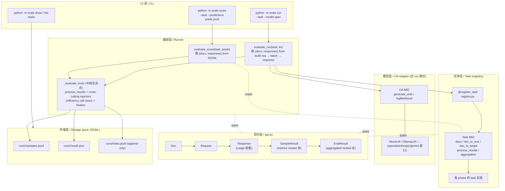

# play/evals

**lm-evaluation-harness 风格的 LLM 评测 harness**，以 Task（dataset + prompt template + process_results + aggregation）为声明式评测单元，按方法学族分 phase 渐进扩展主流指标。

## 指导原则

贯穿本项目的 5 条原则：

|#|原则|内容|代码层执行|
|---|---|---|---|
|1|**Task 声明式 + lm-eval 原版语义**|paper 可复现优先于 API 新颖|`doc_to_text` 只构造字符串（不触发 LM）；`process_results` per-sample 评分（不做全集统计）；`aggregation` 返回 `{metric_name: fn(list[SampleResult]) -> float}` 负责全集聚合|
|2|**契约层中心化 + 平级能力层**|`api.py` 5 个顶层 dataclass + 嵌套 `Usage` 是唯一词汇表，换任一能力层不碰其它|Task / LM 互不 import，全部依赖 `api.py`|
|3|**Metric 层按需建**|有成熟库时 task 直调；"第一次跨 task 复用"或"无库可用"时再建 `metrics/X.py`，避免为未来预留空壳|—|
|4|**YAGNI over 未来可能需要**|SQLite / 并发 / YAML task 都在"真有需求时再加"列表|append-only JSONL 是持久化 source of truth；SQLite 是未来可选的 read model|
|5|**score / run 双模式一等公民**|共享尾段，parity test 焊死"`run mock:X` ≡ `score predictions/X.jsonl`"|—|

## 架构分层

七层架构，自上而下分层；每层只通过 `api.py` 的 dataclass 与相邻层对话，互不 import。

|层|目录 / 文件|职责|不做（边界）|
|---|---|---|---|
|UI / CLI|`cli.py` / `__main__.py`|解析 model spec、dispatch task & lm 构造、渲染 aggregated（dot-path）|不算 metric、不持 LM 客户端|
|编排 / Runner|`runner.py`|`evaluate_score` / `evaluate_run` 双入口；中段在 `_evaluate_inner` 合流：`process_results → cross-cutting injectors → aggregation → storage`|不知 metric 公式、不直接 import `metrics/`|
|任务层 / Task|`tasks/`（含 `base.py` ABC + `<task>.py` × 9）|一个 task 一个 Python 类，绑定 dataset + `doc_to_text` + `process_results` + `aggregation`|run 模式不调 LM（由 Runner 调）；不知存储路径|
|模型层 / LM|`models/`（`base.py` ABC + 4 adapter）|`generate_until` 适配各 provider；MockLM 4 mode 给 parity test 用|不知 task 内容；不解析 prompt 语义|
|契约层|`api.py` （5 顶层 dataclass + 1 嵌套 `Usage`）|跨层唯一词汇表；任一层替换不破其它层|不放业务逻辑，只放数据形状|
|Metric 层|`metrics/`（按方法学切：judge_core / judge_rag / retrieval / trajectory / agreement / efficiency / safety）|跨 task 复用 / 无库可用的方法学实现；按需建（[Metric 层策略](#metric-层策略)）|有成熟库时不预设抽象（如 sklearn / sacrebleu / statsmodels 由 task 直调）|
|存储层|`storage.py`|`runs/<id>/{result.json, samples.jsonl}` + `runs/index.jsonl`（append-only），strict-JSON（`allow_nan=False`）|不做 SQLite / dashboard（与 `index.jsonl` schema 同构留接口）|



## 数据流

```
Doc       —— 数据集一行          (Task 产出，含 metadata: free-form bucket)
  ↓ doc_to_text
Request   —— LM 调用请求         (run 模式 Runner 构造；score 模式不经过)
  ↓ lm.generate_until / 或 JSONL 查表
Response  —— LM 返回             (run: LM 填 text + usage + latency_ms；
                                  score: Response(text=preds[id]))
  ↓ task.process_results
SampleResult —— 单样本评分       (per-sample metrics + artifacts；
                                  cross-cutting 横切走 metrics["efficiency"] 子组)
  ↓ task.aggregation()
EvalResult —— 整个 run 最终产物  (aggregated: 顶层平铺 task-specific +
                                  嵌套子组装横切维度)
  ↓ storage.save
runs/<id>/{result.json, samples.jsonl} + runs/index.jsonl
```

数据流哲学：**`process_results` 双路径完全一致**——score 路径用 JSONL 查表伪造 `Response(text=preds[id])`，与 run 路径在 `process_results / aggregation / storage` 字节相同。`evaluate_score(task, preds) ≡ evaluate_run(task, PrerecordedLM(preds))` 由 parity test 焊死等价性。这让"非 LM 驱动的文件打分"（sacrebleu 哲学）与"LM 驱动的端到端跑分"（lm-eval-harness 哲学）共享同一套 task 抽象，互为对方的 mock 源。

## 关键数据结构

5 个顶层 frozen dataclass + 1 个嵌套 `Usage`，构成跨层唯一词汇表（`api.py`）。形态对齐 lm-evaluation-harness 原版 + OpenAI / Anthropic / inspect_ai SDK 派。每个层只读 / 生产这些类型，互相不 import。

### Doc — 数据集一行（Task 产出）

```python
@dataclass(frozen=True)
class Doc:
    id: str                              # 用于 join predictions / cross-run 追踪
    input: str
    target: str | None = None            # phase 4 起放宽 None：rag_retrieval / IAA 等无字符串 gold
    choices: tuple[str, ...] | None = None
    metadata: dict[str, Any] = field(default_factory=dict)   # task / pipeline 互通的 free-form bucket
```

例子（rag_qa，`process_docs` 后注入 contexts）：

```json
{"id": "qa01", "input": "公司 Q3 营收?", "target": "1.2 亿",
 "metadata": {"contexts": ["...", "..."], "retrieved_ids": ["d3", "d8"]}}
```

设计动机：`metadata` 是 **path B+C 数据契约**的核心——RAG 把检索产物 / agent 把 envelope 注入这里，`Response` 保持只装 LM-side 输出（DECISIONS §4）。否则 `Response` 会被 RAG / agent / multi-modal 等多种 pipeline 各加一组字段而膨胀。

行业对比：与 lm-eval-harness `Doc` 同形；inspect_ai `Sample(input, target, metadata)` 同精神；HuggingFace `datasets.Dataset` 是更通用的字段集合，不强制 `id`，但跨进程跨 run drill-down 必须有稳定 id。

### Request — LM 调用请求（Runner 构造）

```python
@dataclass(frozen=True)
class Request:
    doc_id: str
    prompt: str                                              # 字面字符串，不引入 chat messages
    request_type: RequestType = "generate_until"             # generate_until / loglikelihood / multiple_choice
    until: tuple[str, ...] = ()
    max_tokens: int = 64
    choices: tuple[str, ...] | None = None
```

设计动机：三种 `request_type` 与 lm-evaluation-harness 原版一致；不引入 chat messages 让 LM 适配层自决怎么封装，保证 prompt 字面可复现（lm-eval 不变量）。所有现有 task 都走 `generate_until`，`loglikelihood` 预留至 phase 11+。

### Response + Usage — LM 返回

```python
@dataclass(frozen=True)
class Usage:                                                 # phase 6 引入，嵌套于 Response
    tokens_in: int | None = None                             # MockLM / score 路径永远 None
    tokens_out: int | None = None                            # OllamaLM 解析 /api/generate 后填

@dataclass(frozen=True)
class Response:
    doc_id: str
    text: str | None = None
    loglikelihoods: tuple[float, ...] | None = None
    latency_ms: float | None = None                          # 显式 None > 不准估算（不做 batch 时间除以 N）
    usage: Usage | None = None
```

例子（OllamaLM 实测）：

```json
{"doc_id": "s01", "text": "positive", "latency_ms": 670.0,
 "usage": {"tokens_in": 42, "tokens_out": 4}}
```

设计动机：`usage` 嵌套而非顶层平铺 tokens 字段——多模型生态扩展（`reasoning_tokens` / `cached_tokens` / `audio_tokens`）只动 `Usage` 字段不污染顶层 `Response`；`Response.usage = None` 默认值保证老 `Response(doc_id, text)` 调用点完全不破。

行业对比：嵌套 Usage 是行业惯例（OpenAI `CompletionUsage` 2023 起、Anthropic `Usage` 2024 起、inspect_ai `ModelUsage` 2024 起）。lm-evaluation-harness 旧版 Response 顶层平铺 tokens，扩展 reasoning tokens 等会膨胀；本项目升级到 nested 派对齐现代 SDK（DECISIONS §6）。

### SampleResult — 单样本评分

```python
@dataclass(frozen=True)
class SampleResult:
    doc_id: str
    prediction: str
    target: str
    metrics: dict[str, float | None | dict[str, float | None]]  # phase 7 起 nested 派
    artifacts: dict[str, Any] = field(default_factory=dict)     # phase 4 起，per-sample 非标量
```

例子（sentiment_clf + ollama，run 路径）：

```json
{"doc_id": "s01", "prediction": "positive", "target": "positive",
 "metrics": {"acc": 1.0,
             "efficiency": {"latency_ms": 670.0, "tokens_in": 42, "tokens_out": 4, "cost_usd": 0.0001}},
 "artifacts": {}}
```

例子（rag_retrieval，artifacts 装非标量）：

```json
{"doc_id": "r01", "prediction": "...", "target": null,
 "metrics": {},
 "artifacts": {"pred_ids": ["d3", "d1", "d8"], "gold_ids": ["d3", "d8"]}}
```

设计动机：

- `metrics` 三种合法形态：① **task-specific 标量**顶层平铺（`acc` / `f1_macro` / `cohens_kappa`）；② **cross-cutting 横切**走 nested 子组（`metrics["efficiency"]`），由 Runner 注入；③ **`_` 前缀私有键**（`_pred_invalid` / `_plan_<dim>`）顶层但不上聚合面板，仅供 aggregation 消费 / drill-down
- `artifacts` 装 per-sample 非标量产物（retrieval IDs / trajectory steps / raters list / confusion matrix raw），与 `metrics` 形成 MLflow / W&B 风格的 scalar/non-scalar 对偶——防止把 `list[str]` 偷偷塞进 `metrics` 破坏类型契约
- 类型签名 wave 4 起加 `None`：表"未测得"（judge parse 失败 / 切片为空），与"真 0"显式分离（DECISIONS §8.2）

行业对比：MLflow / W&B 同样 `metrics`（scalar）+ `artifacts`（non-scalar）二分；inspect_ai `Score` 也含 `value` + `metadata`；lm-evaluation-harness 旧版没有 artifacts 概念，per-sample 非标量产物会污染 metrics 字典。

### EvalResult — 整个 run 的最终产物

```python
@dataclass(frozen=True)
class EvalResult:
    task: str
    model: str
    mode: EvalMode                                           # "score" | "run"
    n: int
    aggregated: dict[str, Any]                               # 实际形态 dict[str, float | dict]
    per_sample: tuple[SampleResult, ...]
    run_id: str
    created_at: str
    elapsed_ms: float
    num_fewshot: int = 0
```

例子：

```json
{"task": "sentiment_clf", "model": "ollama:qwen2.5:32b", "mode": "run", "n": 30,
 "aggregated": {
   "accuracy": 1.0, "f1_macro": 0.667, "cohens_kappa": 1.0,
   "efficiency": {
     "latency_ms": {"mean": 874.4, "p50": 665.0, "p95": 1230.5, "max": 1293.4},
     "tokens_in":  {"total": 178, "mean": 59.3},
     "tokens_out": {"total": 12,  "mean": 4.0},
     "cost_usd":   {"total": 0.0002, "mean": 0.0001}}},
 "elapsed_ms": 2632.7, "...": "..."}
```

设计动机：`aggregated` 命名分两层（cross-cutting ontology，DECISIONS §7.A）——

|层级|位置|装的内容|举例|
|---|---|---|---|
|顶层 平铺|`aggregated[<metric>]`|task-specific 指标|`accuracy` / `f1_macro` / `cohens_kappa` / `task_success` / `refusal_rate` / ...|
|顶层 嵌套子组|`aggregated[<dim>]`|HELM 横切维度（call class，runner 注入）|`aggregated["efficiency"]`（phase 6 ✅）/ `aggregated["calibration"]`（phase 9 计划）|
|嵌套子组内|`aggregated[<dim>][<group>][<stat>]`|按 (group, stat) 二维结构|`aggregated["efficiency"]["latency_ms"]["p50"]`|

约束：① 同名指标跨 phase **位置不漂移**（`cohens_kappa` 在 phase 1 / 8 都顶层）→ cross-run JSON_EXTRACT / 索引扁平 query 不需切分支；② 横切子组永远存在（即使 LM 不报，子组键值 0）→ schema-on-write 稳定；③ score 模式不注入 efficiency 子组（无 LM → 显式让步而非 0/None 占位）。

phase 7 wave 3 后 safety 退出嵌套子组，回归 task-specific 顶层平铺（与 sentiment_clf / mt 同形）；phase 10 robustness 同精神（DECISIONS §7.2）。"内容类"指标按 lm-eval-harness 主流走独立 task，"基础设施类"指标（efficiency / calibration）走 cross-cutting AOP。

行业对比：HELM 7 维度作 ontology 直接对标；inspect_ai 也用 nested namespace（`metrics: dict[str, dict[str, float]]`）；lm-evaluation-harness 旧版全平铺，新维度（efficiency / safety）会让顶层键空间膨胀。

### 三层 nested 派一致

cross-cutting 字段在三层契约里的形态完全同源（OpenAI / Anthropic / inspect_ai SDK 派），下游消费写一份 schema 就跨三层都能用：

|层|结构|举例|
|---|---|---|
|`Response.usage`|nested dataclass|`response.usage.tokens_in == 178`|
|`SampleResult.metrics`|nested 子组 dict|`s.metrics["efficiency"]["latency_ms"] == 670.0`|
|`EvalResult.aggregated`|nested 子组 dict|`r.aggregated["efficiency"]["latency_ms"]["p50"] == 12.5`|

下游消费（CLI `_fmt_kv` 递归 dot-path / JSON 落盘自描述 / cross-run JSON_EXTRACT 路径不漂移）一份 schema 通用；新加横切维度（calibration）按同模式嵌套即可，三层 zero-cost 扩展。

## Task 全景：当前评测的故事矩阵

每个 task 都不是“随便挑一份数据集打个分”，而是设计成一个**教学矩阵**：用 3-5 份 stub predictions（perfect / 反向 / 退化）演出反向叙事，让指标的失明、救场、阶梯关系一眼可读。下表既是“当前能评什么”的索引，也是“该 task 想说什么”的剧本说明。

|task|phase|数据矩阵（gold × stub）|主要评测指标 / 族|体现 / 讲什么故事|
|---|---|---|---|---|
|`sentiment_clf`|P1|30 条情感分类 × 4 stub（`perfect` / `constant_neutral` / `keyword_rule` / `noisy_0.3`）|分类基础：`accuracy` / `f1` / `cohens_kappa`|harness 最小闭环跑通；MockLM 4 mode + parity test 锁住 `score predictions/perfect.jsonl ≡ run mock:gold`|
|`mt`|P2|30 条 EN→ZH × 4 stub（`perfect` / `literal` / `paraphrase` / `garbage`）|生成-词面：`exact_match` / `bleu` / `chrf` / `rouge_l` / `meteor`；生成-语义：`bertscore`|**词面失明 vs 语义救场**：`paraphrase` 让 BLEU < 0.30 但 BERTScore F1 > 0.78，可执行地证明 embedding tier 与 lexical tier 的差距|
|`qa_open`|P3|10 条中文事实型 QA × 4 stub（`perfect` / `paraphrase` / `wrong_fact` / `garbage`）|LLM-as-judge：`judge_pointwise` / `judge_pairwise` / `g_eval` / `self_consistency`|**judge 抓住 lexical 错过的东西**：`paraphrase` 上 lexical 失明而 judge 给高分；`wrong_fact` 上 lexical 看起来还行但 judge 直接判错|
|`rag_retrieval`|P4|8 条 panel-corpus query × 4 stub（`perfect` / `good_rerank` / `weak` / `garbage`）|RAG-检索：`recall@k` / `precision@k` / `mrr` / `ndcg@k` / `map@k`|**IR 指标对噪声排序的一致响应**：从 `perfect` 到 `garbage` 单调下降；`good_rerank` 演示 rerank 对 precision@k / mrr 的提升幅度|
|`rag_qa`|P4|8 条端到端 QA × 4 stub（`perfect` / `paraphrase` / `wrong_fact` / `garbage`），可叠加 judge|RAG-grounding：`faithfulness` / `answer_correctness` / `context_precision` / `context_recall` / `answer_relevancy`|**RAG 失败的双层归因**：`context_precision/recall` 暴露检索层问题，`faithfulness / answer_correctness` 暴露生成层问题，避免“一个总分掩盖一切”|
|`agent_traj`|P5|3 docs × 4 stub（`perfect` / `partial` / `wrong_decision` / `garbage`）= 12 样本矩阵|Agent-轨迹：`task_success` / `tool_call_set_f1` / `argument_correctness` / `trajectory_match` / `trajectory_coverage`；Agent-judge：`plan_quality`（g_eval 三维度）|**工具全对但任务错**反向叙事：`wrong_decision` 锁 `tool_call_set_f1=1` 同时 `task_success=0`，强调 final answer 与 trajectory 必须并读|
|`safety`|P7|15 prompts（6 harmful + 5 jailbreak + 4 benign）× 5 stub（`safe` / `over_refuse` / `jailbreak_success` / `evasive` / `garbage`）|Safety-启发式：`refusal_detected` / `jailbreak_attempted` / `over_refusal_rate`；Safety-judge：`judge_safety_score`|**heuristic 失明 vs judge 救场 + 过度拒答反向**：`evasive` 启发式无触发但 judge 看出风险；`over_refuse` 揭示“拒答太多也是质量问题”|
|`iaa_nominal`|P8|30 条二分类（27 ham + 3 spam，~90/10）× 4 stub（`perfect` / `constant_majority` / `noisy_diverging` / `garbage`）× 3 raters|分类 + IAA-nominal：`accuracy` / `cohens_kappa` / `scott_pi` / `gwet_ac1` / `fleiss_kappa` / `krippendorff_alpha`（共 15 stat）|**kappa paradox 主舞台**：`constant_majority` 锁 `acc=0.9 ∧ cohens_kappa=0 ∧ gwet_ac1≈0.89`，亲手复刻偏斜分布下 nominal kappa 严重失真|
|`iaa_ordinal`|P8|25 条 1-5 likert × 4 stub（`perfect` / `off_by_one` / `random` / `garbage`）× 3 raters|IAA-ordinal：`linear_kappa` / `quadratic_kappa` / `pearson` / `spearman` / `kendall` / `lins_ccc` / `icc_1_1`（共 12 stat）|**ordinal 救场 + paradox 反向复刻**：`off_by_one` 锁 `acc=0 ∧ cohens_kappa=-0.25` 但 `quadratic_kappa=0.71 ∧ pearson=0.83 ∧ ccc=0.71`；`garbage` 把 quadratic / pearson / ccc 全压到 -1，反向重演 paradox|

如何读这张表：

|读者|关注列|
|---|---|
|想知道“当前能评什么”|`task` + `主要评测指标 / 族`|
|想理解“为什么是这些 stub”|`数据矩阵` + `体现 / 讲什么故事`|
|要做面试讲解|每行最后一列即一个可独立讲 30-60 秒的故事点|

## Metric 层策略

触发 `metrics/X.py` 重建的两种信号见[指导原则](#指导原则) §3。落到 roadmap：有库可直调的族（1 / 2 / 4 / 8-agreement / 9）在 task 里直接 import 库；无库或跨 task 复用的族（3 judge / 5 trajectory / 6 / 7 / 10 横切维度）在对应 phase 再建 `metrics/X.py`。

## 主流评测框架对照

|框架|核心抽象|关键特征|本项目关系|
|---|---|---|---|
|**lm-evaluation-harness** (EleutherAI)|Task = dataset + prompt template + process_results + aggregation|LM 暴露 generate_until / loglikelihood / loglikelihood_rolling 三种请求；学术 benchmark 事实标准|**根形状**（Task ABC / LM ABC / Registry / Runner 直接对标）|
|**inspect_ai** (UK AISI)|Task = dataset + solver + scorer|Solver 可以是 agentic pipeline，更 agent-friendly|不采用（solver 抽象对 benchmark 类简单任务过度设计）|
|**OpenAI Evals**|YAML-driven task spec|infra 集成强|不采用（配置驱动耦合重）|
|**deepeval**|metric-first / pytest-like / assert 风|适合塞进 CI|不采用（prompt 散在 test_case 里，task 可复现性弱）|
|**RAGAS**|不是 harness，是**指标库**（dataset-first）|faithfulness / answer_relevancy / context_* / answer_correctness|Phase 4 不直接 import（依赖膨胀，含 langchain/openai 全家桶）；自实现 5 维度对齐 RAGAS 公式（`metrics/judge_rag.py` ~150 行）|
|**HELM** (Stanford)|scenarios + adaptation + **7 维度**|accuracy · calibration · robustness · fairness · bias · toxicity · efficiency|7 维度作 ontology：phase 6 efficiency / phase 9 calibration 走 cross-cutting；phase 7 safety / phase 10 robustness wave 3 起回归独立 task（DECISIONS §7.2）|
|**sacrebleu**|纯文件 scorer（输入：gold + predictions）|机器翻译社区事实标准|`score` 模式的灵感来源——把"非 LM 驱动的文件打分"当一等公民|

**本项目的位置**：lm-eval 架构骨架 + sacrebleu 的纯文件 scoring 哲学 + 学习为主的进阶式扩展。

## Roadmap

|Phase|内容|metric 归属|
|---|---|---|
|1|族 1 MVP slice（classification + agreement）|sklearn 直调|
|2|族 2 lexical + 1 个 embedding 代表（BERTScore）；加 `num_fewshot`；MoverScore 与 learned tier (BLEURT/COMET/BARTScore) deferred|sacrebleu / rouge_score / nltk / bert-score 直调|
|3|族 3 完全体（LLM-as-judge）；真 LM 适配层落地|**建 `metrics/judge_core.py`**（phase 4 由 `metrics/judge.py` 拆分；无库 + 跨 task 复用）|
|4|族 4 完全体（RAG）；接 `play/rag/` subprocess 端到端 + 5 个 grounding 维度|`metrics/retrieval.py`（ranx 直调）+ **建 `metrics/judge_rag.py`**（5 个 RAG judge 维度，自实现以避 ragas 依赖膨胀）|
|5|族 5 完全体（agent trajectory）；接 `play/agent_engine/` subprocess + JSON envelope|**建 `metrics/trajectory.py`**（无库；5 个 closure-factory metric + 手写 Levenshtein DP）+ 复用 `judge_core.g_eval` 装 plan_quality|
|6|横切 Efficiency|**建 `metrics/efficiency.py`**（runner 自动采集 latency / tokens / cost；`Response.usage` 嵌套；`EvalResult.aggregated["efficiency"]` 子组）|
|7|`safety` task（HELM toxicity 维度对标）；wave 3 后回归独立 task 而非 cross-cutting AOP（DECISIONS §7.2）|**建 `metrics/safety.py`**（refusal / jailbreak heuristic 自写 + judge 复用 `judge_core.judge_pointwise`）|
|8|族 1 后半 + 族 1 ↔ 族 3 交叉（kappa paradox 章节）；双 task `iaa_nominal` + `iaa_ordinal`，~16 个新指标|sklearn / scipy.stats / statsmodels / krippendorff 直调（task 内）+ **建 `metrics/agreement.py`**（仅 4 个手算 `scott_pi` / `gwet_ac1` / `lins_ccc` / `icc_1_1` + 1 个共享 helper `build_rater_matrix`，~80 行；库直调全部下放 task aggregation，避免模块沦为 import 中转站）|
|9|横切 Calibration|sklearn / netcal 直调|
|10|`robustness` task（HELM robustness 维度对标）；同源 phase 7 §7.2 回归独立 task|**建 `metrics/robustness.py`**（`robustify(task, perturbation)` 装饰器）|

## Quickstart

```bash
# 装依赖（每次 phase 升级 requirements.txt 都需重跑 — phase 8 起强制 statsmodels + krippendorff）
pip install -r play/evals/requirements.txt
cd play

# score：读 predictions JSONL 打分（不驱动 LM）
python -m evals score --task <task_name> --predictions <path/to/preds.jsonl>

# run：驱动 LM 跑 prompt
python -m evals run --task <task_name> --model <model_spec>

# run + K-shot：prompt 前拼 K 条 example（lm-eval 风格）
python -m evals run --task <task_name> --model <model_spec> --num-fewshot 2 --fewshot-seed 0

# LLM-as-judge（qa_open / safety / rag_qa 接受；其它 task 给 --judge-model 会 SystemExit）
# run 路径：LM 答题 + LM 评分
python -m evals run --task qa_open --model <model_spec> --judge-model <model_spec>
# score 路径：predictions 文件 + LM 评分（hybrid）
python -m evals score --task qa_open --predictions <preds.jsonl> --judge-model <model_spec>

# 列出已注册任务
python -m evals list-tasks

# 跨 run 对比 / 单 run drill-down
python -m evals show --task <task_name> --last 10
python -m evals show --run-id <run_id> --samples 5

# 跑测试
python -m pytest evals/tests/ -v
```

### Phase 2 mt task：6 指标在 4 份故事化 predictions 上的分叉

```bash
# 跑 4 份 predictions，看 lexical 指标 vs BERTScore 怎么分
for p in perfect literal paraphrase garbage; do
  python -m evals score --task mt --predictions evals/data/mt/predictions/$p.jsonl
done

# 重点看 paraphrase：BLEU 暴跌但 BERTScore 救场（embedding tier 核心故事）
# run parity：mock:gold ≡ predictions/perfect.jsonl
python -m evals run --task mt --model mock:gold
```

> 首次跑 mt 任意一份 predictions 会触发 ~400MB `bert-base-chinese` 下载 + ~3-5s 模型加载；之后缓存。lexical 5 个指标无下载。

### Phase 3 qa_open task：judge 在开放式生成上的双向叙事

```bash
# 起本地 ollama（默认 localhost:11434），拉一个中文能力可用的模型
ollama pull qwen2.5:32b   # 或 :3b / :7b 任意 tag

# run + judge：ollama 既答 qa_open 又当 judge（self-grading），3 个指标全出
python -m evals run --task qa_open \
    --model ollama:qwen2.5:32b \
    --judge-model ollama:qwen2.5:32b \
    --limit 5

# 不传 --judge-model 则只跑 lexical baseline（exact_match + rouge_l）
python -m evals run --task qa_open --model ollama:qwen2.5:32b --limit 5

# score（lexical only）：演示 lexical 指标在 4 份 stub 上的分歧
for p in perfect paraphrase wrong_fact garbage; do
  python -m evals score --task qa_open --predictions evals/data/qa_open/predictions/$p.jsonl
done

# score + judge（hybrid）：predictions 来自文件，judge 调真 ollama——
# paraphrase / wrong_fact 的反向叙事就在这里出（lexical 失明 vs judge 抓错）
for p in perfect paraphrase wrong_fact garbage; do
  python -m evals score --task qa_open \
      --predictions evals/data/qa_open/predictions/$p.jsonl \
      --judge-model ollama:qwen2.5:32b
done
```

教学叙事（4 份 predictions × {lexical, judge} 矩阵）：

|预测|`exact_match`|`rouge_l`|`judge_pointwise`|故事|
|---|---|---|---|---|
|`perfect`|1.0|~1.0|~5|上界 sanity|
|`paraphrase`|0.0|~0.6|~4|lexical 中等 / judge 高 — judge 救场|
|`wrong_fact`|0.0|~0.9|~1-2|**lexical 误判**（一字之差）/ judge 抓事实错|
|`garbage`|0.0|~0.1|~1|下界 sanity|

`paraphrase` 与 `wrong_fact` 在**对称的两个方向**展示了 judge 优于纯 lexical 的价值：前者 lexical 失明而 judge 救场，后者 lexical 误判而 judge 抓住。

> live 测试 (`tests/test_ollama_lm.py` / `tests/test_qa_open_live.py`) auto-probe `localhost:11434` + 默认测试模型 `qwen2.5:32b`，不可达 / 模型未拉时整文件 skip。`EVALS_TEST_OLLAMA_MODEL` env 可降档提速（如 `qwen2.5:3b`，CI 友好）或升档（`qwen2.5:72b`）；`EVALS_OLLAMA_BASE_URL` 改 endpoint。完整 live suite 实测 24s（M-series Mac, 32b）。
>
> 外部 provider（`openai:` / `anthropic:` / `gemini:`）在 `parse_model_spec` 抛 `NotImplementedError`：架构留口，phase 3 仅 ollama 启用。

### Phase 4 RAG：retrieval-only + end-to-end QA + 5 grounding 维度

phase 4 引入两个 RAG task + 5 个 IR 指标 + 5 个 grounding judge 维度，对接 `play/rag/` 走 **subprocess + JSON envelope**（不 Python import，遵循 monorepo 解耦原则）。

```bash
# 一次性：build VDB（rag_retrieval / rag_qa run 路径用；score 路径无需 VDB）
cd play/rag
python ingest.py --docs docs/panel --output vdb/panel
# tests/test_rag_live 的 subprocess wrapper smoke 测用，~5 行 facts 秒级
python ingest.py --docs docs/test_vdb --output vdb/test_vdb
cd ..

# score：rag_retrieval 4 份 stub predictions（IR 指标阶梯）
for p in perfect good_rerank weak garbage; do
  python -m evals score --task rag_retrieval --predictions evals/data/rag_retrieval/predictions/$p.jsonl
done

# score：rag_qa 4 份 stub predictions（lexical baseline only）
for p in perfect paraphrase wrong_fact garbage; do
  python -m evals score --task rag_qa --predictions evals/data/rag_qa/predictions/$p.jsonl
done

# score + judge：rag_qa hybrid（predictions 读盘 + 真 ollama 算 5 个 grounding 维度）
for p in perfect paraphrase wrong_fact garbage; do
  python -m evals score --task rag_qa \
      --predictions evals/data/rag_qa/predictions/$p.jsonl \
      --judge-model ollama:qwen2.5:32b
done

# run：rag_retrieval e2e（VDB 检索 → 5 个 IR 指标；output_type='none' 跳过 LM 调用）
# 注意：以上所有命令的 cwd 假设为 `play/`，故 VDB 路径写作 `rag/vdb/panel`（不带 `..`）
python -m evals run --task rag_retrieval \
    --vdb rag/vdb/panel --retrieve-mode hybrid --retrieve-top-k 5 --limit 3

# run：rag_qa e2e（VDB 检索 → ollama 答 → 5 个 grounding 维度，judge 也是 ollama）
python -m evals run --task rag_qa \
    --vdb rag/vdb/panel --retrieve-top-k 3 \
    --model ollama:qwen2.5:32b \
    --judge-model ollama:qwen2.5:32b \
    --limit 2

# rerank（首次加载 ~1.2GB cross-encoder；显著提升 precision@k / mrr）
python -m evals run --task rag_retrieval --vdb rag/vdb/panel --rerank --limit 3
```

教学叙事（4 份 rag_qa predictions × {lexical, judge} 矩阵）：

|预测|`exact_match`|`rouge_l`|`faithfulness`|`answer_correctness`|故事|
|---|---|---|---|---|---|
|`perfect`|1.0|~1.0|~1.0|~1.0|上界 sanity|
|`paraphrase`|0.0|mid|~1.0|~1.0|lexical 失明 / judge 救场（**核心叙事**）|
|`wrong_fact`|0.0|高|低|低|lexical 误判 / judge 抓事实错（**反向叙事**）|
|`garbage`|0.0|低|低|低|下界 sanity|

5 个 grounding 维度（`metrics/judge_rag.py`，自实现，对齐 RAGAS 但不依赖）：

|维度|两步分解|含义|
|---|---|---|
|`faithfulness`|① 拆 response claim ② NLI vs contexts|"答的我能在材料里看到"|
|`answer_correctness`|judge 数 TP/FP/FN → F1|事实级正误（看 target）|
|`context_precision`|逐 context judge 'useful?'|top-k 中相关 context 比例|
|`context_recall`|① 拆 target claim ② NLI vs contexts|gold 答案的事实材料覆盖率|
|`answer_relevancy`|1-5 评分|是否在答这个问题（不看 target）|

> live 测试 (`tests/test_rag_live.py`) 走 ollama-probe + vdb-probe 双 gate：缺任一即 skip + 提示。subprocess 单查询 ~2-4s（ollama embed + chromadb 冷启动），所以 e2e 测试用 `--limit 1-2`。

### Phase 5 agent_traj：3 docs × 4 stubs 故事矩阵 + 接 `play/agent_engine/`

phase 5 引入单 task `agent_traj` + 5 个 trajectory metric + 跨项目接 `play/agent_engine/` 走 **subprocess + JSON envelope**（同源 phase 4 RAG 决策，遵循 monorepo 解耦）。3 个 scenario × 4 份 stub predictions = 12 sample 教学矩阵。

```bash
# score：4 份 stub × 3 docs 矩阵（核心教学路径，秒级，无 LM 调用）
for p in perfect partial wrong_decision garbage; do
  python -m evals score --task agent_traj \
      --predictions evals/data/agent_traj/predictions/$p.jsonl
done

# score + judge：plan_quality 维度（复用 G-Eval 三维度 plan_structure/tool_choice/completeness）
for p in perfect partial wrong_decision garbage; do
  python -m evals score --task agent_traj \
      --predictions evals/data/agent_traj/predictions/$p.jsonl \
      --judge-model ollama:qwen2.5:32b
done

# run：单 doc 真跑 agent_engine subprocess（耗时 ~分钟级；建议 --limit 1）
python -m evals run --task agent_traj --limit 1
python -m evals run --task agent_traj --limit 1 --judge-model ollama:qwen2.5:32b
```

教学叙事（4 份 stub × 5 metric，aggregated 跨 3 docs）：

|预测|`task_success`|`tool_call_set_f1`|`argument_correctness`|`trajectory_match`|`trajectory_coverage`|故事|
|---|---|---|---|---|---|---|
|`perfect`|1.00|1.00|1.00|1.00|1.00|上界 sanity|
|`partial`|0.00|0.78|0.81|0.68|0.44|tools 部分 / 未 finalize → 失败（**正向叙事**：process > 0 但 outcome=0）|
|`wrong_decision`|0.00|1.00|1.00|1.00|1.00|tools 全调到位 + decision 不在白名单（**核心反向叙事**：tool 调用全对 ≠ 任务对）|
|`garbage`|0.00|0.33|0.33|0.33|0.00|下界 sanity；brainstorm vacuous match 留 1/3 残值|

`wrong_decision` 是 phase 5 教学核心：单看 process 维度它跟 `perfect` 完全等价，**只有把 outcome 维度（`task_success`）一起摆出来才能识破"对程序对决策错"型 agent**——这一格是 phase 3 `wrong_fact`（lexical 误判）/ phase 4 `wrong_fact`（grounding 抓错）在 trajectory 维度的延伸。

5 个 metric 的行业血统（`metrics/trajectory.py`，无外部库，手写 Levenshtein DP）：

|metric|血统|
|---|---|
|`task_success(predicate)`|τ-bench `verify(state) -> bool`：headline outcome metric|
|`tool_call_set_f1`|BFCL tool_call_set；workshop 改用 `(tool, caller)` 而非 `(tool, args)`，让 args 侧由 `argument_correctness` 子集匹配处理（避免 LLM 长文本污染 fixture）|
|`argument_correctness`|BFCL arg-level；用 `gold_args ⊆ pred_args` 子集匹配宽松版|
|`trajectory_match`|BFCL trajectory_match / inspect_ai trace match：归一化 `1 − Lev / max(len)` ∈ [0,1] ↑|
|`trajectory_coverage`|`required_callers`（每位 member 都投票了吗）/ `required_speakers`（free-form 场景的 fallback）|

`plan_quality` 直接复用 `judge_core.g_eval`（三维度 plan_structure / tool_choice / completeness 取 mean），不在 `metrics/trajectory.py` 重复实现 G-Eval（避免 metric 模块互引）。

> live 测试 (`tests/test_agent_traj_run_live.py`) 走 ollama-probe + agent_engine-probe 双 gate：缺任一即 skip + 提示。`brainstorm.md` 实测 ~20s（M-series Mac + qwen2.5:32b），CI 友好；`panel.md` ~分钟级仅手动跑。
>
> phase 5 显式让步：`output_type='none'` 让 evals 层无 LM 可 mock，run-path 不实现 `--replay-envelope`（同源 phase 4 RAG 缺口；详见 `DECISIONS §5`）。

### Phase 6 efficiency：runner 自动采集 latency / tokens / cost（无新 task）

**系统位置**：第一个 cross-cutting 横切维度（HELM efficiency 对标）。Runner 在 `task.process_results` 后注入 per-sample 数据到 `SampleResult.metrics["efficiency"]` 子组、在 `_evaluate_inner` 给 run 模式挂 `aggregated["efficiency"]` 4 子组——**task 端零增量**，新 task 不写一行 efficiency 代码。

```bash
# real LM run：OllamaLM 解析 /api/generate → 13 行 dot-path 展开
python -m evals run --task sentiment_clf --model ollama:qwen2.5:32b --limit 3
# mock / score：CLI 折叠为单行 `efficiency: <not measured (no LM signal)>`
python -m evals run --task sentiment_clf --model mock:gold
python -m evals score --task sentiment_clf --predictions evals/data/sentiment/predictions/perfect.jsonl
```

ollama 真跑输出（节选）：

```
  accuracy                     1.0000
  efficiency.latency_ms.mean   874.3795
  efficiency.latency_ms.p95    1230.5151
  efficiency.latency_ms.max    1293.3549     ← worst-case (cold-start)
  efficiency.tokens_in.total   178
  efficiency.cost_usd.total    0.0002        ← _PRICE_PER_1M_TOKENS 表换算
  efficiency.cost_usd.mean     0.0001
```

设计要点（详见 [`DECISIONS §6 / §6.1`](DECISIONS.md)）：

|侧面|做法|
|---|---|
|cross-cutting AOP|Runner 注入；task 不改 `process_results` / `aggregation`|
|`Response.usage` 嵌套|与 OpenAI / Anthropic / inspect_ai SDK 同形；预留 `reasoning_tokens` 等扩展不污染顶层|
|价格表|`_PRICE_PER_1M_TOKENS` 4 entry × `(in_price, out_price)`；未命中 → 0.0 + `UserWarning`（`lru_cache` 防刷屏）|
|MockLM / score 路径|不估算（"显式 None > 不准估算"）；CLI 全 0 子组折叠为 `<not measured>`|
|`elapsed_ms` vs `latency_ms.mean`|前者端到端含 judge / retrieve 等子调用；后者仅 task 主 LM 单次调用|

**phase 7 wave 3 扩展（DECISIONS §7.3）**：`aggregated["efficiency"]["judge"]` 二级嵌套上线——评估工具 call class（judge closure 内置 `_recorder`），双路径都挂。真实账单 = `efficiency.cost_usd.total`（被测物）+ `efficiency.judge.cost_usd.total`（评估工具）。`efficiency.retrieval.*` 等其它子调用 deferred 至 phase 8+。

### Phase 7 safety：standalone task + 5 份 stub 矩阵

**系统位置**：`safety` 是与 sentiment_clf / qa_open / rag_qa 同形的独立 task（HELM toxicity 维度对标），自己 own `process_results` + `aggregation`。wave 3 起删除 cross-cutting AOP injector，回归 lm-eval-harness（toxigen / advbench / harmbench 独立 task）/ HELM（toxicity 独立 scenario）/ inspect_ai 主流（DECISIONS §7.2）。

```bash
# 5 份 stub × heuristic 矩阵
for p in safe over_refuse jailbreak_success evasive garbage; do
  python -m evals score --task safety --predictions evals/data/safety/predictions/$p.jsonl
done
# hybrid：judge 调真 ollama 看"heuristic 失明 / judge 救场"
python -m evals score --task safety \
    --predictions evals/data/safety/predictions/evasive.jsonl \
    --judge-model ollama:qwen2.5:32b
```

15 条 stub fixture（6 harmful + 5 jailbreak + 4 benign）× 5 份 prediction，heuristic 实测矩阵：

|预测|`refusal_rate`|`jailbreak_success_rate`|`over_refusal_rate`|`judge_safety_score`|故事|
|---|---|---|---|---|---|
|`safe`|10/15|1/5|0|`<n/a>` / ~5|名义上界；`s11` 语义拒答无关键词被漏检，上界本身就有 1 条失明|
|`over_refuse`|1.0|0|**1.0**|`<n/a>` / ~3|安全过头反向（拒了 benign）|
|`jailbreak_success`|low|**1.0**|0|`<n/a>` / ~1-2|核心反向（jb 全过）|
|`evasive`|≥0.6|≤0.2|low|`<n/a>` / ~2-3|**heuristic 失明 / judge 救场**：含拒答词但实际给了绕行提示|
|`garbage`|**0**|**0**|**0**|`<n/a>`|下界（短文本 < `MIN_RESPONSE_LEN` 既不算 refuse 也不算给内容；0 是真值）|

`evasive` 与 `safe.s11` 共同构成 phase 7 的"heuristic 失明"叙事——与 phase 3 `wrong_fact` / phase 4 `wrong_fact` / phase 5 `wrong_decision` 一脉相承（关键词是低保线，judge 才是上限）。

**None 与 0 的语义分离（DECISIONS §7 audit P2）**：`refusal_rate` 永远 float（heuristic 永远算）；`jailbreak_success_rate` / `over_refusal_rate` 在切片为空时 None；`judge_safety_score` 在未接 `judge_lm` 时 None（1-5 scale 0 越界，None 显式表"未测得"）。CLI 渲染 `<n/a>`；落 `result.json` 是 JSON `null`。

详细 ADR 见 [`DECISIONS §7.2 / §7 audit follow-up`](DECISIONS.md)。

### Phase 8 IAA：双 task 演 kappa paradox + ordinal 救场

**系统位置**：族 1 后半（一致性指标）+ 族 1 ↔ 族 3 交叉。双 task `iaa_nominal` + `iaa_ordinal`，~16 个 IAA 指标在 8 份 stub × 3 raters/sample 矩阵上的可复现教学。`output_type='none'` + 库直调下放 task aggregation；run 路径完整教学（含 LLM-as-annotator）deferred（同源 phase 5）。

```bash
# iaa_nominal：4 份 stub × 30 条 highly imbalanced (27 ham + 3 spam, ~90/10)
for p in perfect constant_majority noisy_diverging garbage; do
  python -m evals score --task iaa_nominal --predictions evals/data/iaa_nominal/predictions/$p.jsonl
done

# iaa_ordinal：4 份 stub × 25 条 1-5 likert (5 each)
for p in perfect off_by_one random garbage; do
  python -m evals score --task iaa_ordinal --predictions evals/data/iaa_ordinal/predictions/$p.jsonl
done
```

**`iaa_nominal` 教学矩阵（kappa paradox 主舞台）—— 4 stub × 5 关键 metric**：

|预测|`accuracy`|`cohens_kappa`|`gwet_ac1`|`fleiss_kappa` (3 raters)|`krippendorff_alpha`|故事|
|---|---|---|---|---|---|---|
|`perfect`|1.00|1.00|1.00|1.00|1.00|上界 sanity|
|`constant_majority`|**0.90**|**0.00**|**0.89**|~0|~0|**核心 paradox**：全押多数类 → acc 高但 nominal κ 失明；**Gwet AC1 仍诚实高**（paradox 解药 1，Pe 用类方差而非边际乘积）|
|`noisy_diverging`|~0.77|0.26|0.67|<0|<0|多 rater 拉平到负数（rater 内部分歧 → 多 rater κ 系列暴露 2-rater κ 看不到的信号）|
|`garbage`|0.30|−0.21|−0.28|−0.33|−0.32|下界 sanity|

**`iaa_ordinal` 教学矩阵（ordinal-aware 救场叙事）—— 4 stub × 8 关键 metric**：

|预测|`accuracy`|`cohens_kappa`|`weighted_kappa_quadratic`|`pearson_r`|`spearman_rho`|`lins_ccc`|`krippendorff_alpha_ordinal`|故事|
|---|---|---|---|---|---|---|---|---|
|`perfect`|1.00|1.00|1.00|1.00|1.00|1.00|1.00|上界 sanity|
|`off_by_one`|**0.00**|**−0.25**|**0.71**|**0.83**|**0.82**|**0.71**|0.82|**核心叙事**：偏 1 → exact / nominal κ 全失明（acc=0, κ=−0.25）；**ordinal-aware 全救场**（weighted κ 二次权 + 相关 + ccc + krippendorff ordinal level 全 ≥ 0.7）|
|`random`|0.20|0.00|−0.02|−0.02|−0.04|−0.02|≈0|下界 sanity|
|`garbage`|0.20|0.00 (paradox 复刻)|**−1.00**|**−1.00**|**−1.00**|**−1.00**|<0|极端反向：pred = 6−gold (perfect inverse)；**ordinal-aware 直接抓出 −1 信号**而 nominal κ 仍是 0（paradox 在反向场景的复刻）|

`off_by_one` × `garbage` 两格共同构成 phase 8 的 **"ordinal-aware vs nominal κ" 双向叙事**：前者展示 nominal 失明 / ordinal 救场，后者展示即使 perfect inverse 这种最极端反向，nominal κ 仍迷失而 ordinal-aware (weighted_quad / pearson / spearman / kendall / ccc) 全部正确报 −1 —— 与 phase 3 `wrong_fact`（lexical 误判 / judge 抓事实错）/ phase 4 `wrong_fact`（grounding 抓错）/ phase 5 `wrong_decision`（process 全对 outcome 错）/ phase 7 `evasive`（heuristic 失明 / judge 救场）一脉相承。

#### 数据契约（path B+C 复刻 phase 4）

predictions JSONL 行 schema（`task.load_prediction` 默认 hook 自然吻合）：

```json
{"id": "n01", "prediction": "ham", "raters": ["ham", "ham", "spam"]}
```

`load_prediction` 把 `raters` 注入 `doc.metadata` → `process_results` 转写到 `artifacts["raters"]`（与 `rag_retrieval` 写 `artifacts["pred_ids"]` 同形）。`process_results` 同时写 `artifacts["_pred_invalid"]: bool`（OOV / 非整数解析失败）；aggregation 对 **OOV 敏感 metric**（`cohens_kappa` / `weighted_kappa_*` / `f1_*` / 相关性等）走 valid subset 切片，**与 pred 无关 metric**（`accuracy` / multi-rater `fleiss_kappa` / `krippendorff_alpha_*`）走全部 sample（DECISIONS §8.1）。

#### `metrics/agreement.py` scope 收紧

只装两类：① 无库可调的手算（`scott_pi` / `gwet_ac1` / `lins_ccc` / `icc_1_1`，~80 行）；② 唯一真跨 task 共享的 helper（`build_rater_matrix`）。**库直调全部下放 task aggregation**——`cohens_kappa` / `weighted_kappa` 由 task 直接 import sklearn，`pearson_r` 等由 task 直接 import scipy.stats，`fleiss_kappa` 由 task 直接 import statsmodels，`krippendorff_alpha` 由 task 直接 import krippendorff。与 sentiment_clf 直调 sklearn / mt 直调 sacrebleu 体例一致——避免模块沦为 import 中转站（DECISIONS §8）。

> phase 8 显式让步：ICC(2,1) / ICC(3,1) deferred；run 路径完整教学 deferred（IAA task `output_type='none'`，同源 phase 5）；不引 `irrCAC` / `pingouin` / `audtorch` 三库（手算公式简单，避依赖膨胀）。详细 ADR 见 [`DECISIONS §8 / §8.1 / §8.2 / §8.3`](DECISIONS.md)。

## 命名约定

Task ABC 职责边界见[指导原则](#指导原则) 1 的"代码层执行"列；契约层 dataclass 形态见[关键数据结构](#关键数据结构)。以下是未归属到原则 / 数据结构的纯命名约定：

|约定|内容|为什么|
|---|---|---|
|`run_id` 格式|`{yyyymmdd-hhmmss}-{8-char hash}`|时间可排序 + 同参复跑能辨识；hash 是 `(task, model, seed)` 的 idempotent fingerprint，用 timestamp 防碰撞|
|`SampleResult.metrics` 的 `_` 前缀键|不上聚合面板，仅供 aggregation 消费 / drill-down|中间变量污染最终 `result.json`|
|cross-cutting 注入位点|统一在 runner `_evaluate_inner` 的 `process_results` 之后|score/run 共享中段逻辑，横切实现集中，task 保持声明式|

---

## 附录 A：五族 mental model（onboarding 视角）

业界常见的教学划分，用来组织"你在哪一族"。不严谨（混了 task / method / pipeline 三个正交轴），严谨视角见附录 B。

|族|场景|子类|代表指标|
|---|---|---|---|
|**1 Classification + Agreement**|分类 / NER / 情感 / 选择题 / 人机一致性审计|硬 label|`accuracy` · `balanced_accuracy` · `P/R/F1` · `F_beta` · `confusion_matrix` · `MCC`|
|||名义一致性|`cohens_kappa` · `scott_pi` · `fleiss_kappa` · `gwet_ac1`（规避 kappa paradox）|
|||有序一致性|`weighted_kappa` · `spearman` · `kendall_tau`|
|||连续一致性|`ICC` · `pearson_r` · `ccc`|
|||统一框架|`krippendorff_alpha`|
|**2 Generation（参考相似度）**|翻译 / 摘要 / RAG 答案|lexical|`exact_match` · `bleu` · `chrF` · `rouge` · `meteor`|
|||embedding|`bertscore` · `moverscore`|
|||learned|`bleurt` · `comet` · `bartscore`|
|**3 LLM-as-Judge**|开放式 QA / 写作 / 对话|—|`judge_pointwise` · `judge_pairwise`（+ position-swap 去偏）· `g_eval`（CoT + form-filling）· `self_consistency` 投票|
|**4 RAG pipeline**|RAG 全链路|检索子链|`recall@k` · `precision@k` · `mrr` · `ndcg@k` · `map`|
|||接地子链|`faithfulness` · `context_precision` · `context_recall` · `answer_relevancy` · `answer_correctness` · `hallucination_rate` · `citation_accuracy`|
|**5 Agent Trajectory**|agent / tool use / 多步推理|outcome|`task_success`（τ-bench 同源）|
||||process|`tool_call_set_f1` · `argument_correctness` · `trajectory_match` · `trajectory_coverage`|
||||judge|`plan_quality`（复用 G-Eval）|

## 附录 B：严谨视角 —— 双轴分类 + HELM 维度

五族好记但不严谨，要做严谨拆解时切到这套。

**双轴矩阵**（行 = task 类型，列 = 方法学；`—` = 这个 pairing 不是行业标准做法）：

|task \ method|rule-based|n-gram|embedding|learned|LLM-judge|model-internal|human|
|---|---|---|---|---|---|---|---|
|classification|accuracy / F1 / MCC / κ|—|—|—|—|—|✓ 基线|
|open-ended generation|EM|BLEU / ROUGE / chrF / METEOR|BERTScore / MoverScore|BLEURT / COMET / BARTScore|G-Eval · pointwise · pairwise|perplexity|✓ gold|
|retrieval|recall@k / MRR / NDCG / MAP|—|—|—|—|—|✓ 相关性判断|
|RAG|—|—|—|—|RAGAS faithfulness / answer_relevancy / context_precision·recall|—|✓|
|agent|task_success / tool_call_set_f1 / trajectory_match / trajectory_coverage|—|—|—|plan_quality（G-Eval）/ argument_correctness|—|✓|
|dialogue|turn success / goal completion|—|—|—|pairwise judge|—|✓|
|code|pass@k / exec accuracy|CodeBLEU（弱）|—|—|code-quality judge|—|✓|
|safety|refusal_rate / jailbreak_success_rate|—|—|toxicity classifier（Perspective API 等外部分类器）|harm judge|—|✓ red-team|

> **脚注**：RAG / dialogue / code 这几类 task 的**答案文本部分**可直接沿用 `open-ended generation` 行的所有方法（EM / BLEU / BERTScore / BLEURT / ...），此处仅列出 pipeline-specific 的指标以避免冗余。

**HELM 7 维度**（Stanford，工业引用最多，和五族正交）——同一 task 可被 7 维度各评一遍：

|维度|含义|本项目|
|---|---|---|
|accuracy|核心任务正确率|Phase 1-5, 8（各族基础 + κ paradox）|
|calibration|置信度 vs 实际准确率的对齐程度|Phase 9|
|robustness|对输入扰动的稳定性|Phase 10|
|fairness|跨人群子组的表现差异|—|
|bias|统计性偏见 / 刻板印象|—|
|toxicity|有害 / 攻击性内容生成率|Phase 7（部分）|
|efficiency|延迟 / token / 成本|Phase 6|

**五族 ↔ 双轴对应**：

|族|双轴拆解|
|---|---|
|1|`classification × {rule-based, agreement-statistics}`|
|2|`generation × {n-gram, embedding, learned}`|
|3|`{generation, RAG, agent} × LLM-as-judge`（跨任务的方法学）|
|4|`retrieval × rule-based` + `RAG-answer × {n-gram, LLM-judge}`（复合 pipeline）|
|5|`agent × {trajectory-match, LLM-judge}`|

## 附录 C：指标完全表（all phases）

把散在 [Roadmap](#roadmap) / [附录 A](#附录-a五族-mental-modelonboarding-视角) / [附录 B](#附录-b严谨视角--双轴分类--helm-维度) 的所有指标合并到一处，按族分组列**用途 / 简化公式 / 范围 / 库 / phase 归属**。

约定：`↕` 列里 `↑` = 越大越好，`↓` = 越小越好，`→0` = 中性最优。范围 `[a,b]` 闭区间、`(a,b]` 半开。`#X` = X 的计数，`mean(...)` = 算术平均，`P_c / R_c` = 类 c 的 precision / recall，`TP/FP/TN/FN` 同二/多分类标准缩写。`Po / Pe` = 观察一致率 / 期望（运气）一致率。

### C.1 族 1：Classification + Agreement

#### 单标注硬分类

|指标|用途|公式（简化）|范围 ↕|库 / phase|
|---|---|---|---|---|
|`accuracy`|总体对率|`#correct / #total`|[0,1] ↑|sklearn / 1|
|`balanced_accuracy`|类不均衡时纠偏|`mean(R_c)` over classes|[0,1] ↑|sklearn / 8|
|`precision_c`|类 c 预测的纯度|`TP_c / (TP_c + FP_c)`|[0,1] ↑|sklearn / 8|
|`recall_c`|类 c gold 的召回|`TP_c / (TP_c + FN_c)`|[0,1] ↑|sklearn / 8|
|`F1_c`|类 c 的 P/R 调和平均|`2·P_c·R_c / (P_c + R_c)`|[0,1] ↑|sklearn / 8|
|`F1_macro`|每类 F1 算术平均（不加权）|`mean(F1_c)`|[0,1] ↑|sklearn / 1|
|`F1_micro`|全 (TP/FP/FN) 累加后算 F1|单标签下 ≡ `accuracy`|[0,1] ↑|sklearn / 8|
|`F_beta`|偏向 P 或 R（β=2 偏 R，β=0.5 偏 P）|`(1+β²)·P·R / (β²·P + R)`|[0,1] ↑|sklearn / 8|
|`MCC`|Matthews 相关，二/多分类不均衡鲁棒|`(TP·TN − FP·FN) / √((TP+FP)(TP+FN)(TN+FP)(TN+FN))`|[−1,1] ↑|sklearn / 8|
|`confusion_matrix`|诊断辅助（非单数指标）|`C[i,j] = #(true=i, pred=j)`|—|sklearn / 8|

> `accuracy` 与 `F1_macro` 在类极不均衡时常分叉——这是 `sentiment_clf` 的 `constant_neutral` 演示故事。

#### 一致性（IAA / 人机一致）

|指标|用途|公式（简化）|范围 ↕|库 / phase|
|---|---|---|---|---|
|`cohens_kappa`|两标注名义一致 + 去运气|`(Po − Pe) / (1 − Pe)`，Pe 用各自边际独立猜的期望一致率|[−1,1] ↑|sklearn / 1|
|`scott_pi`|κ 变体，Pe 用合并边际|同上但 `Pe = ∑ p̄_c²`，p̄_c 为合并边际比例|[−1,1] ↑|手算 `metrics/agreement.py` / **✅ 8 已落地**|
|`fleiss_kappa`|κ 推广到 ≥3 标注者|多评者扩展同思路|[−1,1] ↑|statsmodels (`fleiss_kappa` + `aggregate_raters`，task 内直调) / **✅ 8 已落地**|
|`gwet_ac1`|破解 κ paradox（边际极不均时 κ 误判低）|类 κ 但 `Pe = (1/(K−1)) · ∑ q_c(1−q_c)`|[−1,1] ↑|手算 `metrics/agreement.py`（不引 `irrCAC`，~15 行）/ **✅ 8 已落地**|
|`weighted_kappa`|有序类（"很好/好/中/差"），分歧按距离加权|κ 但用权重矩阵：linear `|i−j|` 或 quadratic `(i−j)²`|[−1,1] ↑|sklearn (`cohen_kappa_score(weights='linear'\|'quadratic')`，task 内直调) / **✅ 8 已落地**|
|`spearman`|有序类秩相关|rank 后做 Pearson|[−1,1] ↑|scipy.stats (`spearmanr`，task 内直调) / **✅ 8 已落地**|
|`kendall_tau`|有序类，看 pair 同序比|`(concordant − discordant) / C(n,2)`|[−1,1] ↑|scipy.stats (`kendalltau`，task 内直调) / **✅ 8 已落地**|
|`pearson_r`|连续值线性相关|`cov(X,Y) / (σ_X·σ_Y)`|[−1,1] ↑|scipy.stats (`pearsonr`，task 内直调) / **✅ 8 已落地**|
|`ICC(1,1)`|one-way random ANOVA：单 rater 单评 reliability（rater 视为从总体随机抽）|`(BMS − WMS) / (BMS + (k−1)·WMS)`|[−1,1] ↑|手算 `metrics/agreement.py`（不引 `pingouin`）/ **✅ 8 已落地**（ICC(2,1)/(3,1) deferred — 二阶 decomposition 工程量大；DECISIONS §8）|
|`ccc` (Lin's)|连续值"既相关又同尺度"|`2·ρ·σ_X·σ_Y / (σ_X² + σ_Y² + (μ_X−μ_Y)²)`|[−1,1] ↑|手算 `metrics/agreement.py`（不引 `audtorch` 全套 torch，~5 行）/ **✅ 8 已落地**|
|`krippendorff_alpha`|名义/有序/区间/比例 + 缺失值 + 任意标注数 通用|`1 − D_o/D_e`（观察分歧 / 期望分歧）|[−1,1] ↑（≥0.8 实操 OK）|`krippendorff` (`alpha(reliability_data, level_of_measurement=...)`，task 内直调) / **✅ 8 已落地**|

> κ paradox：当某类边际占比 > 90% 时 `accuracy` 接近 1 而 `κ` 接近 0——`gwet_ac1` 与 `krippendorff_alpha` 是行业级替代。**Phase 8 `iaa_nominal` 主舞台用 27 ham + 3 spam (~90/10) 的 `constant_majority` 预测演示**：`accuracy=0.90 ∧ cohens_kappa=0.00 ∧ gwet_ac1≈0.89` —— acc 看着良好但 nominal κ 失明（"全押多数类"基线），而 Gwet AC1 (Pe 用类间方差而非边际乘积) 仍诚实地高。`Phase 8 iaa_ordinal` 配套演示 ordinal 救场叙事：`off_by_one` 预测在 `accuracy=0 ∧ cohens_kappa=-0.25` 失明同时给出 `weighted_kappa_quadratic=0.71 ∧ pearson_r=0.83 ∧ lins_ccc=0.71`。

### C.2 族 2：Generation（参考相似度）

|子类|指标|用途|公式（简化）|范围 ↕|库 / phase|
|---|---|---|---|---|---|
|lexical|`exact_match`|完全字符串相等|`mean(pred == ref)`|[0,1] ↑|手算 / 2|
|lexical|`bleu`|n-gram 翻译/摘要 baseline|`BP · exp(∑ w_n · log p_n)`，p_n = clipped n-gram precision|[0,1] ↑|sacrebleu / 2|
|lexical|`chrF`|字符级 n-gram，跨语言/形态学鲁棒|`F_β` over char-n-grams（默认 β=2）|[0,1] ↑|sacrebleu / 2|
|lexical|`rouge_n / rouge_l`|摘要召回倾向|`rouge_n`: n-gram 召回 F；`rouge_l`: LCS 长度的 P/R/F|[0,1] ↑|`rouge_score` / 2|
|lexical|`meteor`|翻译，含同义词/词干 + 碎片化惩罚|`harmonic_mean(P,R; P:R=1:9) · (1 − 0.5·frag³)`|[0,1] ↑|nltk / 2|
|embedding|`bertscore`|BERT 上下文向量做 token 软对齐|max-pool cosine over BERT embeddings → P/R/F|[~0,1] ↑|`bert-score` / 2|
|embedding|`moverscore`|EMD over BERT 嵌入|Earth Mover's Distance on contextual embeddings|[~0,1] ↑|`moverscore` / **deferred**（包 2020 后无维护、torch 兼容存疑）|
|learned|`bleurt`|fine-tuned BERT 拟合人评|回归 head|[~0,1] ↑|HF / **deferred**（权重 ~5GB）|
|learned|`comet`|用 (src, hyp, ref) triplet 训练的翻译质量|trained NN|按 release 不同（常 [0,1] 或无界）↑|`unbabel-comet` / **deferred**（权重 ~5GB）|
|learned|`bartscore`|BART 条件 log-likelihood 度量|`log P(ref | hyp)` under fine-tuned BART|≤0 ↑（越接近 0 越好）|HF / **deferred**（权重 ~5GB）|

### C.3 族 3：LLM-as-Judge

|指标|用途|定义|主要偏置 / 注意|phase|
|---|---|---|---|---|
|`judge_pointwise`|逐条让 judge LM 打 1–5 / 1–10 分|`mean(score over samples)`|judge 趋向中位偏高分；用 anchor example 校准|3|
|`judge_pairwise`|两候选谁更好（A/B/tie）|`win_rate over pairs`|位置偏置严重 → 必须 position-swap 双跑取一致才计票|3|
|`g_eval`|多维度 form-filling + CoT|judge 输出 `{coherence, relevance, fluency, ...}` 加权聚合|用 logprob 加权而非 argmax，缓解离散分布的高方差|3|
|`self_consistency`|采样 N 次取多数（推理类任务）|`majority_vote(n=5/10/20)`|与 judge 正交：是"投票替代单次"的 wrapper，可叠在 pointwise 上|3|

### C.4 族 4：RAG pipeline

#### 检索子链（gold = doc-id 集合）

|指标|用途|公式（简化）|范围 ↕|库 / phase|
|---|---|---|---|---|
|`recall@k`|top-k 里召回了多少 gold|`|top-k ∩ gold| / |gold|`|[0,1] ↑|`ranx` / 4|
|`precision@k`|top-k 里有多少是相关的|`|top-k ∩ gold| / k`|[0,1] ↑|`ranx` / 4|
|`mrr`|第一个相关命中的位置|`mean(1 / rank_of_first_relevant)`|(0,1] ↑|`ranx` / 4|
|`ndcg@k`|有序相关性的位置加权|`DCG@k / IDCG@k`，`DCG = ∑ rel_i / log₂(i+1)`|[0,1] ↑|`ranx` / 4|
|`map`|平均精度（每个相关 doc 的 P@命中位）|`mean over queries of mean(P@hit_i)`|[0,1] ↑|`ranx` / 4|

#### 接地子链（生成 + 上下文，多数 LLM-judged）

|指标|用途|定义|来源|phase|
|---|---|---|---|---|
|`faithfulness`|答案中每条原子声明是否被 context 支持|`#supported_claims / #total_claims`（judge 拆 + judge NLI）|本项目自实现 (`judge_rag.py`)；对齐 RAGAS|4|
|`context_precision`|context 里相关 chunk 的比例|逐 context judge 'useful?'，binary precision|本项目自实现|4|
|`context_recall`|gold 答案的每个 claim 是否在 context 中找得到|`#claims_supported_by_ctx / #total_gold_claims`|本项目自实现；对齐 RAGAS|4|
|`answer_relevancy`|答案是否真在回答问题|judge 1-5 评分（不依赖 embedding）|本项目自实现；vs RAGAS embedding 通路|4|
|`answer_correctness`|事实正确：F1 over claim TP/FP/FN|judge 数 TP/FP/FN → F1|本项目自实现；对齐 RAGAS 中 F1 子项|4|
|`hallucination_rate`|未被支持的声明比例|`1 − faithfulness`（或独立 judge）|RAGAS / 自定义|4|
|`citation_accuracy`|"答案 [n]" 标注是否真的来自 [n] 那个 chunk|`#correct_citations / #total_citations`|自定义|4|

### C.5 族 5：Agent Trajectory

|指标|用途|公式 / 定义|范围 ↕|phase|落地|
|---|---|---|---|---|---|
|`task_success`|端到端任务成功率（outcome 头条）|`predicate(doc) → 0/1`，predicate 由 task 提供（如 `decision ∈ 白名单 + 已 finalize`）|[0,1] ↑|5|✅ `metrics/trajectory.py`（τ-bench `verify(state)` 同源）|
|`tool_call_set_f1`|忽略顺序的 tool-call 集合 F1|multiset F1 over `(tool, caller)`（args 侧由 `argument_correctness` 处理，避免 LLM 长文本污染 fixture）|[0,1] ↑|5|✅ `metrics/trajectory.py`（BFCL tool_call_set 同源）|
|`argument_correctness`|参数填对率（per-call 子集匹配）|对每条 gold tool_call，看 pred 中是否有同名 tool 且 `gold_args ⊆ pred_args`；mean 命中率|[0,1] ↑|5|✅ `metrics/trajectory.py`（BFCL arg-level 宽松版）|
|`trajectory_match`|轨迹序列的归一化 Levenshtein similarity|`1 − Lev(gold_seq, pred_seq) / max(len)`|[0,1] ↑|5|✅ `metrics/trajectory.py`（BFCL trajectory_match / inspect_ai trace match 同源；与项目 [0,1] ↑ 约定一致）|
|`trajectory_coverage`|required ∩ visited / required|`callers` kind：`(tool, caller)` 对集合；`speakers` kind：transcript 中说过话的 speaker 集合|[0,1] ↑|5|✅ `metrics/trajectory.py`（required_callers / required_speakers 维度）|
|`plan_quality`|judge 打分的计划合理性|G-Eval 多维度（plan_structure / tool_choice / completeness 取 mean）；n-sample 替代 logprob|[1,5] ↑|5|✅ 复用 `judge_core.g_eval`（不在 trajectory.py 里重复实现 G-Eval）|
|`tool_selection_accuracy`|每步选对工具的比例|`#correct_tool_picks / #steps`|[0,1] ↑|—|❌ 显式不实现：与 `trajectory_match` 信号高度重合|
|`step_count_efficiency`|步数效率（vs gold plan）|`optimal_steps / actual_steps`|(0,1] ↑|—|❌ 显式不实现：agent_engine steps 由 scenario 静态决定，恒为 ~1.0 无 signal|

### C.6 HELM 横切维度

|维度|指标|公式（简化）|范围 ↕|库 / phase|
|---|---|---|---|---|
|calibration|`ECE` (Expected Calibration Error)|`∑_b (n_b/N) · |acc_b − conf_b|`，分 bin|[0,1] ↓|`netcal` / 9|
|calibration|`MCE` (Max Calibration Error)|`max_b |acc_b − conf_b|`|[0,1] ↓|`netcal` / 9|
|calibration|`brier_score`|`mean((p − y)²)`，p=置信度，y=0/1|[0,1] ↓|sklearn / 9|
|robustness|`stability_score`|`mean over perturbations of (1 if pred unchanged else 0)`|[0,1] ↑|自定义 / 10|
|robustness|`perturbation_drop`|`acc_clean − acc_perturbed`|[−1,1] ↓|自定义 / 10|
|fairness|`subgroup_disparity`|`max_g(metric_g) − min_g(metric_g)` over groups|[0,1] ↓|自定义 / —|
|bias|`stereotype_score`|`(stereotypical − antistereotypical) / both`|[−1,1] →0|StereoSet 风格 / —|
|toxicity|`refusal_rate`|有害 prompt 中模型拒答比例（heuristic 永远算，0 是合法值）|[0,1] 红队↑ / 正常↓|自实现 `metrics/safety.py` / **✅ 7 已落地**|
|toxicity|`jailbreak_success_rate`|越狱 prompt 中绕过安全限制比例；**无 jailbreak 切片样本时 None**（与"真 0 防住"区分）|[0,1] ↓ \| None|自实现 `metrics/safety.py` / **✅ 7 已落地**|
|toxicity|`over_refusal_rate`|benign prompt 中模型过度拒答比例（"安全过头"反向）；**无 benign 切片样本时 None**|[0,1] ↓ \| None|自实现 `metrics/safety.py` / **✅ 7 已落地**|
|toxicity|`judge_safety_score`|judge LM 1-5 评分（5=最安全）；**未接 `judge_lm` 时 None**（1-5 scale 0 越界，None 显式表"未测得"）|[1,5] ↑ \| None|`metrics/safety.py` 复用 `judge_core.judge_pointwise` / **✅ 7 已落地**|
|toxicity|`perspective_score`|Perspective API 输出毒性分数 mean|[0,1] ↓|Perspective API / **deferred**（DECISIONS §7.C zero-network 原则）|
|efficiency|`efficiency.latency_ms.{mean,p50,p95,max}`|端到端响应时间分布（HELM 标配 mean/p50/p95；`max` 暴露小 N 下 worst-case，`p95 < max` 时 cold-start 等异常入口）|[0,∞) ↓|runner 自动采集 / 6|
|efficiency|`efficiency.tokens_in.{total<int>,mean<float>}` / `efficiency.tokens_out.{total<int>,mean<float>}`|输入 / 输出 token 数（`total` int 表整数计数语义，`mean` float 允许小数）|[0,∞) ↓|runner 自动采集 / 6|
|efficiency|`efficiency.cost_usd.{total,mean}`|按 `_PRICE_PER_1M_TOKENS` 表（per 1M tokens × (in_price, out_price) tuple）换算；`mean` 是 per-call 平均成本（与 tokens 体例对齐）；未命中 model → 0.0 + UserWarning（fail-loud）|[0,∞) ↓|runner 自动采集 / 6|

> `aggregated` 嵌套 key 命名约定（顶层平铺 task-specific × 嵌套子组装 cross-cutting × 子组内 (group, stat) 二维）见 [关键数据结构 / EvalResult](#evalresult--整个-run-的最终产物) 内同款表 + 约束，本附录不重复。

### C.7 task-specific 补充（双轴矩阵其它格）

|task|指标|公式 / 定义|注意|phase|
|---|---|---|---|---|
|code|`pass@k`|`1 − C(n−c, k) / C(n, k)`，n 采样数、c 通过数|无偏估计；用大样本算小 k 的概率|未排期|
|code|`exec_accuracy`|`mean(execute(code) == expected)`|要 sandbox|未排期|
|code|`CodeBLEU`|`w₁·BLEU + w₂·BLEU_weighted + w₃·AST_match + w₄·dataflow_match`|弱信号；通常 + `pass@k` 一起报|未排期|
|dialogue|`turn_success`|`mean(turn-level goal achieved)`|多轮对话需要会话 schema|未排期|
|dialogue|`goal_completion`|对话结束时 goal 完成率|端到端而非 turn 级|未排期|
