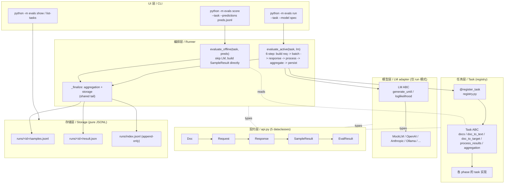

# play/evals

**lm-evaluation-harness 风格的 LLM 评测 harness**，以 Task（dataset + prompt template + process_results + aggregation）为声明式评测单元，按方法学族分 phase 渐进扩展主流指标。

## 特性

- **score / run 双模式一等公民**：共享 aggregation + storage；parity test 焊死"`run mock:X` ≡ `score predictions/X.jsonl`"
- **Task 声明式范式（lm-evaluation-harness 原版）**：一个 Python 类绑定 dataset + prompt template + process_results + aggregation；`@register_task` 登记、CLI 字符串调度
- **契约层居中（`api.py` 5 个 dataclass）**：Task / LM 平级互不 import，全部依赖 `api.py` 词汇表
- **纯 JSONL 存储（刻意 YAGNI）**：`runs/<id>/{result.json, samples.jsonl}` + `runs/index.jsonl`（append-only 扁平索引，schema 和未来可选 SQLite 同构）
- **Metric 按需建**：有成熟库时 task 直调；无库或跨 task 复用时再建 `metrics/X.py`

## 指导原则

贯穿本项目的 5 条原则：

|#|原则|内容|代码层执行|
|---|---|---|---|
|1|**Task 声明式 + lm-eval 原版语义**|paper 可复现优先于 API 新颖|`doc_to_text` 只构造字符串（不触发 LM）；`process_results` per-sample 评分（不做全集统计）；`aggregation` 返回 `{metric_name: fn(list[SampleResult]) -> float}` 负责全集聚合|
|2|**契约层中心化 + 平级能力层**|`api.py` 5 个 dataclass 是唯一词汇表，换任一能力层不碰其它|Task / LM 互不 import，全部依赖 `api.py`|
|3|**Metric 层按需建**|有成熟库时 task 直调；"第一次跨 task 复用"或"无库可用"时再建 `metrics/X.py`，避免为未来预留空壳|—|
|4|**YAGNI over 未来可能需要**|SQLite / 并发 / YAML task 都在"真有需求时再加"列表|append-only JSONL 是持久化 source of truth；SQLite 是未来可选的 read model|
|5|**offline / active 双模式一等公民**|共享尾段，parity test 焊死"`run mock:X` ≡ `score predictions/X.jsonl`"|—|

## 架构分层



## 数据流

```
Doc       —— 数据集一行         (Task 产出)
  ↓ doc_to_text
Request   —— LM 调用请求         (run 模式 Runner 构造；score 模式不经过)
  ↓ lm.generate_until / 或 JSONL 查表
Response  —— LM 返回             (run 模式：LM 产；score 模式：Response(text=preds[id]))
  ↓ task.process_results
SampleResult —— 单样本评分       (per-sample metrics：一条能算完的，如 acc=0/1)
  ↓ task.aggregation()
EvalResult —— 整个 run 最终产物  (aggregated：要看全集的，如 f1_macro / kappa)
  ↓ storage.save
runs/<id>/{result.json, samples.jsonl} + runs/index.jsonl
```

## Task 声明式范式（为什么 prompt 和 metric 绑在 task 里）

学术 benchmark 文化：paper 报分数时，**prompt 字面字符串 + 数据集 + metric 三者一起**才算一次可复现的测量。

- Task 拥有 `doc_to_text` 的**字面字符串输出** → prompt 不会被 provider 的 system prompt / chat 模板隐式改写
- Task 拥有 `process_results + aggregation` → 换 prompt 做 A/B 时 metric 不动，换 metric 时 prompt 不动
- 换 LM 时**只换一个对象**，Task 零改动

`@register_task("name")` 装饰器登记 name → 类的映射；import 时副作用触发注册（Django URL / Flask route / pytest fixture 同款模式）。CLI 从字符串直接 `get_task()` 拿实例，不需要 if-else 分派。

## Metric 层策略

没有预留的 metric 抽象层。触发 `metrics/X.py` 重建的两种信号：

1. **跨 task 复用**——同一方法学被 2+ task 调用
2. **无成熟库可调**——方法学本身需要非平凡实现

对应到 roadmap：有库可直调的族（1 / 2 / 4 / 5-agreement / 7）在 task 里直接 import 库；无库或跨 task 复用的族（3 judge / 6 trajectory / 8-10 横切维度）在对应 phase 再建 `metrics/X.py`。

## 主流评测框架对照

|框架|核心抽象|关键特征|本项目关系|
|---|---|---|---|
|**lm-evaluation-harness** (EleutherAI)|Task = dataset + prompt template + process_results + aggregation|LM 暴露 generate_until / loglikelihood / loglikelihood_rolling 三种请求；学术 benchmark 事实标准|**根形状**（Task ABC / LM ABC / Registry / Runner 直接对标）|
|**inspect_ai** (UK AISI)|Task = dataset + solver + scorer|Solver 可以是 agentic pipeline，更 agent-friendly|不采用（solver 抽象对 benchmark 类简单任务过度设计）|
|**OpenAI Evals**|YAML-driven task spec|infra 集成强|不采用（配置驱动耦合重）|
|**deepeval**|metric-first / pytest-like / assert 风|适合塞进 CI|不采用（prompt 散在 test_case 里，task 可复现性弱）|
|**RAGAS**|不是 harness，是**指标库**（dataset-first）|faithfulness / answer_relevancy / context_* / answer_correctness|Phase 4 作为 RAG 指标库直调|
|**HELM** (Stanford)|scenarios + adaptation + **7 维度**|accuracy · calibration · robustness · fairness · bias · toxicity · efficiency|Phase 7-10 的横切维度直接对标（见附录 B）|
|**sacrebleu**|offline scorer（输入：gold + predictions）|机器翻译社区事实标准|`score` 模式的灵感来源——offline 打分作为一等公民|

**本项目的位置**：lm-eval 架构骨架 + sacrebleu 的 offline scoring 哲学 + 学习为主的进阶式扩展。

## Roadmap

|Phase|内容|metric 归属|
|---|---|---|
|1|族 1 MVP slice（classification + agreement）|sklearn 直调|
|2|族 2 完全体（generation）；加 `num_fewshot`|sacrebleu / rouge_score / bert_score / unbabel-comet 直调|
|3|族 3 完全体（LLM-as-judge）；真 LM 适配层落地|**建 `metrics/judge.py`**（无库 + 跨 task 复用）|
|4|族 4 完全体（RAG）；接 `play/rag/` 端到端|ranx / ragas 直调|
|5|族 1 后半 + 族 1 ↔ 族 3 交叉（kappa paradox 章节）|scipy.stats / krippendorff / statsmodels 直调|
|6|族 5 完全体（agent trajectory）；接 `play/agent_engine/`|**建 `metrics/trajectory.py`**（无库）|
|7|横切 Calibration|sklearn / netcal 直调|
|8|横切 Robustness|**建 `metrics/robustness.py`**（`robustify(task, perturbation)` 装饰器）|
|9|横切 Safety|**建 `metrics/safety.py`**（refusal / jailbreak 判定自写）|
|10|横切 Efficiency|**建 `metrics/efficiency.py`**（runner 自动采集 latency / tokens / cost）|

## Quickstart

```bash
# 装依赖
pip install -r play/evals/requirements.txt
cd play

# score：offline 打分 predictions JSONL
python -m evals score --task <task_name> --predictions <path/to/preds.jsonl>

# run：active 驱动 LM
python -m evals run --task <task_name> --model <model_spec>

# 列出已注册任务
python -m evals list-tasks

# 跨 run 对比 / 单 run drill-down
python -m evals show --task <task_name> --last 10
python -m evals show --run-id <run_id> --samples 5

# 跑测试
python -m pytest evals/tests/ -v
```

## 命名约定

Task ABC 职责边界已并入[指导原则](#指导原则) 1 的"代码层执行"列。以下是未归属到原则的纯命名约定：

|约定|内容|为什么|
|---|---|---|
|`run_id` 格式|`{yyyymmdd-hhmmss}-{8-char hash}`|时间可排序 + 同参复跑能辨识|
|`SampleResult.metrics` 的 `_` 前缀键|不上聚合面板，仅供 aggregation 消费|中间变量污染最终 `result.json`|

---

## 附录 A：五族 mental model（onboarding 视角）

业界常见的教学划分，用来组织"你在哪一族"。不严谨（混了 task / method / pipeline 三个正交轴），严谨视角见附录 B。

|族|场景|子类|代表指标|
|---|---|---|---|
|**1 Classification + Agreement**|分类 / NER / 情感 / 选择题 / 人机一致性审计|硬 label|`accuracy` · `balanced_accuracy` · `P/R/F1` · `F_beta` · `confusion_matrix` · `MCC`|
|||名义一致性|`cohens_kappa` · `scott_pi` · `fleiss_kappa` · `gwet_ac1`（规避 kappa paradox）|
|||有序一致性|`weighted_kappa` · `spearman` · `kendall_tau`|
|||连续一致性|`ICC` · `pearson_r` · `ccc`|
|||统一框架|`krippendorff_alpha`|
|**2 Generation（参考相似度）**|翻译 / 摘要 / RAG 答案|lexical|`exact_match` · `bleu` · `chrF` · `rouge` · `meteor`|
|||embedding|`bertscore` · `moverscore`|
|||learned|`bleurt` · `comet` · `bartscore`|
|**3 LLM-as-Judge**|开放式 QA / 写作 / 对话|—|`judge_pointwise` · `judge_pairwise`（+ position-swap 去偏）· `g_eval`（CoT + form-filling）· `self_consistency` 投票|
|**4 RAG pipeline**|RAG 全链路|检索子链|`recall@k` · `precision@k` · `mrr` · `ndcg@k` · `map`|
|||接地子链|`faithfulness` · `context_precision` · `context_recall` · `answer_relevancy` · `answer_correctness` · `hallucination_rate` · `citation_accuracy`|
|**5 Agent Trajectory**|agent / tool use / 多步推理|—|`task_success_rate` · `tool_selection_accuracy` · `tool_call_set_f1` · `argument_correctness` · `trajectory_edit_distance` · `step_count_efficiency` · `trajectory_coverage` · `plan_quality`|

## 附录 B：严谨视角 —— 双轴分类 + HELM 维度

五族好记但不严谨，要做严谨拆解时切到这套。

**双轴矩阵**（行 = task 类型，列 = 方法学；`—` = 这个 pairing 不是行业标准做法）：

|task \ method|rule-based|n-gram|embedding|learned|LLM-judge|model-internal|human|
|---|---|---|---|---|---|---|---|
|classification|accuracy / F1 / MCC / κ|—|—|—|—|—|✓ 基线|
|open-ended generation|EM|BLEU / ROUGE / chrF / METEOR|BERTScore / MoverScore|BLEURT / COMET / BARTScore|G-Eval · pointwise · pairwise|perplexity|✓ gold|
|retrieval|recall@k / MRR / NDCG / MAP|—|—|—|—|—|✓ 相关性判断|
|RAG|—|—|—|—|RAGAS faithfulness / answer_relevancy / context_precision·recall|—|✓|
|agent|task_success_rate / tool_call_f1 / trajectory_edit_distance / step_count|—|—|—|plan_quality / argument_correctness|—|✓|
|dialogue|turn success / goal completion|—|—|—|pairwise judge|—|✓|
|code|pass@k / exec accuracy|CodeBLEU（弱）|—|—|code-quality judge|—|✓|
|safety|refusal_rate / jailbreak_success_rate|—|—|toxicity classifier（Perspective API 等外部分类器）|harm judge|—|✓ red-team|

> **脚注**：RAG / dialogue / code 这几类 task 的**答案文本部分**可直接沿用 `open-ended generation` 行的所有方法（EM / BLEU / BERTScore / BLEURT / ...），此处仅列出 pipeline-specific 的指标以避免冗余。

**HELM 7 维度**（Stanford，工业引用最多，和五族正交）——同一 task 可被 7 维度各评一遍：

|维度|含义|本项目|
|---|---|---|
|accuracy|核心任务正确率|Phase 1-6（各族基础）|
|calibration|置信度 vs 实际准确率的对齐程度|Phase 7|
|robustness|对输入扰动的稳定性|Phase 8|
|fairness|跨人群子组的表现差异|—|
|bias|统计性偏见 / 刻板印象|—|
|toxicity|有害 / 攻击性内容生成率|Phase 9（部分）|
|efficiency|延迟 / token / 成本|Phase 10|

**五族 ↔ 双轴对应**：

|族|双轴拆解|
|---|---|
|1|`classification × {rule-based, agreement-statistics}`|
|2|`generation × {n-gram, embedding, learned}`|
|3|`{generation, RAG, agent} × LLM-as-judge`（跨任务的方法学）|
|4|`retrieval × rule-based` + `RAG-answer × {n-gram, LLM-judge}`（复合 pipeline）|
|5|`agent × {trajectory-match, LLM-judge}`|
