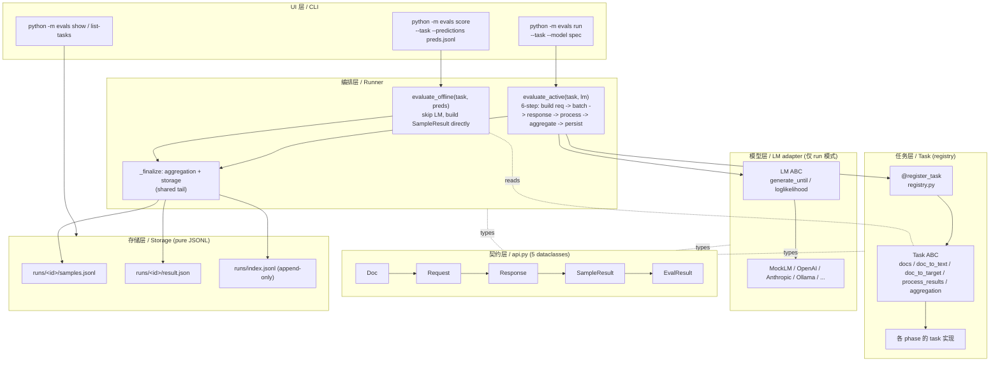

# play/evals

**lm-evaluation-harness 风格的 LLM 评测 harness**，以 Task（dataset + prompt template + process_results + aggregation）为声明式评测单元，按方法学族分 phase 渐进扩展主流指标。

## 特性

- **score / run 双模式一等公民**：共享 aggregation + storage；parity test 焊死"`run mock:X` ≡ `score predictions/X.jsonl`"
- **Task 声明式范式（lm-evaluation-harness 原版）**：一个 Python 类绑定 dataset + prompt template + process_results + aggregation；`@register_task` 登记、CLI 字符串调度
- **契约层居中（`api.py` 5 个 dataclass）**：Task / LM 平级互不 import，全部依赖 `api.py` 词汇表
- **纯 JSONL 存储（刻意 YAGNI）**：`runs/<id>/{result.json, samples.jsonl}` + `runs/index.jsonl`（append-only 扁平索引，schema 和未来可选 SQLite 同构）
- **Metric 按需建**：有成熟库时 task 直调；无库或跨 task 复用时再建 `metrics/X.py`

## 指导原则

贯穿本项目的 5 条原则：

|#|原则|内容|代码层执行|
|---|---|---|---|
|1|**Task 声明式 + lm-eval 原版语义**|paper 可复现优先于 API 新颖|`doc_to_text` 只构造字符串（不触发 LM）；`process_results` per-sample 评分（不做全集统计）；`aggregation` 返回 `{metric_name: fn(list[SampleResult]) -> float}` 负责全集聚合|
|2|**契约层中心化 + 平级能力层**|`api.py` 5 个 dataclass 是唯一词汇表，换任一能力层不碰其它|Task / LM 互不 import，全部依赖 `api.py`|
|3|**Metric 层按需建**|有成熟库时 task 直调；"第一次跨 task 复用"或"无库可用"时再建 `metrics/X.py`，避免为未来预留空壳|—|
|4|**YAGNI over 未来可能需要**|SQLite / 并发 / YAML task 都在"真有需求时再加"列表|append-only JSONL 是持久化 source of truth；SQLite 是未来可选的 read model|
|5|**offline / active 双模式一等公民**|共享尾段，parity test 焊死"`run mock:X` ≡ `score predictions/X.jsonl`"|—|

## 架构分层



## 数据流

```
Doc       —— 数据集一行         (Task 产出)
  ↓ doc_to_text
Request   —— LM 调用请求         (run 模式 Runner 构造；score 模式不经过)
  ↓ lm.generate_until / 或 JSONL 查表
Response  —— LM 返回             (run 模式：LM 产；score 模式：Response(text=preds[id]))
  ↓ task.process_results
SampleResult —— 单样本评分       (per-sample metrics：一条能算完的，如 acc=0/1)
  ↓ task.aggregation()
EvalResult —— 整个 run 最终产物  (aggregated：要看全集的，如 f1_macro / kappa)
  ↓ storage.save
runs/<id>/{result.json, samples.jsonl} + runs/index.jsonl
```

## Task 声明式范式（为什么 prompt 和 metric 绑在 task 里）

学术 benchmark 文化：paper 报分数时，**prompt 字面字符串 + 数据集 + metric 三者一起**才算一次可复现的测量。

- Task 拥有 `doc_to_text` 的**字面字符串输出** → prompt 不会被 provider 的 system prompt / chat 模板隐式改写
- Task 拥有 `process_results + aggregation` → 换 prompt 做 A/B 时 metric 不动，换 metric 时 prompt 不动
- 换 LM 时**只换一个对象**，Task 零改动

`@register_task("name")` 装饰器登记 name → 类的映射；import 时副作用触发注册（Django URL / Flask route / pytest fixture 同款模式）。CLI 从字符串直接 `get_task()` 拿实例，不需要 if-else 分派。

## Metric 层策略

没有预留的 metric 抽象层。触发 `metrics/X.py` 重建的两种信号：

1. **跨 task 复用**——同一方法学被 2+ task 调用
2. **无成熟库可调**——方法学本身需要非平凡实现

对应到 roadmap：有库可直调的族（1 / 2 / 4 / 5-agreement / 7）在 task 里直接 import 库；无库或跨 task 复用的族（3 judge / 6 trajectory / 8-10 横切维度）在对应 phase 再建 `metrics/X.py`。

## 主流评测框架对照

|框架|核心抽象|关键特征|本项目关系|
|---|---|---|---|
|**lm-evaluation-harness** (EleutherAI)|Task = dataset + prompt template + process_results + aggregation|LM 暴露 generate_until / loglikelihood / loglikelihood_rolling 三种请求；学术 benchmark 事实标准|**根形状**（Task ABC / LM ABC / Registry / Runner 直接对标）|
|**inspect_ai** (UK AISI)|Task = dataset + solver + scorer|Solver 可以是 agentic pipeline，更 agent-friendly|不采用（solver 抽象对 benchmark 类简单任务过度设计）|
|**OpenAI Evals**|YAML-driven task spec|infra 集成强|不采用（配置驱动耦合重）|
|**deepeval**|metric-first / pytest-like / assert 风|适合塞进 CI|不采用（prompt 散在 test_case 里，task 可复现性弱）|
|**RAGAS**|不是 harness，是**指标库**（dataset-first）|faithfulness / answer_relevancy / context_* / answer_correctness|Phase 4 作为 RAG 指标库直调|
|**HELM** (Stanford)|scenarios + adaptation + **7 维度**|accuracy · calibration · robustness · fairness · bias · toxicity · efficiency|Phase 7-10 的横切维度直接对标（见附录 B）|
|**sacrebleu**|offline scorer（输入：gold + predictions）|机器翻译社区事实标准|`score` 模式的灵感来源——offline 打分作为一等公民|

**本项目的位置**：lm-eval 架构骨架 + sacrebleu 的 offline scoring 哲学 + 学习为主的进阶式扩展。

## Roadmap

|Phase|内容|metric 归属|
|---|---|---|
|1|族 1 MVP slice（classification + agreement）|sklearn 直调|
|2|族 2 lexical + 1 个 embedding 代表（BERTScore）；加 `num_fewshot`；MoverScore 与 learned tier (BLEURT/COMET/BARTScore) deferred|sacrebleu / rouge_score / nltk / bert-score 直调|
|3|族 3 完全体（LLM-as-judge）；真 LM 适配层落地|**建 `metrics/judge.py`**（无库 + 跨 task 复用）|
|4|族 4 完全体（RAG）；接 `play/rag/` 端到端|ranx / ragas 直调|
|5|族 1 后半 + 族 1 ↔ 族 3 交叉（kappa paradox 章节）|scipy.stats / krippendorff / statsmodels 直调|
|6|族 5 完全体（agent trajectory）；接 `play/agent_engine/`|**建 `metrics/trajectory.py`**（无库）|
|7|横切 Calibration|sklearn / netcal 直调|
|8|横切 Robustness|**建 `metrics/robustness.py`**（`robustify(task, perturbation)` 装饰器）|
|9|横切 Safety|**建 `metrics/safety.py`**（refusal / jailbreak 判定自写）|
|10|横切 Efficiency|**建 `metrics/efficiency.py`**（runner 自动采集 latency / tokens / cost）|

## Quickstart

```bash
# 装依赖
pip install -r play/evals/requirements.txt
cd play

# score：offline 打分 predictions JSONL
python -m evals score --task <task_name> --predictions <path/to/preds.jsonl>

# run：active 驱动 LM
python -m evals run --task <task_name> --model <model_spec>

# run + K-shot：prompt 前拼 K 条 example（lm-eval 风格）
python -m evals run --task <task_name> --model <model_spec> --num-fewshot 2 --fewshot-seed 0

# 列出已注册任务
python -m evals list-tasks

# 跨 run 对比 / 单 run drill-down
python -m evals show --task <task_name> --last 10
python -m evals show --run-id <run_id> --samples 5

# 跑测试
python -m pytest evals/tests/ -v
```

### Phase 2 mt task：6 指标在 4 份故事化 predictions 上的分叉

```bash
# 跑 4 份 predictions，看 lexical 指标 vs BERTScore 怎么分
for p in perfect literal paraphrase garbage; do
  python -m evals score --task mt --predictions evals/data/mt/predictions/$p.jsonl
done

# 重点看 paraphrase：BLEU 暴跌但 BERTScore 救场（embedding tier 核心故事）
# active parity：mock:gold ≡ predictions/perfect.jsonl
python -m evals run --task mt --model mock:gold
```

> 首次跑 mt 任意一份 predictions 会触发 ~400MB `bert-base-chinese` 下载 + ~3-5s 模型加载；之后缓存。lexical 5 个指标无下载。

## 命名约定

Task ABC 职责边界已并入[指导原则](#指导原则) 1 的"代码层执行"列。以下是未归属到原则的纯命名约定：

|约定|内容|为什么|
|---|---|---|
|`run_id` 格式|`{yyyymmdd-hhmmss}-{8-char hash}`|时间可排序 + 同参复跑能辨识|
|`SampleResult.metrics` 的 `_` 前缀键|不上聚合面板，仅供 aggregation 消费|中间变量污染最终 `result.json`|

---

## 附录 A：五族 mental model（onboarding 视角）

业界常见的教学划分，用来组织"你在哪一族"。不严谨（混了 task / method / pipeline 三个正交轴），严谨视角见附录 B。

|族|场景|子类|代表指标|
|---|---|---|---|
|**1 Classification + Agreement**|分类 / NER / 情感 / 选择题 / 人机一致性审计|硬 label|`accuracy` · `balanced_accuracy` · `P/R/F1` · `F_beta` · `confusion_matrix` · `MCC`|
|||名义一致性|`cohens_kappa` · `scott_pi` · `fleiss_kappa` · `gwet_ac1`（规避 kappa paradox）|
|||有序一致性|`weighted_kappa` · `spearman` · `kendall_tau`|
|||连续一致性|`ICC` · `pearson_r` · `ccc`|
|||统一框架|`krippendorff_alpha`|
|**2 Generation（参考相似度）**|翻译 / 摘要 / RAG 答案|lexical|`exact_match` · `bleu` · `chrF` · `rouge` · `meteor`|
|||embedding|`bertscore` · `moverscore`|
|||learned|`bleurt` · `comet` · `bartscore`|
|**3 LLM-as-Judge**|开放式 QA / 写作 / 对话|—|`judge_pointwise` · `judge_pairwise`（+ position-swap 去偏）· `g_eval`（CoT + form-filling）· `self_consistency` 投票|
|**4 RAG pipeline**|RAG 全链路|检索子链|`recall@k` · `precision@k` · `mrr` · `ndcg@k` · `map`|
|||接地子链|`faithfulness` · `context_precision` · `context_recall` · `answer_relevancy` · `answer_correctness` · `hallucination_rate` · `citation_accuracy`|
|**5 Agent Trajectory**|agent / tool use / 多步推理|—|`task_success_rate` · `tool_selection_accuracy` · `tool_call_set_f1` · `argument_correctness` · `trajectory_edit_distance` · `step_count_efficiency` · `trajectory_coverage` · `plan_quality`|

## 附录 B：严谨视角 —— 双轴分类 + HELM 维度

五族好记但不严谨，要做严谨拆解时切到这套。

**双轴矩阵**（行 = task 类型，列 = 方法学；`—` = 这个 pairing 不是行业标准做法）：

|task \ method|rule-based|n-gram|embedding|learned|LLM-judge|model-internal|human|
|---|---|---|---|---|---|---|---|
|classification|accuracy / F1 / MCC / κ|—|—|—|—|—|✓ 基线|
|open-ended generation|EM|BLEU / ROUGE / chrF / METEOR|BERTScore / MoverScore|BLEURT / COMET / BARTScore|G-Eval · pointwise · pairwise|perplexity|✓ gold|
|retrieval|recall@k / MRR / NDCG / MAP|—|—|—|—|—|✓ 相关性判断|
|RAG|—|—|—|—|RAGAS faithfulness / answer_relevancy / context_precision·recall|—|✓|
|agent|task_success_rate / tool_call_f1 / trajectory_edit_distance / step_count|—|—|—|plan_quality / argument_correctness|—|✓|
|dialogue|turn success / goal completion|—|—|—|pairwise judge|—|✓|
|code|pass@k / exec accuracy|CodeBLEU（弱）|—|—|code-quality judge|—|✓|
|safety|refusal_rate / jailbreak_success_rate|—|—|toxicity classifier（Perspective API 等外部分类器）|harm judge|—|✓ red-team|

> **脚注**：RAG / dialogue / code 这几类 task 的**答案文本部分**可直接沿用 `open-ended generation` 行的所有方法（EM / BLEU / BERTScore / BLEURT / ...），此处仅列出 pipeline-specific 的指标以避免冗余。

**HELM 7 维度**（Stanford，工业引用最多，和五族正交）——同一 task 可被 7 维度各评一遍：

|维度|含义|本项目|
|---|---|---|
|accuracy|核心任务正确率|Phase 1-6（各族基础）|
|calibration|置信度 vs 实际准确率的对齐程度|Phase 7|
|robustness|对输入扰动的稳定性|Phase 8|
|fairness|跨人群子组的表现差异|—|
|bias|统计性偏见 / 刻板印象|—|
|toxicity|有害 / 攻击性内容生成率|Phase 9（部分）|
|efficiency|延迟 / token / 成本|Phase 10|

**五族 ↔ 双轴对应**：

|族|双轴拆解|
|---|---|
|1|`classification × {rule-based, agreement-statistics}`|
|2|`generation × {n-gram, embedding, learned}`|
|3|`{generation, RAG, agent} × LLM-as-judge`（跨任务的方法学）|
|4|`retrieval × rule-based` + `RAG-answer × {n-gram, LLM-judge}`（复合 pipeline）|
|5|`agent × {trajectory-match, LLM-judge}`|

## 附录 C：指标完全表（all phases）

把散在 [Roadmap](#roadmap) / [附录 A](#附录-a五族-mental-modelonboarding-视角) / [附录 B](#附录-b严谨视角--双轴分类--helm-维度) 的所有指标合并到一处，按族分组列**用途 / 简化公式 / 范围 / 库 / phase 归属**。

约定：`↕` 列里 `↑` = 越大越好，`↓` = 越小越好，`→0` = 中性最优。范围 `[a,b]` 闭区间、`(a,b]` 半开。`#X` = X 的计数，`mean(...)` = 算术平均，`P_c / R_c` = 类 c 的 precision / recall，`TP/FP/TN/FN` 同二/多分类标准缩写。`Po / Pe` = 观察一致率 / 期望（运气）一致率。

### C.1 族 1：Classification + Agreement

#### 单标注硬分类

|指标|用途|公式（简化）|范围 ↕|库 / phase|
|---|---|---|---|---|
|`accuracy`|总体对率|`#correct / #total`|[0,1] ↑|sklearn / 1|
|`balanced_accuracy`|类不均衡时纠偏|`mean(R_c)` over classes|[0,1] ↑|sklearn / 5|
|`precision_c`|类 c 预测的纯度|`TP_c / (TP_c + FP_c)`|[0,1] ↑|sklearn / 5|
|`recall_c`|类 c gold 的召回|`TP_c / (TP_c + FN_c)`|[0,1] ↑|sklearn / 5|
|`F1_c`|类 c 的 P/R 调和平均|`2·P_c·R_c / (P_c + R_c)`|[0,1] ↑|sklearn / 5|
|`F1_macro`|每类 F1 算术平均（不加权）|`mean(F1_c)`|[0,1] ↑|sklearn / 1|
|`F1_micro`|全 (TP/FP/FN) 累加后算 F1|单标签下 ≡ `accuracy`|[0,1] ↑|sklearn / 5|
|`F_beta`|偏向 P 或 R（β=2 偏 R，β=0.5 偏 P）|`(1+β²)·P·R / (β²·P + R)`|[0,1] ↑|sklearn / 5|
|`MCC`|Matthews 相关，二/多分类不均衡鲁棒|`(TP·TN − FP·FN) / √((TP+FP)(TP+FN)(TN+FP)(TN+FN))`|[−1,1] ↑|sklearn / 5|
|`confusion_matrix`|诊断辅助（非单数指标）|`C[i,j] = #(true=i, pred=j)`|—|sklearn / 5|

> `accuracy` 与 `F1_macro` 在类极不均衡时常分叉——这是 `sentiment_clf` 的 `constant_neutral` 演示故事。

#### 一致性（IAA / 人机一致）

|指标|用途|公式（简化）|范围 ↕|库 / phase|
|---|---|---|---|---|
|`cohens_kappa`|两标注名义一致 + 去运气|`(Po − Pe) / (1 − Pe)`，Pe 用各自边际独立猜的期望一致率|[−1,1] ↑|sklearn / 1|
|`scott_pi`|κ 变体，Pe 用合并边际|同上但 `Pe = ∑ p̄_c²`，p̄_c 为合并边际比例|[−1,1] ↑|手算 / 5|
|`fleiss_kappa`|κ 推广到 ≥3 标注者|多评者扩展同思路|[−1,1] ↑|statsmodels / 5|
|`gwet_ac1`|破解 κ paradox（边际极不均时 κ 误判低）|类 κ 但 `Pe = (1/(K−1)) · ∑ q_c(1−q_c)`|[−1,1] ↑|`irrCAC` / 5|
|`weighted_kappa`|有序类（"很好/好/中/差"），分歧按距离加权|κ 但用权重矩阵：linear `\|i−j\|` 或 quadratic `(i−j)²`|[−1,1] ↑|sklearn / 5|
|`spearman`|有序类秩相关|rank 后做 Pearson|[−1,1] ↑|scipy.stats / 5|
|`kendall_tau`|有序类，看 pair 同序比|`(concordant − discordant) / C(n,2)`|[−1,1] ↑|scipy.stats / 5|
|`pearson_r`|连续值线性相关|`cov(X,Y) / (σ_X·σ_Y)`|[−1,1] ↑|scipy.stats / 5|
|`ICC`|多评者连续值一致（区分 ICC(1,1)/(2,1)/(3,1) 等型号）|MS_between / MS_within 的比值（型号决定具体形式）|[0,1] ↑|`pingouin` / 5|
|`ccc` (Lin's)|连续值"既相关又同尺度"|`2·ρ·σ_X·σ_Y / (σ_X² + σ_Y² + (μ_X−μ_Y)²)`|[−1,1] ↑|`audtorch` / 5|
|`krippendorff_alpha`|名义/有序/区间/比例 + 缺失值 + 任意标注数 通用|`1 − D_o/D_e`（观察分歧 / 期望分歧）|[−1,1] ↑（≥0.8 实操 OK）|`krippendorff` / 5|

> κ paradox：当某类边际占比 > 90% 时 `accuracy` 接近 1 而 `κ` 接近 0——`gwet_ac1` 与 `krippendorff_alpha` 是行业级替代。Phase 5 的"族 1 ↔ 族 3 交叉"章节专门演示此现象。

### C.2 族 2：Generation（参考相似度）

|子类|指标|用途|公式（简化）|范围 ↕|库 / phase|
|---|---|---|---|---|---|
|lexical|`exact_match`|完全字符串相等|`mean(pred == ref)`|[0,1] ↑|手算 / 2|
|lexical|`bleu`|n-gram 翻译/摘要 baseline|`BP · exp(∑ w_n · log p_n)`，p_n = clipped n-gram precision|[0,1] ↑|sacrebleu / 2|
|lexical|`chrF`|字符级 n-gram，跨语言/形态学鲁棒|`F_β` over char-n-grams（默认 β=2）|[0,1] ↑|sacrebleu / 2|
|lexical|`rouge_n / rouge_l`|摘要召回倾向|`rouge_n`: n-gram 召回 F；`rouge_l`: LCS 长度的 P/R/F|[0,1] ↑|`rouge_score` / 2|
|lexical|`meteor`|翻译，含同义词/词干 + 碎片化惩罚|`harmonic_mean(P,R; P:R=1:9) · (1 − 0.5·frag³)`|[0,1] ↑|nltk / 2|
|embedding|`bertscore`|BERT 上下文向量做 token 软对齐|max-pool cosine over BERT embeddings → P/R/F|[~0,1] ↑|`bert-score` / 2|
|embedding|`moverscore`|EMD over BERT 嵌入|Earth Mover's Distance on contextual embeddings|[~0,1] ↑|`moverscore` / **deferred**（包 2020 后无维护、torch 兼容存疑）|
|learned|`bleurt`|fine-tuned BERT 拟合人评|回归 head|[~0,1] ↑|HF / **deferred**（权重 ~5GB）|
|learned|`comet`|用 (src, hyp, ref) triplet 训练的翻译质量|trained NN|按 release 不同（常 [0,1] 或无界）↑|`unbabel-comet` / **deferred**（权重 ~5GB）|
|learned|`bartscore`|BART 条件 log-likelihood 度量|`log P(ref \| hyp)` under fine-tuned BART|≤0 ↑（越接近 0 越好）|HF / **deferred**（权重 ~5GB）|

### C.3 族 3：LLM-as-Judge

|指标|用途|定义|主要偏置 / 注意|phase|
|---|---|---|---|---|
|`judge_pointwise`|逐条让 judge LM 打 1–5 / 1–10 分|`mean(score over samples)`|judge 趋向中位偏高分；用 anchor example 校准|3|
|`judge_pairwise`|两候选谁更好（A/B/tie）|`win_rate over pairs`|位置偏置严重 → 必须 position-swap 双跑取一致才计票|3|
|`g_eval`|多维度 form-filling + CoT|judge 输出 `{coherence, relevance, fluency, ...}` 加权聚合|用 logprob 加权而非 argmax，缓解离散分布的高方差|3|
|`self_consistency`|采样 N 次取多数（推理类任务）|`majority_vote(n=5/10/20)`|与 judge 正交：是"投票替代单次"的 wrapper，可叠在 pointwise 上|3|

### C.4 族 4：RAG pipeline

#### 检索子链（gold = doc-id 集合）

|指标|用途|公式（简化）|范围 ↕|库 / phase|
|---|---|---|---|---|
|`recall@k`|top-k 里召回了多少 gold|`\|top-k ∩ gold\| / \|gold\|`|[0,1] ↑|`ranx` / 4|
|`precision@k`|top-k 里有多少是相关的|`\|top-k ∩ gold\| / k`|[0,1] ↑|`ranx` / 4|
|`mrr`|第一个相关命中的位置|`mean(1 / rank_of_first_relevant)`|(0,1] ↑|`ranx` / 4|
|`ndcg@k`|有序相关性的位置加权|`DCG@k / IDCG@k`，`DCG = ∑ rel_i / log₂(i+1)`|[0,1] ↑|`ranx` / 4|
|`map`|平均精度（每个相关 doc 的 P@命中位）|`mean over queries of mean(P@hit_i)`|[0,1] ↑|`ranx` / 4|

#### 接地子链（生成 + 上下文，多数 LLM-judged）

|指标|用途|定义|来源|phase|
|---|---|---|---|---|
|`faithfulness`|答案中每条原子声明是否被 context 支持|`#supported_claims / #total_claims`（judge 拆 + 判）|RAGAS|4|
|`context_precision`|context 里相关 chunk 的位置加权|MAP-like over context chunks（rank-aware）|RAGAS|4|
|`context_recall`|gold 答案的每个 claim 是否在 context 中找得到|`#claims_supported_by_ctx / #total_gold_claims`|RAGAS|4|
|`answer_relevancy`|答案是否真在回答问题|从答案反推潜在 question，与原 question 的 cosine|RAGAS|4|
|`answer_correctness`|事实正确 + 语义相似 的复合|`w · F1(extracted_claims) + (1−w) · cosine_sim`|RAGAS|4|
|`hallucination_rate`|未被支持的声明比例|`1 − faithfulness`（或独立 judge）|RAGAS / 自定义|4|
|`citation_accuracy`|"答案 [n]" 标注是否真的来自 [n] 那个 chunk|`#correct_citations / #total_citations`|自定义|4|

### C.5 族 5：Agent Trajectory

|指标|用途|公式 / 定义|范围 ↕|phase|
|---|---|---|---|---|
|`task_success_rate`|端到端任务成功率|`mean(0/1 of task completed)`|[0,1] ↑|6|
|`tool_selection_accuracy`|每步选对工具的比例|`#correct_tool_picks / #steps`|[0,1] ↑|6|
|`tool_call_set_f1`|忽略顺序的 tool-call 集合 F1|F1 over multiset of `(tool_name, normalized_args)`|[0,1] ↑|6|
|`argument_correctness`|参数填对率|`mean over tool-calls of arg-level match`|[0,1] ↑|6|
|`trajectory_edit_distance`|轨迹序列的最小编辑距离|Levenshtein on tool-name sequence|[0,∞) ↓|6|
|`step_count_efficiency`|步数效率（vs gold plan）|`optimal_steps / actual_steps`|(0,1] ↑（>1 表示比 gold 还少）|6|
|`trajectory_coverage`|关键状态/工具是否都访问到|`#visited_required / #total_required`|[0,1] ↑|6|
|`plan_quality`|judge 打分的计划合理性|G-Eval-like（结构 / 可行性 / 最优性多维度）|[0,1] 或 [1,5] ↑|6|

### C.6 HELM 横切维度

|维度|指标|公式（简化）|范围 ↕|库 / phase|
|---|---|---|---|---|
|calibration|`ECE` (Expected Calibration Error)|`∑_b (n_b/N) · \|acc_b − conf_b\|`，分 bin|[0,1] ↓|`netcal` / 7|
|calibration|`MCE` (Max Calibration Error)|`max_b \|acc_b − conf_b\|`|[0,1] ↓|`netcal` / 7|
|calibration|`brier_score`|`mean((p − y)²)`，p=置信度，y=0/1|[0,1] ↓|sklearn / 7|
|robustness|`stability_score`|`mean over perturbations of (1 if pred unchanged else 0)`|[0,1] ↑|自定义 / 8|
|robustness|`perturbation_drop`|`acc_clean − acc_perturbed`|[−1,1] ↓|自定义 / 8|
|fairness|`subgroup_disparity`|`max_g(metric_g) − min_g(metric_g)` over groups|[0,1] ↓|自定义 / —|
|bias|`stereotype_score`|`(stereotypical − antistereotypical) / both`|[−1,1] →0|StereoSet 风格 / —|
|toxicity|`refusal_rate`|有害 prompt 中模型拒答比例|[0,1] 红队↑ / 正常↓|自定义 / 9|
|toxicity|`jailbreak_success_rate`|越狱 prompt 中绕过安全限制比例|[0,1] ↓|自定义 / 9|
|toxicity|`perspective_score`|Perspective API 输出毒性分数 mean|[0,1] ↓|Perspective API / 9|
|efficiency|`latency_ms`|端到端响应时间|[0,∞) ↓|runner 自动采集 / 10|
|efficiency|`tokens_in / tokens_out`|输入 / 输出 token 数|[0,∞) ↓|runner 自动采集 / 10|
|efficiency|`cost_usd`|按 provider 价格表换算|[0,∞) ↓|runner 自动采集 / 10|

### C.7 task-specific 补充（双轴矩阵其它格）

|task|指标|公式 / 定义|注意|phase|
|---|---|---|---|---|
|code|`pass@k`|`1 − C(n−c, k) / C(n, k)`，n 采样数、c 通过数|无偏估计；用大样本算小 k 的概率|未排期|
|code|`exec_accuracy`|`mean(execute(code) == expected)`|要 sandbox|未排期|
|code|`CodeBLEU`|`w₁·BLEU + w₂·BLEU_weighted + w₃·AST_match + w₄·dataflow_match`|弱信号；通常 + `pass@k` 一起报|未排期|
|dialogue|`turn_success`|`mean(turn-level goal achieved)`|多轮对话需要会话 schema|未排期|
|dialogue|`goal_completion`|对话结束时 goal 完成率|端到端而非 turn 级|未排期|
