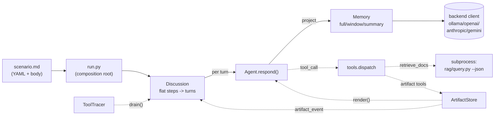

# play/multiagent

Step-driven 多 agent 讨论引擎：scenario = 一份 markdown，YAML frontmatter 声明参与者 / 流程 / 工具 / memory / artifact，body 即话题。共享 transcript + per-agent 投影，支持 ollama / openai / anthropic / gemini 四个后端，可被 `[play/rag/](../rag/)` 通过 subprocess 喂数据。

## 特性

- **Scenario 即配置**：YAML frontmatter + markdown body，一文件一场景；启动期 schema 校验，作者改场景零代码
- **扁平 step 列表**：`steps:` 一段顺序声明所有 turn，`who` 用 role/all/name 列表灵活寻址；引擎按声明顺序展开，每 turn 注入 `<turn>turn X of N</turn>` pinned marker，让 agent 自感位置
- **Shared transcript + per-agent projection**：history 只有一份权威视图，每个 agent 在 `respond()` 时按 `speaker == owner` 投影为 `assistant`，他人投影为 `<message from="X">`，控制流（`topic / turn / artifact_event`）投影为带标签的 user 消息
- **Per-agent memory 三策略**：`full / window / summary` 同接口可换；pinned 类型（控制流 + artifact 事件）永不被剪
- **Shared artifact + 结构化投票**：sectioned markdown + `replace / append` mode + 投票 + `finalize`；artifact view 带外注入（不进 history），artifact_event 进 history（pinned）
- **Artifact tool ACL（`tool_owners`）**：每个 artifact 工具的可调用方在 `artifact.tool_owners` 显式声明，取值与 `who` 完全对齐（role / all / name 列表）；未列出的工具默认对所有 agent 开放
- **Step assert（require_tool）**：声明 step 必须调用某工具；缺则 nudge 重试，最终落 stderr WARNING——**让沉默违规可见**而非强制
- **Tool observability**：`ToolTracer` 双 sink——stderr 实时 🔧 emoji + transcript event（`visible=False`，离线回放可用）
- **Subprocess 隔离工具**：`retrieve_docs` 通过 `subprocess.run(python rag/query.py --json)` 调用，进程边界保证两个子项目的 `config.py` / 依赖互不串台
- **多后端 pluggable**：`config.py` 改一行 `BACKEND` 切换 ollama / openai / anthropic / gemini

## 架构



## 环境准备

- Python 3.12+
- `pip install -r requirements.txt`（`anthropic / google-genai / openai / pyyaml`）
- 选一个后端（默认 ollama）：

```bash
# 本地 ollama（默认）
ollama pull qwen2.5:32b
# 或者改 config.py 的 BACKEND，并填上对应 *_API_KEY
```

`retrieve_docs` 需要 `[play/rag/](../rag/)` 已建好 VDB（详见 rag README）。

## 快速开始

在 `play/multiagent/` 目录下：

```bash
# 1. 经典圆桌（主持人 + 2 嘉宾）
python run.py scenarios/roundtable.md

# 2. 决策会议（主持人 + 4 成员，11 步 25 turn，带 artifact + 投票 + finalize）
python run.py scenarios/panel.md --save-artifact /tmp/panel.md

# 3. RAG 工具烟囱测试（agents 通过 subprocess 调 rag）
python run.py scenarios/test_vdb.md
```

预期输出片段：

```
============================================================
  Participants: 主持人, 嘉宾A, 嘉宾B
  Steps: 3  |  Total turns: 4
============================================================

🗣  [主持人] (step=open): 各位嘉宾好，今天我们讨论 ...
🗣  [嘉宾A] (step=discuss): 从技术原理 ...
🔧 [嘉宾A] retrieve_docs(query='AGI 路径', vdb_dir='...') → {hits: 3}
...
```

## CLI 速查

> 完整说明见 `python run.py --help`。

| 参数                  | 必选   | 默认           | 说明                                                                |
| ------------------- | ---- | ------------ | ----------------------------------------------------------------- |
| `scenario`          | 是    | —            | scenario `.md` 文件路径                                               |
| `--no-stream`       | flag | `False`      | 关闭流式输出                                                            |
| `--save-artifact`   | 否    | —            | 把最终 artifact markdown 落盘（仅 `artifact.enabled` 场景生效）              |
| `--save-transcript` | 否    | —            | 落盘结构化 history（topic / turn / speaker / tool_call / artifact_event）JSON |

## Scenario schema

YAML frontmatter 字段：

| 字段          | 类型     | 说明                                                                                                       |
| ----------- | ------ | -------------------------------------------------------------------------------------------------------- |
| `agents`    | list   | 必填，至少 1 项；每项 `{name, role, prompt}`，可选 `model / temperature / max_tokens / memory`；`role` ∈ {moderator, member} |
| `steps`     | list   | 必填，至少 1 项；每项 `{who, instruction, id?, require_tool?, max_retries?}`；按列表顺序展开成 turn                          |
| `memory`    | dict   | scenario 级默认 memory 配置；agent 级 `memory` 字段可覆盖                                                            |
| `tools`     | list   | 每项 `{name: <tool>, ...defaults}`；scenario 级默认值会从 LLM schema 中隐藏并注入到 dispatch                             |
| `artifact`  | dict   | `{enabled, initial_sections?, tool_owners?}`；section 项可声明 `mode: replace\|append`；`tool_owners` 限制可调用方  |

`who` 取值（共四种）：

| 形态                  | 含义                                                  |
| ------------------- | --------------------------------------------------- |
| `moderator`         | scalar role：所有 role=moderator 的 agent，按声明顺序          |
| `member`            | scalar role：所有 role=member 的 agent，按声明顺序            |
| `all`               | scalar 关键字：全员，按声明顺序                                  |
| `[name1, name2]`    | 显式名单：按列表顺序，每个 name 必须存在；单点也写成 `[name]`              |

`<artifact>` 视图在每次发言前带外注入（不进 history）。`<turn>turn X of N</turn>` 在每 turn 前 pinned 注入，让 agent 自感位置。

### Memory 策略

| `type`    | 必填字段             | 行为                                                            |
| --------- | ---------------- | ------------------------------------------------------------- |
| `full`    | —                | 默认；保留全量 history                                               |
| `window`  | `max_recent`     | 保留所有 pinned marker + 最近 N 条发言                                 |
| `summary` | `max_recent` + 可选 `model / max_tokens / temperature / summarizer_prompt / summarize_instruction` | stale 发言增量折叠进 `<summary>` block；client 由 `run.py` 注入 |

### Artifact 工具

| 工具                  | 默认可见性                | 作用                                       |
| ------------------- | -------------------- | ---------------------------------------- |
| `read_artifact`     | all（除非 tool_owners 限制） | 返回当前 markdown 视图                         |
| `write_section`     | all（受 mode 限）        | 覆盖式写 section；`append` 节调用返回 error      |
| `append_section`    | all（受 mode 限）        | 追加 entry；`replace` 节调用返回 error          |
| `propose_vote`      | all（除非 tool_owners 限制） | 注册结构化投票，返回 `vote_id`                     |
| `cast_vote`         | all（除非 tool_owners 限制） | 记录一票（按 `caller` 覆盖写）                     |
| `finalize_artifact` | all（除非 tool_owners 限制） | 封板；幂等返回 error 防重入                        |

> ⚠ 历史上 `propose_vote` / `finalize_artifact` 是硬编码的"主持人专属"。当前没有任何硬编码默认——若你想保留这个语义，**必须**在 `artifact.tool_owners` 里显式声明 `propose_vote: moderator` / `finalize_artifact: moderator`。

`require_tool: <tool>` 在 step 结束后扫 `artifact.drain_events()` 验证调用是否发生；未命中追加 nudge instruction 重试，重试用尽 stderr WARNING。

## Scenario 库

| 文件                  | 用途                                                       |
| ------------------- | -------------------------------------------------------- |
| `example.md`        | **kitchen-sink 模板**：每个 frontmatter 字段都用一遍 + 行内注释 + body 含运行时心智模型，新作者从这里开始 |
| `roundtable.md`     | 主持人 + 2 嘉宾，最简流程烟囱（3 step）                                |
| `debate.md`         | 无主持人，2 立场对辩（2 step）                                      |
| `brainstorm.md`     | 无主持人，演示 `who: [name, ...]` 显式列表寻址（2 step）                |
| `panel.md`          | 决策会议：主持人 + 4 成员，11 step / 25 turn，artifact + 投票 + finalize（最完整） |
| `test_vdb.md`       | `retrieve_docs` 烟囱测试（subprocess 调 rag）                   |
| `test_memory.md`    | 三种 memory 策略的可见度对照                                      |
| `test_artifact.md`  | 6 个 artifact 工具 + mode 冲突 self-correct + tool_owners 过滤   |
| `test_phase_assert.md` | `require_tool` + `max_retries` 重试闭环烟囱                  |

## 项目结构

```
play/multiagent/
├── README.md                   # 本文件
├── DESIGN_DECISIONS.md         # 设计决策时间线（按时间顺序）
├── requirements.txt            # anthropic / google-genai / openai / pyyaml
├── config.py                   # BACKEND + 各家 model/key/默认参数
├── run.py                      # CLI + composition root（装配点集中）
├── discussion.py               # Discussion 引擎：扁平 steps -> 线性 turn
├── agent.py                    # Agent.respond() + memory 投影入口
├── memory.py                   # FullHistory / WindowMemory / SummaryMemory
├── artifact.py                 # ArtifactStore + 6 工具 + 投票 + finalize
├── tools.py                    # TOOL_DEFINITIONS + dispatch + retrieve_docs
├── anthropic_client.py         # 后端 client（含 tool_handler loop）
├── openai_client.py            #
├── gemini_client.py            #
├── ollama_client.py            #
└── scenarios/                  # 场景库（见上表）
```

设计动机、候选方案与 trade-off 评估见 `[DESIGN_DECISIONS.md](DESIGN_DECISIONS.md)`。
