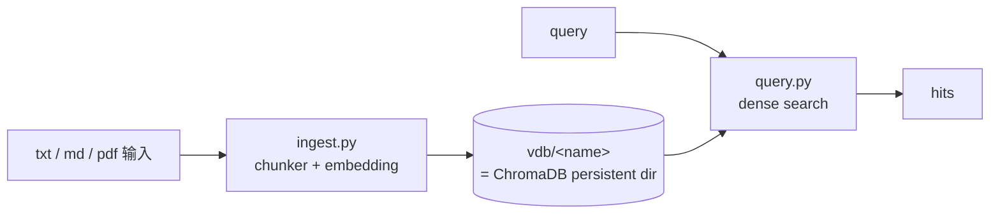
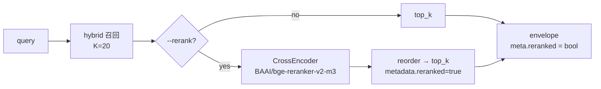

# Journal

> 日期以实际 commit 历史为准。每个里程碑围绕 1 段 100-300 字的“为什么这么做、对未来意味着什么”叙事展开，配框架变更表、必要时的 mermaid 图、以及当期新增/改动的模块与 CLI 接口。

## 2026-04-15 — 首个 RAG PoC：ChromaDB + Ollama + 段落感知 chunker

这个阶段的里程碑是把一个最小可用的 RAG 在本机跑通，并在“技术栈拍板”这一步留下长期收益。`ingest.py` / `query.py` 两个独立 CLI；`upsert` 而非 `add` 让重 ingest 幂等；collection 名直接等于 `basename(--output)`，作者不需要同时想两个名字。最值得讲的两条决定：选 **embedded ChromaDB（`PersistentClient(path=...)`）** 而不是 Qdrant / Weaviate / pgvector——VDB 就是一个目录，可 `cp -r` 迁移、可 git ignore，与 workshop 节奏天然契合；选 **Ollama embedding** 而不是 OpenAI API / sentence-transformers 直跑——和 multiagent 主推理共用 runtime，避免一个项目维护两个 LLM 后端的密钥 / 计费 / 限流。

### 框架变更

|变更|目的|
|---|---|
|两个独立 CLI（`ingest.py` / `query.py`）|入仓即可用，零额外服务依赖|
|embedded ChromaDB（`PersistentClient`）|VDB 即目录，可 `cp -r` / 单文件迁移|
|Ollama embedding（默认 `qwen3-embedding:8b`）|与主推理共用 runtime，避免双后端|
|`upsert` 替代 `add`|重 ingest 幂等，避免开发节奏被脏数据卡住|
|collection 名 = `basename(--output)`|目录名即 collection 名，避免“两个名字”心智负担|



### 新增 / 改动模块

|模块|说明|
|---|---|
|`ingest.py`|混合输入（文件 / 目录 `nargs="+"`）；`.txt / .md / .pdf` 三种格式|
|`query.py`|首版纯 dense 检索，CLI pretty-print|
|`chunker.py`|段落感知切分：按 `\n\n` 切段落、贪心打包、超长字符硬切、overlap 用尾部完整段落回带|
|`ollama_embedding.py`|包装 ChromaDB `EmbeddingFunction` 接 Ollama `/api/embed`|

### 新增数据 / 演示场景

|目的|内容|
|---|---|
|首批知识库|6 篇 panel 场景的角色档案，作为 `play/agent_engine`（彼时 `play/multiagent`）的私有背景知识|

## 2026-04-16 — 结构化 search API + `--json` subprocess 契约

这个里程碑把 RAG 从“给人看的 CLI”升级为“可被其他子项目程序化调用的能力”。`query.py` 加 `--json` 模式：stdout 仅 JSON envelope，warnings / 进度走 stderr，subprocess 消费者 `json.loads(stdout)` 即可。同期把 API 分层做了三层：`search()` 纯函数 → `query()` 薄 pretty-print 包装 → CLI 更薄一层。最值得讲的设计是数据契约 `SearchResult` TypedDict **字段去 chroma 化**——不叫 `document` / `distance`，避免绑 provider；`score = 1.0/(1.0+distance)` 把底层距离折算为“越大越相似”，调用方不必知道是 L2 还是 cosine。这一步立下的 subprocess + JSON envelope 契约，后来被 `play/agent_engine` 的 `retrieve_docs` 工具直接复用，再后来 `play/evals` phase 4 / phase 5 也照搬。

### 框架变更

|变更|目的|
|---|---|
|`query.py --json` 模式|stdout 专供机器消费，warnings / 进度走 stderr|
|API 分层：`search()` 纯函数 + `query()` 薄包装 + CLI|每层职责清晰，单测可拆开做|
|`SearchResult` TypedDict（去 chroma 化字段）|不绑 ChromaDB 词汇，未来换 Qdrant / pgvector 不破契约|
|`score = 1.0/(1.0+distance)`|调用方看“相似度”，不必关心 L2/cosine|
|`OLLAMA_BASE_URL` 跨子项目统一|多子项目共享同一本地 LLM|

```mermaid
flowchart LR
    HOST[(consumer 进程<br/>play/agent_engine 等)]
    HOST -->|subprocess.run<br/>[python, query.py, --json]| CLI[query.py --json]
    CLI --> S[search 纯函数]
    S --> VDB[(vdb)]
    S --> ENV[JSON envelope<br/>list[SearchResult]]
    ENV -->|stdout| HOST
    CLI -. stderr 走 warning .- HOST
```

### 新增 / 改动模块

|模块|说明|
|---|---|
|`query.py`|拆 `search()` 纯函数 + `query()` 薄包装；新增 `--json` envelope 输出|
|`SearchResult` TypedDict|`content / score / source / metadata` 四字段，跨 provider 稳定契约|

### 新增数据 / 演示场景

|目的|内容|
|---|---|
|文档目录按场景分组|`docs/panel/` / `docs/test_vdb/` 等子目录组织|

## 2026-04-25 — Hybrid retrieval：dense + BM25 + RRF 默认开启

稀有专名 / 编号场景（`ZX-7492` / `SRV-8831`）单纯 dense 召回率拉胯，这是 RAG 进入“可生产可用”的硬门槛。这个里程碑引入 BM25 + RRF，把 hybrid 改成默认 mode（`dense` / `bm25` 留作诊断）。最值得讲的是“**关键工程对偶**”：BM25 tokenizer 复用 embedding 模型同款 BPE（Qwen3-Embedding-8B），与 dense 端 tokenization 同源；跨语言（CJK / 拉丁 / 代码 / emoji）一致。融合策略选 **RRF（Reciprocal Rank Fusion，k=60，Cormack et al. 2009）**——只用排名不用 score，免 normalize；与 Elasticsearch 8.8+ 官方 hybrid 一致。同时 CLI envelope 从裸数组 `[hit, ...]` 破坏性升级到 `{query, data, meta}`，对齐 OpenAI Vector Store / Pinecone / Cohere 共同子集；`search()` Python API 不变。

### 框架变更

|变更|目的|
|---|---|
|`mode={dense, bm25, hybrid}`，hybrid 默认|生产场景即默认值，dense / bm25 仅作诊断|
|BM25 tokenizer 与 dense embedding 同款 BPE|跨语言 tokenization 同源，避免 hybrid 内部口径漂移|
|RRF（k=60）融合|只用排名不 normalize，工业界主流默认|
|`top_k * HYBRID_OVERSAMPLE`（=4）召回 oversample|融合前给两路足够候选|
|`bm25.pkl` 与 chroma 同目录|VDB 仍是单目录可 `cp -r` 迁移|
|`metadata.json` 加 `tokenizer` 哨兵|VDB 自描述：query 端读回，避免 ingest/query tokenizer 不一致|
|envelope 升级 `{query, data, meta}` (BREAKING)|对齐 OpenAI / Pinecone / Cohere 共同子集；solo 项目不付兼容税一次到位|
|per-hit `metadata.retrieval` / `metadata.reranked`|provenance 标注，下游可不依赖 envelope `meta`|

```mermaid
flowchart LR
    Q[query] --> D[dense_search<br/>top_k * 4]
    Q --> B[bm25_search<br/>top_k * 4]
    D --> RRF[rrf_fuse<br/>k=60]
    B --> RRF
    RRF --> TOP[top_k]
    TOP --> ENV[envelope<br/>{query, data, meta}]
```

### 新增 / 改动模块

|模块|说明|
|---|---|
|`bm25.py`|`dense_search` / `bm25_search` / `rrf_fuse` 三个纯函数|
|`tokenizer.py`|HF tokenizer 包装 + `lru_cache`|
|`prefetch.py`|一次性拉 HF 资产到 cache，避免运行时下载|
|`ingest.py` / `query.py`|读写 `bm25.pkl`；`metadata.json` 写入 / 校验 `tokenizer` 哨兵|
|envelope schema|裸数组 → `{query, data, meta}`（破坏性）|

### 新增数据 / 演示场景

|目的|内容|
|---|---|
|稀有专名 / 编号场景|为 hybrid 提供单纯 dense 拉胯的反向叙事样本|

## 2026-04-25 — Cross-encoder reranker（两阶段 retrieval）

这个里程碑把检索从单阶段升级为两阶段：召回（hybrid，K=20 候选）→ 精排（cross-encoder 重排到 top_k）。重排默认 off（`--rerank` 显式开启），是为了避免每次启动加载 ~1.2GB 模型；`lru_cache(1)` 让首次 ~5s 加载之后零启动开销。模型选 `BAAI/bge-reranker-v2-m3`（多语言 + 中英 / 代码 / emoji 友好）。召回池 `K=20` 是 BEIR / MS MARCO 的经验值，在 M-series Mac 上 cross-encoder 耗时可忽略。最重要的 caveat 是 “**重排不能挽回召回的漏**”：若 hybrid 第一阶段把正确文档排在 K=20 之外，reranker 也救不回来——它只能 reorder，不能 retrieve。这是两阶段架构的持续 trade-off。同期 `agent_engine` 侧把 `mode` + `rerank` 通过 OpenAI tool schema 暴露给 LLM，让歧义 query 可由 LLM 自适应触发 rerank。

### 框架变更

|变更|目的|
|---|---|
|`--rerank` flag（默认 off）|避免每次启动付 ~1.2GB 模型加载代价|
|`lru_cache(1)` 单例 lazy load|首次 ~5s 之后零启动开销|
|`K=20` 候选池|BEIR / MS MARCO 经验值，重排耗时可忽略|
|每 hit `metadata.reranked = True` + envelope `meta.reranked = True`|双路径标注，下游对账无歧义|
|`agent_engine` 端 slim envelope 解包|HTTP envelope ↔ SDK 解列表两层分工，对齐 OpenAI SDK 风格|



### 新增 / 改动模块

|模块|说明|
|---|---|
|`reranker.py`|`sentence-transformers.CrossEncoder` + `lru_cache(1)` 单例 lazy load|
|`query.py`|加 `--rerank` flag；返回 envelope 标注 `meta.reranked`|
|`agent_engine/tools/retrieve_docs.py`（同 commit）|把 rag CLI envelope 解包为 slim `{data, meta:{mode, reranked, top_k}}` 给 LLM；ToolTracer preview 升级|

### 新增数据 / 演示场景

|目的|内容|
|---|---|
|歧义 query 自适应 rerank|`agent_engine` 侧 `scenarios/test_vdb.md` prompt nudge LLM 在歧义 query 上 `rerank=true`|
