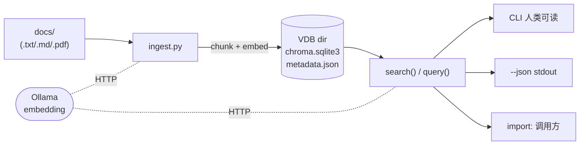

# play/rag

本地优先的极简 RAG 工具集：ChromaDB 做向量库 + Ollama 跑 embedding，CLI 与程序化 API 两用，可被外部工具（如 `[play/multiagent/](../multiagent/)`）通过 subprocess + JSON 契约消费。

## 特性

- **本地零运维**：embedded ChromaDB，VDB 就是一个目录，`cp -r` 即迁移
- **VDB 自描述**：`metadata.json` 记录 `embedding_model / chunk_size / chunk_overlap`，query 端默认沿用，避免"用错模型查对的库"的静默失败
- **段落感知 chunker**：按 `\n\n` 切段，贪心打包，回带保持完整段落不破语义
- **Provider-agnostic 返回值**：`SearchResult` 用 `content / score / source / metadata`，不绑 ChromaDB 字段
- `**--json` 子进程契约**：stdout 输出纯 JSON 数组，stderr 走警告/进度，便于 `subprocess.run(..., capture_output=True)` 拆开消费
- **多格式输入**：支持 `.txt / .md / .pdf`（PDF 走 pymupdf）

## 架构




## 环境准备

- Python 3.12+
- `pip install -r requirements.txt`（仅 `chromadb` + `pymupdf`）
- 安装并启动 [Ollama](https://ollama.com)，拉取 embedding 模型：

```bash
ollama pull qwen3-embedding:8b   # 默认，中文友好
# 或更轻量替代：
ollama pull nomic-embed-text
```

## 快速开始

仓库自带最小数据集 `[docs/test_vdb/](docs/test_vdb)`。在 `play/rag/` 目录下：

```bash
# 1. 建库
python ingest.py --docs docs/test_vdb --output vdb/test_vdb

# 2. 检索（人类可读）
python query.py --vdb vdb/test_vdb --query "项目代号"
```

预期输出片段：

```
Query: 项目代号
Top 5 results

--- [1] source=项目事实.txt  chunk=0  score=0.6234 ---
项目事实清单

- 项目代号：ZX-7492
- 服务器编号：SRV-8831
...
```

机器消费模式（stdout 仅 JSON 数组）：

```bash
python query.py --vdb vdb/test_vdb --query "项目代号" --json
```

## CLI 速查

> 完整说明与默认值见 `python ingest.py --help` / `python query.py --help`。

### `ingest.py`


| 参数             | 必选  | 默认                   | 说明                                  |
| -------------- | --- | -------------------- | ----------------------------------- |
| `--docs`       | 是   | —                    | 一个或多个文件/目录，递归收集 `.txt/.md/.pdf`     |
| `--output`     | 是   | —                    | VDB 输出目录（自动创建）                      |
| `--chunk-size` | 否   | `512`                | 单 chunk 目标字符数                       |
| `--overlap`    | 否   | `64`                 | 相邻 chunk 段落级回带字符上限                  |
| `--model`      | 否   | `qwen3-embedding:8b` | Ollama embedding 模型，写入 metadata 作哨兵 |
| `--collection` | 否   | `basename(--output)` | ChromaDB collection 名               |


### `query.py`


| 参数             | 必选   | 默认                       | 说明                                    |
| -------------- | ---- | ------------------------ | ------------------------------------- |
| `--vdb`        | 是    | —                        | VDB 目录（`ingest --output` 产物）          |
| `--query`      | 是    | —                        | 查询文本                                  |
| `--top-k`      | 否    | `5`                      | 返回前 N 个最相似 chunk                      |
| `--model`      | 否    | metadata 中的 stored model | 显式覆盖 embedding 模型；不一致仅 stderr WARNING |
| `--collection` | 否    | 第一个 collection           | 多 collection VDB 必须显式指定               |
| `--json`       | flag | `False`                  | stdout 输出纯 JSON 数组                    |


## 编程式 API

```python
from query import search

hits = search(
    vdb_dir="vdb/test_vdb",
    query_text="项目代号",
    top_k=3,
)
for h in hits:
    print(h["source"], h["score"], h["content"][:60])
```

返回 `list[SearchResult]`，字段：


| 字段         | 类型      | 说明                                     |
| ---------- | ------- | -------------------------------------- |
| `content`  | `str`   | chunk 文本                               |
| `score`    | `float` | 相似度，越大越相似（公式 `1.0 / (1.0 + distance)`） |
| `source`   | `str`   | 文件相对路径                                 |
| `metadata` | `dict`  | 含 `chunk_index` 等                      |


`search()` 是纯函数，`query()` 是它的 pretty-print 包装；CLI 的 `--json` 路径直接 `json.dumps(search(...))`。

## VDB 目录解剖

```
vdb/test_vdb/
├── chroma.sqlite3              # ChromaDB 主存储
├── metadata.json               # 自描述哨兵（本仓库写入）
└── <uuid>/                     # ChromaDB 内部数据
```

`metadata.json` 字段：


| 字段                             | 含义                      |
| ------------------------------ | ----------------------- |
| `embedding_model`              | ingest 时用的模型；query 默认沿用 |
| `chunk_size` / `chunk_overlap` | 切分参数                    |
| `doc_count` / `chunk_count`    | 入库统计                    |
| `created_at`                   | UTC ISO 时间戳             |


## 项目结构

```
play/rag/
├── README.md                   # 本文件
├── DESIGN_DECISIONS.md         # 设计决策时间线
├── requirements.txt            # chromadb + pymupdf
├── config.py                   # EMBED_MODEL / CHUNK_SIZE 等默认值
├── chunker.py                  # 段落感知切分（split_text）
├── ingest.py                   # 建库 CLI + ingest() 函数
├── query.py                    # 检索 CLI + search() / query() API
├── docs/                       # 示例文档
└── vdb/                        # 示例 VDB 输出
```

