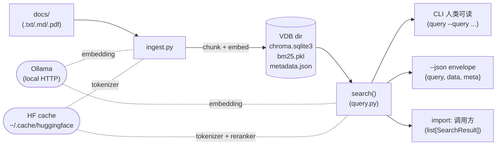
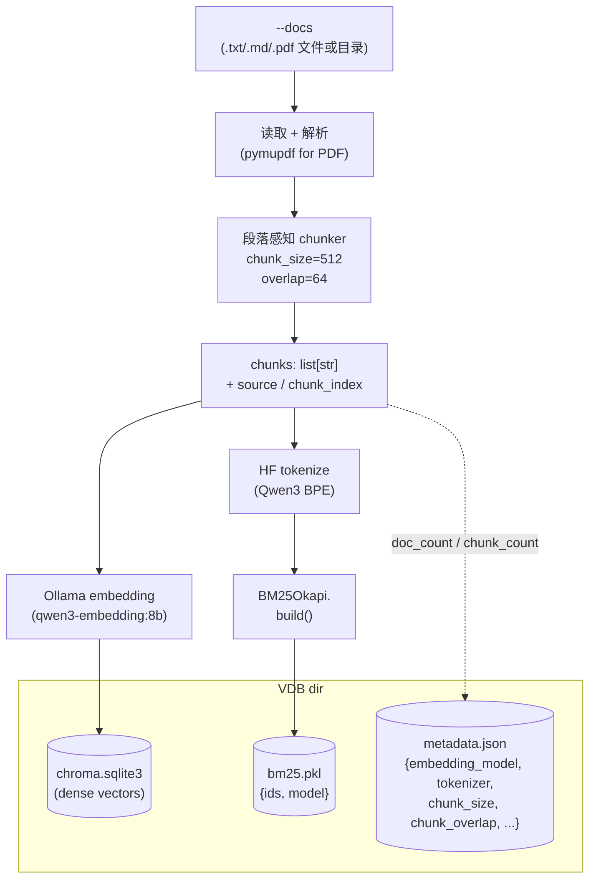
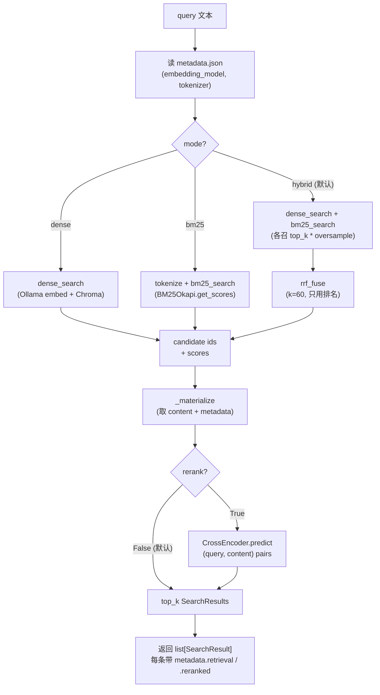

# play/rag

本地优先的两阶段 RAG 工具集：**dense (Ollama embedding) + BM25 + RRF 融合**做召回，可选 **cross-encoder（`bge-reranker-v2-m3`）** 精排。CLI 与程序化 API 两用，可被外部工具（如 `[play/agent_engine/](../agent_engine/)`）通过 subprocess + JSON envelope 消费。

## 特性

- **本地零运维**：embedded ChromaDB，VDB 就是一个目录，`cp -r` 即迁移
- **VDB 自描述**：`metadata.json` 记录 `embedding_model / chunk_size / chunk_overlap / tokenizer`，query 端默认沿用，避免"用错模型查对的库"或"用错 tokenizer 切对的库"的静默失败
- **段落感知 chunker**：按 `\n\n` 切段，贪心打包，回带保持完整段落不破语义
- **Hybrid 召回（默认）**：dense（语义） + BM25（字面）双路，**RRF（Reciprocal Rank Fusion，`k=60`）** 只用排名融合，免 score normalize
- **跨语言 BM25**：HF tokenizer 复用 embedding 模型同款（Qwen3 BPE），中英 / 代码 / emoji 一致切分，与 dense 端 tokenization 同源
- **Cross-encoder reranker（可选）**：`BAAI/bge-reranker-v2-m3` lazy-load + `lru_cache(1)` 单例，`--rerank` 显式开启
- **Provider-agnostic 返回值**：`SearchResult` 用 `content / score / source / metadata`，每条 hit 标 `metadata.retrieval` / `metadata.reranked` 来源
- **`--json` envelope 契约**：stdout 输出 `{query, data, meta}`，对齐 OpenAI Vector Store / Pinecone / Cohere 共同子集；warnings/进度走 stderr
- **多格式输入**：支持 `.txt / .md / .pdf`（PDF 走 pymupdf）

## 架构总览



## Ingest 数据流

`ingest.py` 把文档转为可检索的 VDB 目录：dense 向量进 ChromaDB，BM25 倒排索引序列化到 `bm25.pkl`，自描述哨兵写 `metadata.json`。



## Query 数据流

默认 hybrid 召回；`--rerank` 在召回池上叠一层 cross-encoder 精排。两路检索都在 `RERANK_CANDIDATES * HYBRID_OVERSAMPLE` 范围内 oversample，确保 RRF / 精排有足够候选。



## 环境准备

- Python 3.12+
- `pip install -r requirements.txt`（`chromadb / pymupdf / ollama / rank-bm25 / tokenizers / sentence-transformers / torch`）
- 安装并启动 [Ollama](https://ollama.com)，拉取 embedding 模型：

```bash
ollama pull qwen3-embedding:8b   # 默认，中文友好
# 或更轻量替代：
ollama pull nomic-embed-text
```

- **首次跑或换机时拉 HF 资产**（一次性 ~1.2GB，之后离线复用）：

```bash
python prefetch.py   # 拉 BM25 tokenizer (~10MB) + reranker model (~1.2GB)
```

> 不跑 prefetch 也能用：`ingest.py` / `query.py` 首次调用时会自动下载，但在测试现场会卡几秒。

## 快速开始

仓库自带最小数据集 `[docs/test_vdb/](docs/test_vdb)`。在 `play/rag/` 目录下：

```bash
# 1. 建库（hybrid 索引同时生成 chroma 向量 + bm25.pkl）
python ingest.py --docs docs/test_vdb --output vdb/test_vdb

# 2. 检索（默认 hybrid，人类可读）
python query.py --vdb vdb/test_vdb --query "项目代号"

# 3. 高精度路径（候选池上叠 cross-encoder 精排）
python query.py --vdb vdb/test_vdb --query "项目代号" --rerank

# 4. 诊断模式（单路检索做对照）
python query.py --vdb vdb/test_vdb --query "项目代号" --mode dense
python query.py --vdb vdb/test_vdb --query "项目代号" --mode bm25
```

预期输出片段：

```
Query: 项目代号
Top 5 results (mode=hybrid)

--- [1] source=项目事实.txt  chunk=0  score=0.0328 ---
项目事实清单
- 项目代号：ZX-7492
...
```

机器消费模式（stdout 仅 JSON envelope，warnings 走 stderr）：

```bash
python query.py --vdb vdb/test_vdb --query "项目代号" --json --rerank
```

## CLI 速查

> 完整说明与默认值见 `python ingest.py --help` / `python query.py --help`。

### `ingest.py`

| 参数             | 必选  | 默认                   | 说明                                  |
| -------------- | --- | -------------------- | ----------------------------------- |
| `--docs`       | 是   | —                    | 一个或多个文件/目录，递归收集 `.txt/.md/.pdf`     |
| `--output`     | 是   | —                    | VDB 输出目录（自动创建）                      |
| `--chunk-size` | 否   | `512`                | 单 chunk 目标字符数                       |
| `--overlap`    | 否   | `64`                 | 相邻 chunk 段落级回带字符上限                  |
| `--model`      | 否   | `qwen3-embedding:8b` | Ollama embedding 模型，写入 metadata 作哨兵 |
| `--collection` | 否   | `basename(--output)` | ChromaDB collection 名               |

### `query.py`

| 参数             | 必选   | 默认                       | 说明                                    |
| -------------- | ---- | ------------------------ | ------------------------------------- |
| `--vdb`        | 是    | —                        | VDB 目录（`ingest --output` 产物，必须含 `bm25.pkl`） |
| `--query`      | 是    | —                        | 查询文本                                  |
| `--top-k`      | 否    | `5`                      | 返回前 N 个最相似 chunk                      |
| `--mode`       | 否    | `hybrid`                 | 检索策略：`dense` / `bm25` / `hybrid`；后两者仅诊断用 |
| `--rerank`     | flag | `False`                  | 启用 cross-encoder 精排（首次 ~5s 加载 ~1.2GB） |
| `--model`      | 否    | metadata 中的 stored model | 显式覆盖 embedding 模型；不一致仅 stderr WARNING |
| `--collection` | 否    | 第一个 collection           | 多 collection VDB 必须显式指定               |
| `--json`       | flag | `False`                  | stdout 输出 `{query, data, meta}` envelope |

### `prefetch.py`

无参数。一次性拉取 HF tokenizer + reranker 到 `~/.cache/huggingface/`。

## 编程式 API

```python
from query import search

hits = search(
    vdb_dir="vdb/test_vdb",
    query_text="项目代号",
    top_k=3,
    mode="hybrid",   # "dense" / "bm25" / "hybrid"（默认）
    rerank=False,    # True 时叠 cross-encoder 精排
)
for h in hits:
    print(h["source"], h["score"], h["metadata"]["retrieval"], h["content"][:60])
```

返回 `list[SearchResult]`，字段：

| 字段         | 类型      | 说明                                                       |
| ---------- | ------- | -------------------------------------------------------- |
| `content`  | `str`   | chunk 文本                                                 |
| `score`    | `float` | 相似度分数；**跨 mode 不可比**（dense=`1/(1+dist)`、bm25=原始分、hybrid=RRF、rerank=CE logit） |
| `source`   | `str`   | 文件相对路径                                                   |
| `metadata` | `dict`  | 含 `chunk_index / retrieval / reranked` 等                 |

`search()` 是纯函数，`query()` 是它的 pretty-print 包装；CLI 的 `--json` 路径包装成 envelope 后 `print` 到 stdout。

## `--json` envelope 契约

```jsonc
{
  "query": "项目代号",
  "data": [
    {
      "content": "项目事实清单\n- 项目代号：ZX-7492\n...",
      "score": 0.9847580194473267,
      "source": "项目事实.txt",
      "metadata": {
        "source": "项目事实.txt",
        "chunk_index": 0,
        "retrieval": "hybrid",
        "reranked": true
      }
    }
  ],
  "meta": {
    "vdb": "vdb/test_vdb",
    "mode": "hybrid",
    "reranked": true,
    "top_k": 5,
    "embedding_model": "qwen3-embedding:8b"
  }
}
```

设计参照 OpenAI Vector Store search / Pinecone query / Cohere rerank 的共同子集——`data` 装业务对象、`meta` 装请求级元信息，未来加 pagination / timing / version 字段是加法式演化，不破契约。

## VDB 目录解剖

```
vdb/test_vdb/
├── chroma.sqlite3              # ChromaDB 主存储（dense vectors）
├── bm25.pkl                    # BM25 倒排索引（{ids, model} pickle）
├── metadata.json               # 自描述哨兵（本仓库写入）
└── <uuid>/                     # ChromaDB 内部数据
```

`metadata.json` 字段：

| 字段                             | 含义                              |
| ------------------------------ | ------------------------------- |
| `embedding_model`              | ingest 时用的模型；query 默认沿用         |
| `tokenizer`                    | BM25 用的 HF tokenizer；query 默认沿用 |
| `chunk_size` / `chunk_overlap` | 切分参数                            |
| `doc_count` / `chunk_count`    | 入库统计                            |
| `created_at`                   | UTC ISO 时间戳                     |

> 缺 `bm25.pkl` 时 `query.py` 直接 `FileNotFoundError` 提示重 ingest——单人项目不为不存在的"老 VDB"付兼容税。

## 项目结构

```
play/rag/
├── README.md                   # 本文件
├── DESIGN_DECISIONS.md         # 设计决策时间线
├── requirements.txt            # chromadb + pymupdf + ollama + rank-bm25 + tokenizers + sentence-transformers + torch
├── config.py                   # EMBED_MODEL / CHUNK_SIZE / RRF_K / RERANKER_MODEL 等默认值
├── chunker.py                  # 段落感知切分（split_text）
├── tokenizer.py                # HF tokenizer 包装（lru_cache + special-token 过滤）
├── bm25.py                     # dense_search / bm25_search / rrf_fuse 三个纯函数
├── reranker.py                 # CrossEncoder lazy 单例 + rerank()
├── ingest.py                   # 建库 CLI + ingest()：embed → chroma + bm25.pkl + metadata.json
├── query.py                    # 检索 CLI + search() / query() API
├── prefetch.py                 # 一次性拉 HF tokenizer + reranker 到本地 cache
├── docs/                       # 示例文档
└── vdb/                        # 示例 VDB 输出
```
