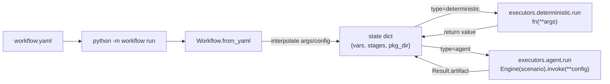

# play/workflow

声明式 pipeline runner——按 yaml 顺序串接**确定性 stage**（Python 函数）与 **agent stage**（调用 [play/agent_engine/](../agent_engine/) 的 `Engine.invoke()`）。workflow 自身**不内嵌 LLM 逻辑**；agent stage 通过 `executors/agent.py` 是它**唯一**的 LLM 耦合点（plan §2 关键边界）。

## 边界（plan §9 / §12 显式不做项）

> **有意为之**——本 play 不超过 ~350 行；要 retry / UI / durability 等成熟能力，直接迁 Prefect / Temporal / Argo（plan §9 论证迁移成本仅 ~3~4h）。

|维度|不做什么|替代办法|
|---|---|---|
|可靠性|retry / timeout / circuit-breaker|hook 自己用 `tenacity` / `signal`|
|流控|DAG / 条件 / 循环 / 并行|stages 是线性列表；分支需求拆 hook 或多份 yaml|
|生命周期|cron / 调度 / 持久化 / resume|runner 是 one-shot；调度交给外层（cron / GitHub Actions）|
|模板|过滤器 / 表达式 / inline Python (`code:` 块)|`{{ x.y.z }}` 路径访问；数据转换写 hook（参考 kitchen_sink 的 `to_yaml` stage）|
|插件|stdlib / 自动注册装饰器|显式 `import`，调试可见；只有 1 个真消费者前 YAGNI|
|CLI|多子命令 (`validate` / `list` / `inspect`)|只 `run`，避免 scope creep|
|trace_id|不实现|保留 W3C `traceparent` env 变量名 + JSON 字段名以待未来零成本接入（plan §9.1）|

报错哲学（plan §12）：必填字段缺失 → `sys.exit("Error: ...")`，**不**给"你大概想用 X"提示；引用不存在的 stage / 错误类型 → 模板插值期 `KeyError`，让 traceback 直说；runtime 错误（hook raise / scenario 装配失败）→ 直接传上去，不二次包装；没有"老用户引导"，没有"schema migration"。

新需求出现时：先看是否能由 hook 函数内部解决（用 `tenacity` 包重试、用 `subprocess` 包外部调用、用 `Path.read_text()` 读文件…），再考虑改 workflow 库本身。

## 公开 API

### Python

以下路径假定当前工作目录为 **`play/`**（与 `python -m workflow run ...` 一致）。

```python
from workflow import Workflow

wf = Workflow.from_yaml("qa_assets/workflows/qa_supervisor.yaml")
state = wf.run(
    {
        "csv_path": "qa_assets/examples/req_tracker.csv",
        "output_dir": "/tmp/qa_out",
    }
)
# state["stages"]["render_csv"]["output"]  # 末段 stage 输出
```

### CLI

```bash
cd play/
python -m workflow run workflow/examples/kitchen_sink.yaml \
    --vars greeting=Hello \
    --vars n_lines=3
```

## 字段速查（规范 SoT）

> [examples/kitchen_sink.yaml](examples/kitchen_sink.yaml) 是字段速查 + 心智模型的**唯一权威**——每个字段用一次 + 行内 `#` 注释 + 末尾"运行时心智模型"段。新作者从这里开始；本 README 只做总览。

```text
play/workflow/
├── runner.py             Workflow.from_yaml + .run；每 stage start/done + duration_ms
├── schema.py             最小校验 (必填字段缺失 sys.exit；不做向后兼容/友好提示)
├── state.py              路径访问插值 (~50 行；整字符串保类型, 内嵌强制 str)
├── executors/
│   ├── deterministic.py  fn 字符串 → callable, 调用并返回值
│   └── agent.py          Engine(scenario).invoke(**config) → Result.artifact
├── cli.py                argparse + --vars k=v + Workflow.run
├── examples/
│   ├── kitchen_sink.yaml + kitchen_sink_hooks.py    字段速查 (可运行)
│   └── chat.yaml                                     纯 agent 单 stage
├── __init__.py           导出 Workflow
├── __main__.py           python -m workflow
├── DECISIONS.md          ADR 归档（每条架构决策一个条目，仿 evals 风格：Date / Context / Options / Decision / Consequences / 示例 / 面试官可能问）
├── JOURNAL.md            每日进展（按里程碑，≤2 条/天，含功能 + 技术，必要时反链 DECISIONS §N）
└── README.md             本文件
```

## 运行时心智模型



